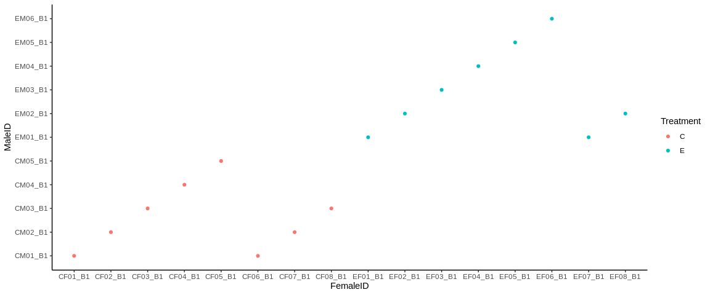

Sample Table Summary
================
adowneywall
11/12/2019

### Data

``` r
parents<-read.csv("/home/downeyam/Github/2018OAExp_larvae/input_files/Block1 of LarvalExp2018_LarvaeCrosses - Parent_ID.csv")
larvae<-read.csv("/home/downeyam/Github/2018OAExp_larvae/input_files/Block1 of LarvalExp2018_LarvaeCrosses - Cross.csv")
```

### Parent Summary

``` r
## Table give clue for distribution of male / female plus indicator of maturity (True = mature, False immature)
table(parents$Sex,parents$Ooze)
```

    ##    
    ##     FALSE TRUE
    ##   F    27   15
    ##   I     0    0
    ##   M    25   11

``` r
## Gonad Data
table(parents$Sex,parents$Gonad_DNA)
```

    ##    
    ##     FALSE TRUE
    ##   F     2   40
    ##   I     1    0
    ##   M     6   30

``` r
# 40 female gonad samples, 30 male sperm

# Samples used for crosses
parent_cross<-parents[!is.na(parents$Parent_BlockID),]
table(parent_cross$Sex)
```

    ## 
    ##  F  I  M 
    ## 16  0 11

``` r
# 16 females used for crosses / 11 males
```

### Merging Data

``` r
larvae_sampled <- larvae[larvae$QG_Meth == "Meth",]

larvae_red <- subset(larvae_sampled,select=c("FemaleID","MaleID","TimeCross","LarvaeDNAAge_hours"))
larvae_red$Treatment <- substr(larvae_red$FemaleID,start = 1,stop = 1)
parent_red <- subset(parent_cross,select=c("Parent_BlockID","Adult_ID","Sex","Time_GametesStripped","Time_SampGonad"))

m1<-left_join(larvae_red,parent_red,by=c("FemaleID"="Parent_BlockID"))
```

    ## Warning: Column `FemaleID`/`Parent_BlockID` joining factors with different
    ## levels, coercing to character vector

``` r
m2<-left_join(m1,parent_red,by=c("MaleID"="Parent_BlockID"))
```

    ## Warning: Column `MaleID`/`Parent_BlockID` joining factors with different
    ## levels, coercing to character vector

``` r
# Should be 16 zygote and larval pools.
# 27 tissues (sperm or eggs)
# 16 females
# 16+16+16 = 48 samples (not including any males)
```

Figure of crosses from block 1

``` r
library(ggplot2)
ggplot(larvae_red,aes(x=FemaleID,y=MaleID,colour=Treatment)) + geom_point() + theme_classic()
```

<!-- -->
