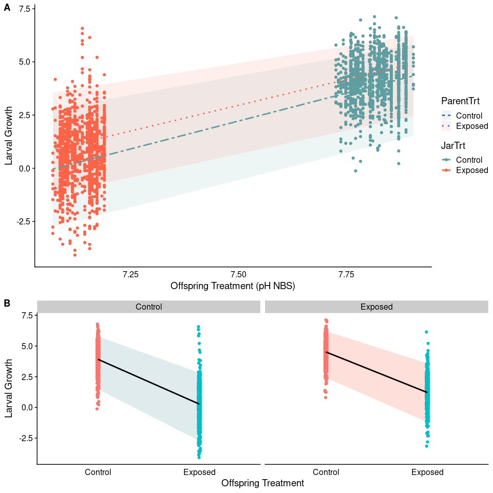
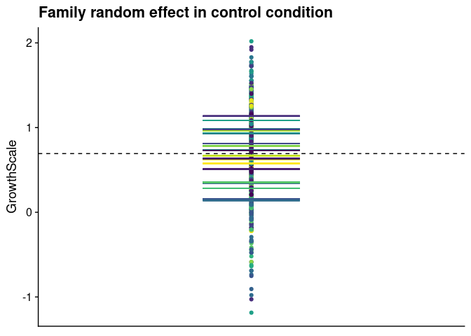
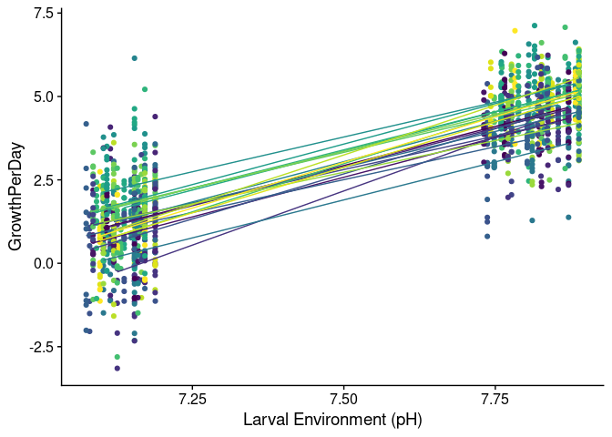

Estimating heritability and maternal effects in larval growth from an
intergenerational OA experiment
================

-   [Motivation](#motivation)
-   [Questions](#questions)
    -   [Q1 - What is the heritability of larvae growth in *C.
        virginica*?](#q1---what-is-the-heritability-of-larvae-growth-in-c-virginica)
    -   [Q2 - Does parental methylation correspond with larval
        growth?](#q2---does-parental-methylation-correspond-with-larval-growth)
    -   [Animal Model](#animal-model)
    -   [Important considerations for this
        data](#important-considerations-for-this-data)
    -   [1A - Does heritability of larval growth differ depending on the
        larval and/or adult
        environment?](#1a---does-heritability-of-larval-growth-differ-depending-on-the-larval-andor-adult-environment)
    -   [1B - Is there evidence that plastic growth response (seen in
        Elises paper) are
        heritable?](#1b---is-there-evidence-that-plastic-growth-response-seen-in-elises-paper-are-heritable)
    -   [2A Is parental methylation a significant explanatory variable
        in a linear mixed model that examines the effects of
        intergenerational OA exposure on larval
        growth?](#2a-is-parental-methylation-a-significant-explanatory-variable-in-a-linear-mixed-model-that-examines-the-effects-of-intergenerational-oa-exposure-on-larval-growth)
    -   [2B Is parental methylation an important component for
        explaining variance in larvae growth using an animal
        model?](#2b-is-parental-methylation-an-important-component-for-explaining-variance-in-larvae-growth-using-an-animal-model)

``` r
library(ggplot2)
library(cowplot)
library(viridisLite)
library(lme4)
```

    ## Loading required package: Matrix

## Motivation

In 2018 we conducted an ocean acidification exposure experiment with the
aim of looking at the effects of inter-generational OA on oyster larvae
growth. In this experiment we exposed adult oysters to ambient or OA
conditions and then generated offspring from adults in both conditions
and exposed them to both OA and ambient treatments. We found that
offspring treatment and parental condition both impacted larvae growth
(figure below). As a follow-up to this work we are interested in
understanding the additive genetic and non-genetic sources of variation
that explain the variance (differences) we see in larval growth, then
leverage this information to better understand the evolutionary
potential of larval growth in response to OA and whether or not prior
parental exposure to OA effects the evolutionary potential.

<!-- -->

*Larvae Growth as a function of offspring and parental treatment. A)
Larval growth by offspring environmental pH. Boxes represent the 95%
quantile for offspring, separated by parental treatment. B) Larval
growth by offspring treatment (categorical). Boxes represent the 95%
quantile for offspring.*

# Questions

### Q1 - What is the heritability of larvae growth in *C. virginica*?

-   The main objective of this paper is to estimate heritability. This
    is a numeric quantity that describes the proportion of total
    phenotypic variation that is due to additive genetic variation and
    thus describes how quickly a population can respond to a unit of
    selection (Falconer & Mackay, 1996). Importantly, factors that can
    impact phenotypic variation (e.g. the environment) are also expected
    to influence estimates of heritability. Consequently, evaluating
    heritability within the context of current and future environments
    can give insights into the evolutionary potential of a phenotype.
-   In our experiment we were interested in examining larval growth
    responses in ambient (i.e., current) and future OA conditions in
    offspring created from parents that had or had not experienced OA.

**Part A** - Does heritability of larval growth differ depending on the
larval and/or adult environment? If so, how does it differ among ambient
and OA conditions and how does parental conditioning (i.e., exposure to
OA) impact estimates of heritability? **Part B** - Is there evidence
that plastic growth response (seen in Elises paper) are heritable? Does
heritability of plasticity differ when parents are conditioned to OA?

### Q2 - Does parental methylation correspond with larval growth?

**Part A** - Is parental methylation a significant explanatory variable
in a linear mixed model that examines the effects of intergenerational
OA exposure on larval growth?

-   In this question we use a linear mixed model that includes a measure
    of parental methylation as a covariate (fixed effect). The model
    will be an extension of the model that was run by Elise in her
    paper.

**Part B** - Is parental methylation an important component for
explaining variance in larvae growth using an animal model?

-   In this question we use the animal mode from Q1 with a measure of
    parental DNA methylation included as a random effect similar to the
    relatedness matrix or pedigree data used to represent additive
    genetic variance. Support for this approach found in [Thomson et al
    2018](https://journals.plos.org/plosone/article?id=10.1371/journal.pone.0197720).

## Animal Model

The animal model is a specific example of a linear mixed model, which
focuses on estimating the variance components of a response variable
(generally a measurement of a continuous phenotype). It is often used to
quantify heritability or narrow-sense heritability, the proportion of
offspring phenotypic variance that is due to due additive genetic
variation. This value represents the relationship between the phenotype
and the underlying genes and can offer insight into the effectiveness of
selection on the trait and has been used to infer evolutionary potential
to future conditions. For an overview of animal models see [Wilson et
al. 2010](https://besjournals.onlinelibrary.wiley.com/doi/full/10.1111/j.1365-2656.2009.01639.x).

For a single trait, we can estimate the amount of phenotypic variance
() that is due to
genetic differences among individuals
() (Falconer &
Mackay 1996). Genotypic differences among individuals are composed of
additive (),
dominance () and
interaction or epistatic
() genetic
sources of variance. However,
 and
 are extremely
difficult to estimate in non‐experimental settings and both animal
breeders and field ecologists have tended to focus on measuring additive
genetic variance by estimating the phenotypic similarity of relatives
(Falconer & Mackay 1996; [Kruuk
2004](https://royalsocietypublishing.org/doi/abs/10.1098/rstb.2003.1437?casa_token=DgJhlGdLxr8AAAAA:6YAIB3cqbXG_SeAfDEDrW3Ce9q8K8P0vEubhSyxJ6JghuOZb731p_WXCBvAzjbTYxSdux6Z9Ia3KPw)).
In the simplest case, this involves statistically partitioning the
phenotypic variance into two parts such that

where  is the
residual variance.
 is normally
interpreted as arising from environmental effects which entails the
assumption that dominance and epistasis make negligible contributions to
. (From Wilson et
al 2010).

More recently, the recognition that it is possible to consider the
effects of parents on the phenotype of their offspring as inheritance
makes those maternal effects shift from being an environmental source of
variation to be treated as putative sources of both additive and
non-additive non-genetic variance. That is, one may decompose the
phenotypic variance into additive genetic, additive epigenetic, additive
behavioural variance, additive environmental variance and so on, which
together with various sources of non-additive and environmental sources
of variance sum up to the total phenotypic variance in a population:


where
,
and

stands for transmitted non-genetic variation, and
 for
non-transmitted variation.

can be further split so that

so that it comprises transmitted epigenetic, transmitted parental
non-genetic, transmitted ecological and transmitted social components,
respectively. From [Helantera et
al. 2020](https://royalsocietypublishing.org/doi/full/10.1098/rstb.2019.0366)

**Simple Animal Model**


where  is the
mean phenotypic value and
 is a n
by n matrix of relatedness values or a table of all individual pedigrees
(included as a random effect) and

is the residual error.

In this simply model we estimate random intercepts for all lineages
(each color in the figure). These are generally based on individual
observations, but can also be done with replicate lineage or family
level summaries.

    lmer(GrowthScale~(1|family),data=phenotype)

<!-- -->

Above the dashed line represents the population mean,
, and the
colored dashes represent estimates of family level growth (included in a
mixed model as a random intercept). **NOTE**, this figure is purely for
illustrative purposes and is only intended to represent approximately
what is occurring when additive genetic variation is being estimated in
an LMM.

**Random Slope**

From a technical modeling perspective, most studies estimate random
variance components (including additive genetic variation) as a random
intercept. I think this makes sense in the case above where the
phenotype is being evaluated in a single environment. However, if you
are looking at phenotypic variation across a range of conditions
(e.g. environment pHs), a random slope has been used in the model. See
[Nussey et al
2007](https://onlinelibrary.wiley.com/doi/full/10.1111/j.1420-9101.2007.01300.x)
for an example.

Below we see phenotype varies by environment (pH). Moreover, families
(each color) do not all behave the same. This suggests that variation in
the reaction norm slope (i.e., plasticity) may be due in part to
additive genetic variation.

    lmer(GrowthPerDay~JarpHNBS + (JarpHNBS|family),data=pheno)

    ## Warning in checkConv(attr(opt, "derivs"), opt$par, ctrl = control$checkConv, :
    ## Model failed to converge with max|grad| = 0.0692525 (tol = 0.002, component 1)

<!-- -->

## Important considerations for this data

1.  We have approximately 2700 total observations, about 710 for each
    parent-offspring combination. This includes about 60 observations
    per family (20 x 3 jars).
2.  In the design we exposed offspring collected from each parent
    combination (family) to both ambient and OA conditions. This gives
    us a **family level** measure of larval growth plasticity, since we
    are not measure the same individual in multiple environments.
    Moreover, we have three replicate measures per family per offspring
    treatment (jars). This design means **we are slightly limited on
    which types of models we can run that consider individual level
    estimates of larval growth**.

## 1A - Does heritability of larval growth differ depending on the larval and/or adult environment?

**Option 1** Run each parent-offspring treatment combination separately
using simply animal model.


In this option we would generate heritability and maternal effect
estimates for each parent-offspring combination (four total). For the
simpliest comparison among treatment levels we can see if the 95%
credibility intervals overlap for each measure among treatment (I
suspect they will). Alternatively, I am looking into whether some other
statistical tests can be used (i.e., T-test or multi-level test on the
posterior probabilities) makes sense.

**Option 2** Run each parental environment separately and use offspring
environment (pH) as a fixed covariate.


Revised estimation of heritability:


This was an approach recently discussed by [de Villemereuil et
al. 2017](https://onlinelibrary.wiley.com/doi/full/10.1111/jeb.13232),
which includes fixed-effect variance

in the model to improve estimates of heritability. **Importantly**, I
believe this approach would provide an improved estimate of heritability
(and maternal effects) for each parent treatment by accounting for the
effect of offspring environment, but **would not** allow you to see
whether heritability differed among larvae environments.

**Option 3** Run each parent-offspring treatment combination separately
using multivariate animal model using family-level estimates of growth.

 = \mu + Animalz + damIDz + JarIDz + \epsilon")

This is discussed in Wilson et al 2010 and used recently by Tasoff et
al. 2020. It is more frequently used to look at the correlation in
heritability among two different traits, but by treating a phenotype
measured in two environments as two distinct traits (rather than one
trait with repeated measures) we can test for genotype‐by‐environment
interaction (G x E) by looking at covariance among the two ‘traits’.

## 1B - Is there evidence that plastic growth response (seen in Elises paper) are heritable?

Given that we have family level reaction norm data one potentially
interesting question we can ask is whether plasticity is heritable and
whether heritability of plasticity is different when parents are
conditioned to another environment.

**Option 1** Estimate plasticity for each family and run animal model
for each parent treatment.

In this option plasticity could be estimated by fitting a linear
regression model to each family. Slopes from these models would then
serve as the response variable in the animal model. This has been
described in Wilson et al 2010. The challenge here is whether we have
the power after reducing the number of observations to run the model.

**Option 2** Fit individual data with an animal model that includes a
random intercept and slope. Method performed previous by Nussey et
al. 2007, I am looking into there specific approach. It is unclear to me
how they estimated heritability of plasticity based on the ouputs from
this model (i.e., it is not as simply as dividing
 by
).

## 2A Is parental methylation a significant explanatory variable in a linear mixed model that examines the effects of intergenerational OA exposure on larval growth?

This would be fairly strait forward. I would start with the best model
from Elise’s paper and then include parental methylation in the model as
a fixed covariate.

Two options for determining the parental methylation fingerprint:

-   PCA and use the first PC component - This works if the first PC
    explains most of total variation in DNAm sequence data.
-   Used the euclidean distance matrix approach from Thomson et al
    2018 - Needs work still need to then generate single value for each
    individual.

## 2B Is parental methylation an important component for explaining variance in larvae growth using an animal model?

In this scenario we are building on the idea discussed recently in
[Helantera et
al. 2020](https://royalsocietypublishing.org/doi/full/10.1098/rstb.2019.0366)
and previously by [Day and Bonduriansky et
al. 2011](https://pubmed.ncbi.nlm.nih.gov/21750377/), where we include a
measure of non-genetic inheritance into our model to see if it explains
variation in phenotype not otherwise explained by additive genetic
variation or maternal effects. Something like:


Or to rewrite it in the model format where we run the model for each
parental treatment separately:


The trick here is how we estimate parental methylation for the model.
Thankfully, Thomson et al 2018 provides a clear way of creating a
variance-covariance matrix based on euclidean distance for each
individual’s genome-wide DNA methylation. This matrix echoes that of the
matrix that represents the genetic relatedness based on the pedigree
data. For this approach we evaluate the inclusion of parental
methylation in two ways: **First** we see if DNA methylation explains a
significant amount of variation of our phenotype. **Second** we see if
the inclusion of DNA methylation is decreasing the amount of phenotypic
variation explained by additive genetic variation. The latter should
give us insight into whether our DNA methylation measure is simply
competeing additive genetic variation to explain similar variation in
our phenotype.

**Challenge 1** : I could see a scenario in which DNA methylation and
additive genetic variation are confounded and are highly correlated.
This will make it difficult to assess what DNA methylation is actually
contributing.

**Challenge 2** : We might expect that we might see DNA methylation
(induced by OA) have the greatest impact among parental treatments.
Given the model structure (one model for each parental treatment), we
may not see the effect of parental methylation on offspring phenotype.

Other thoughts on improving our approach: I wonder it is possible to
correct for this somehow. One possibility is regressing DNA methylation
relatedness estimates (determined using the Thomson et al approach)
against the additive genetic relatedness estimates (based on animal
pedigree) and representing DNA methylation in the animal model as the
residuals of that model. Still thinking about if this makes sense and
finding sources that do something similar.
