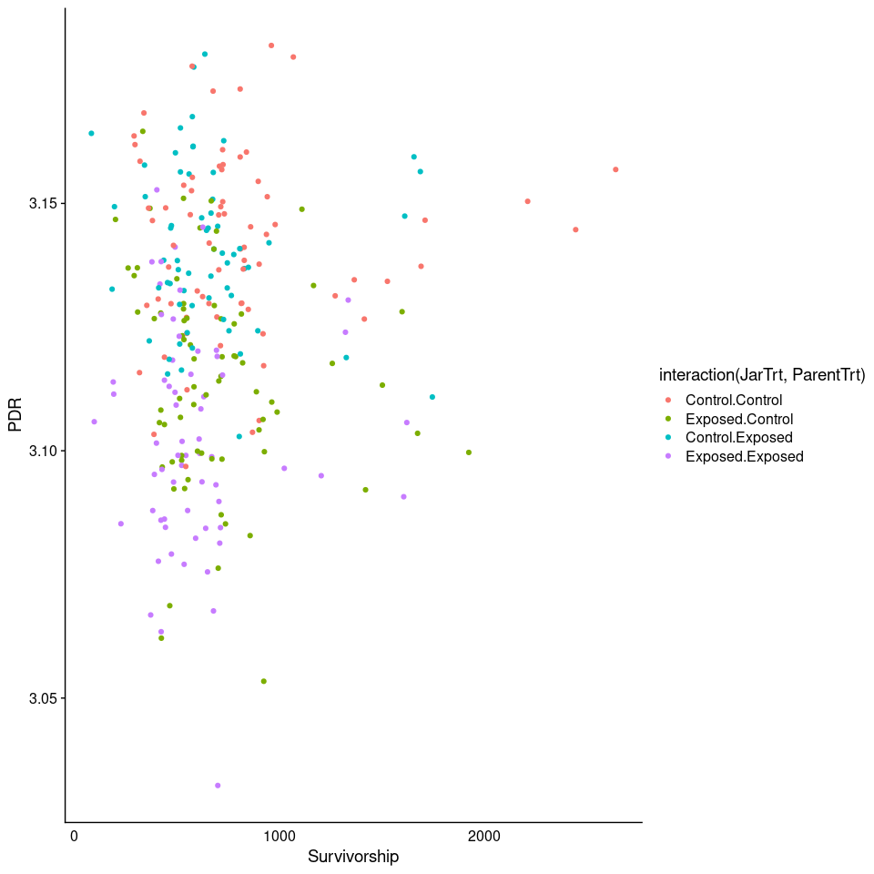

Estimating heritability and maternal effects in larval growth from an
intergenerational OA experiment
================

-   [Motivation](#motivation)
-   [Main Experimental Factors](#main-experimental-factors)
-   [Main Questions](#main-questions)
    -   [Main Question 1 : What is the heritability of *C. virginica*
        larval growth and morphology and what are the significant
        variance components that determine larval growth and morphology
        variance in the animal
        model?](#main-question-1--what-is-the-heritability-of-c-virginica-larval-growth-and-morphology-and-what-are-the-significant-variance-components-that-determine-larval-growth-and-morphology-variance-in-the-animal-model)
    -   [Main Question 2 : What is the effect of including parental
        methylation in the animal model and does it explain variation in
        larval phenotype not otherwise explained by additive genetic
        variation or maternal
        effects?](#main-question-2--what-is-the-effect-of-including-parental-methylation-in-the-animal-model-and-does-it-explain-variation-in-larval-phenotype-not-otherwise-explained-by-additive-genetic-variation-or-maternal-effects)
-   [Versions of the data available](#versions-of-the-data-available)
    -   [Individual observations](#individual-observations)
    -   [Jar-level summary
        observations](#jar-level-summary-observations)
    -   [Family-level summary
        observations](#family-level-summary-observations)
    -   [Visualizing the data](#visualizing-the-data)
-   [Steps For Each Question](#steps-for-each-question)
    -   [Question 1](#question-1)
        -   [Individual Summary Data](#individual-summary-data)
        -   [Jar-Level Summary Data](#jar-level-summary-data)
    -   [Question 2](#question-2)

``` r
library(ggplot2)
library(cowplot)
library(viridisLite)
library(lme4)
```

    ## Loading required package: Matrix

## Motivation

In 2018 we conducted an ocean acidification exposure experiment with the
aim of looking at the effects of inter-generational OA on oyster larvae
growth. In this experiment we exposed adult oysters to ambient or OA
conditions and then generated offspring from adults in both conditions
and exposed them to both OA and ambient treatments. We found that
offspring treatment and parental condition both impacted larvae growth
(figure below). As a follow-up to this work we are interested in
understanding the additive genetic and non-genetic sources of variation
that explain the variance (differences) we see in larval growth, then
leverage this information to better understand the evolutionary
potential of larval growth in response to OA and whether or not prior
parental exposure to OA effects the evolutionary potential.

<!-- -->

*Larvae Growth as a function of offspring and parental treatment. A)
Larval growth by offspring environmental pH. Boxes represent the 95%
quantile for offspring, separated by parental treatment. Boxes represent
the 95% quantile for offspring.*

## Main Experimental Factors

**Response Variable**

-   Larval Growth
-   Perimeter - Diameter Ratio (PDR, morphology)

**Explanatory Variable**

-   Offspring environment (factor or covariate)
-   Parental environment (factor)
-   Maternal effect (ID)
-   Parental methylation fingerprint

# Main Questions

## Main Question 1 : What is the heritability of *C. virginica* larval growth and morphology and what are the significant variance components that determine larval growth and morphology variance in the animal model?

## Main Question 2 : What is the effect of including parental methylation in the animal model and does it explain variation in larval phenotype not otherwise explained by additive genetic variation or maternal effects?

# Versions of the data available

There are two main types of forms of collected data- (1) **individual**
(e.g., growth and morphology), and (2) **jar-level** (e.g.,
survivorship). Moreover, family-level data was summarized from
individual data in order to calculate the reaction norms of each family
(since we didn’t have multiple measures of response from the same
individual in different environments) using linear regression.

### Individual observations

Number of observations (total): 2698

    ##          
    ##           Control Exposed
    ##   Control     710     620
    ##   Exposed     730     628

*Off Env. on y-axis, Parent Env. on x-axis*

-   Advantages
    -   Largest dataset with highest replication
    -   No using summarized data
-   Limitations
    -   Can only look at growth and morphology measures
    -   Can’t examine jar and family level metrics (e.g., survivorship
        and reaction norms)
    -   Can’t examine the same phenotype in multiple offspring
        environments using a bivariate model to evaluate genetic
        covariance

#### Visualizaton of Additive Genetic and Maternal Effects on Growth and Morphology (PDR)

**Growth**
<!-- --><!-- -->

**PDR**
<!-- --><!-- -->

### Jar-level summary observations

Number of observations (total): 270

    ##          
    ##           Control Exposed
    ##   Control      71      63
    ##   Exposed      73      63

*Off Env. on y-axis, Parent Env. on x-axis*

-   Advantages
    -   Can use bivariate animal model to examine genetic covariance
        between growth/morphology and survivorship
-   Limitations
    -   Data summarized (averaged) by jar
    -   Still can look at reaction norms or examine the same phenotype
        in multiple offspring env. using bivariate model

#### Visualizaton of Survivorship

    ## Warning: Removed 1 rows containing non-finite values (stat_smooth).

    ## Warning: Removed 1 rows containing missing values (geom_point).

<!-- --><!-- --><!-- -->

### Family-level summary observations

Number of observations (total): 45

    ## 
    ## Control Exposed 
    ##      24      21

-   Advantages
    -   Can look at heritability of reaction norms (slope)
    -   Can examine genetic covariance in the same trait among offspring
        environments using bivariate model
-   Limitations
    -   Data summarized (averaged) by family and linear regression used
        to estimate reactions norm slopes.

### Visualizing the data

**Reaction norm slope by parental treatment**

    ## Warning: Removed 1 rows containing missing values (geom_point).

<!-- -->

**Reaction norm slope vs. prediction at ambient**

    ## `geom_smooth()` using formula 'y ~ x'

    ## Warning: Removed 1 rows containing non-finite values (stat_smooth).

    ## Warning: Removed 1 rows containing missing values (geom_point).

<!-- -->

**Survival vs. Reaction norm slope**

    ## `geom_smooth()` using formula 'y ~ x'

<!-- -->

**Survival vs. Growth**

    ## `geom_smooth()` using formula 'y ~ x'

<!-- -->

# Steps For Each Question

## Question 1

What is the heritability of *C. virginica* larval growth and morphology
and what are the significant variance components that determine larval
growth and morphology variance in the animal model?

### Individual Summary Data

#### Step 1 - Examine EACH response variable using separate models for EACH parent-offspring environment combination

 + (1|damID) + (1|JarID)")

**Rationale** : In preliminary runs of the model we saw heritability
seemed to slightly differ among parent AND treatment combinations. If we
include offspring environment or parent environment as covariate this
would make it difficult to see this interaction in our heritability
estimate.

#### Step 2 - Examine EACH response variable separately for EACH parent treatment and INCLUDE offspring as covariate.

 + (1|damID) + (1|JarID)")

**Rationale**: This gives us more power to compare differences in
heritability depending on parental condition

#### Step 3 - Examine BOTH response variables (growth and morphology) together in bivariate model for EACH parent-offspring environment combination

 = u + (1|animal) + (1|damID) + (1|JarID)")

#### Step 4 - Examine BOTH response variables (growth and morphology) together in bivariate model foor EACH parent treatment and INCLUDE offspring as covariate.

 = u + offspringEnv_{pH} + (1|animal) + (1|damID) + (1|JarID)")

### Jar-Level Summary Data

#### Step 1 - Examine heritability of survivorship and its genetic covariance with growth or morphology using separate bivariate models for EACH response variable (growth or PDR) for EACH parent-offspring environment combination

 = u + (1|animal) + (1|damID) + (1|JarID)")

## Question 2

What is the effect of including parental methylation in the animal model
and does it explain variation in larval phenotype not otherwise
explained by additive genetic variation or maternal effects?

#### Step 1 - Estimate a DNA methylation similarity matrix based on sire and dames separately (i.e., maternal vs paternal methylation), then create a single DNA methylation similarity matrix based on the parentl methylation mid-point for each CpG.

#### Step 2 - Perform same individual-level comparisons as above but including DNA methylation similarity matrices

**No offspring env covariate**
 + (1|methylation_S) + (1|methylation_D) + (1|damID) + (1|JarID)")

**With offspring env. covariate**
 + (1|methylation_S) + (1|methylation_D) + (1|damID) + (1|JarID)")
