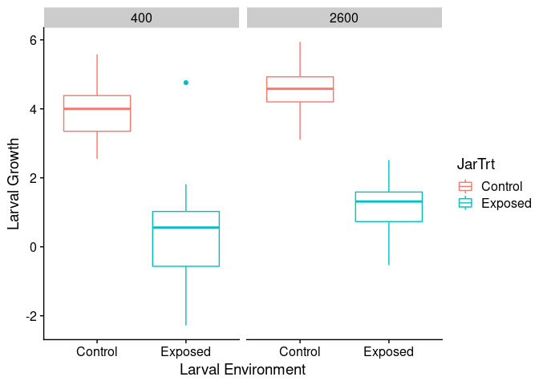
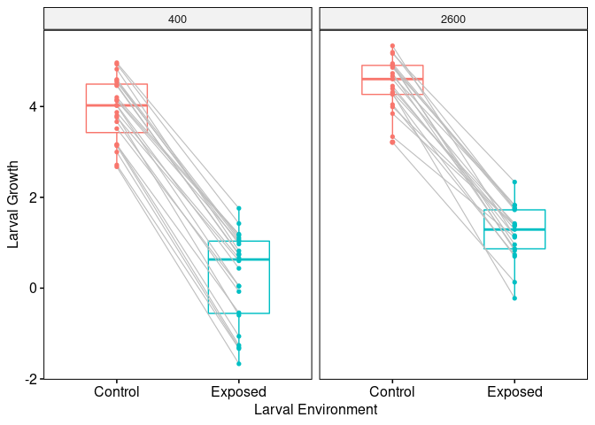
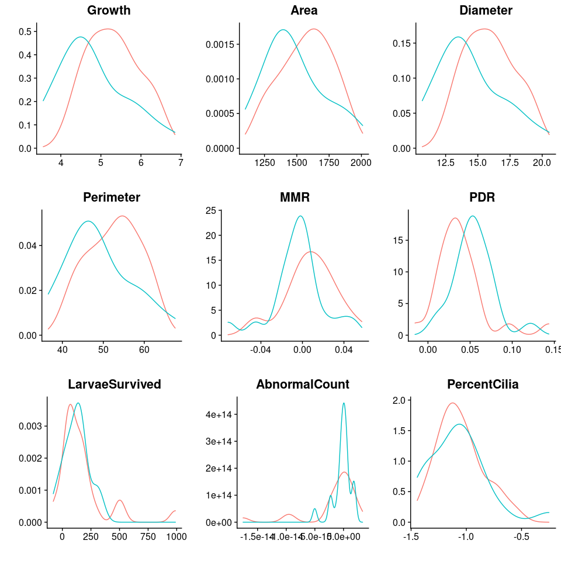
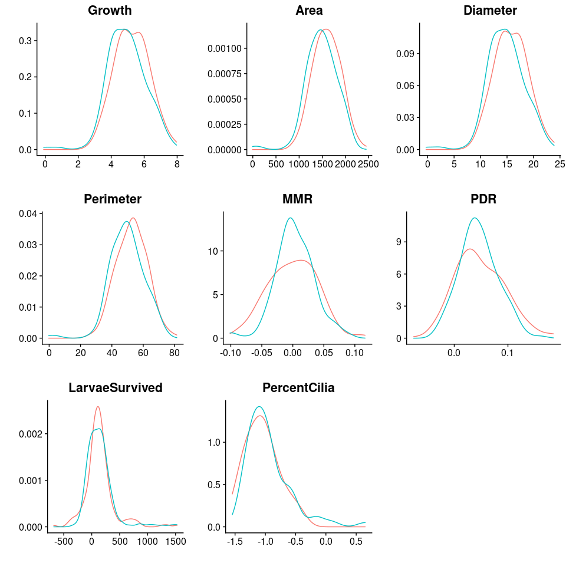

Estimating plasticity of larvae responses to OA
================

  - [Overview](#overview)
      - [Initial Visualization of Data](#initial-visualization-of-data)
  - [Option 1 - Estimating slopes via
    regression](#option-1---estimating-slopes-via-regression)
      - [Distribution of slopes for various phenotypes by parental
        treatment](#distribution-of-slopes-for-various-phenotypes-by-parental-treatment)
  - [Option 2 - Use bootstraping to generate a distribution of slopes
    based on the average of randomly sampled test
    datasets](#option-2---use-bootstraping-to-generate-a-distribution-of-slopes-based-on-the-average-of-randomly-sampled-test-datasets)
      - [Distribution of slopes for various phenotypes by parental
        treatment](#distribution-of-slopes-for-various-phenotypes-by-parental-treatment-1)

## Overview

With the 2018 larval data I think we have the potential to estimate both
traditional heritability of phenotypic variance and heritability of
plasticity. I haven’t seen this frequently discussed in the literature
from the perspective of heritability, but thinking of plasticity as the
slope of the reaction norm is common in other areas of evolutionary
biology. Given that we split individuals from each parental cross into
both larval control and exposed environments, we should have a simple
two environment reaction norm for each cross. Below I discuss two
approaches for slope estimation, which could subsequently be used as a
response variable with an animal model to estimate heritability of
plasticity.

**Larval Data**

``` r
jr <- readRDS("~/Github/2018OAExp_larvae/input_files/JarHeritabilityData.RDS")
ind <- readRDS("~/Github/2018OAExp_larvae/input_files/IndHeritabilityData.RDS")
```

### Initial Visualization of Data

Here we the estimated growth for each jar by larval treatment (x-axis)
and facet by parental treatment. You can see that OA has a significant
effect on larvae growth and parental treatment also seems to impact
growth in both treatments.

``` r
ggplot(jrp,aes(x=JarTrt,y=Growth,colour=JarTrt)) + 
  facet_grid(.~ParentTrt) + 
  geom_boxplot() +
  theme_cowplot() + 
  labs(x="Larval Environment",y="Larval Growth","Growth by Jar")
```

<!-- -->

Next, we summarize the mean growth among replicate jars (n approx. = 3)
and use grey lines to show the phenotypic plasticity (slope) of each
family cross. This was possible because zygotes created from parental
crosses were split with half going into a larval control treatment and
half going into an exposed treatment.

``` r
ggpaired(jrp_summary, x = "JarTrt", y = "Growth",id="parentalComb",
         color = "JarTrt", line.color = "gray", line.size = 0.4,facet.by = "ParentTrt") + 
  labs(x = "Larval Environment" , y = "Larval Growth") +
  theme(legend.position = "none")
```

<!-- -->

I think it makes sense to think of these grey lines as family specific
reaction norms, with the slope of each family representing a measure of
phenotypic plasticity of a particular phenotype (e.g. growth) in
response to a specific environmental stress (e.g. OA). In turn, to
examine the heritability of plasticity it might be appropriate to
estimate this slope for each family, and use this as our response
variable in the animal model.

Unfortunately, I have not see much literature on this approach, but I
can think of two ways in which we can estimate the slope for each
cross:  
\* **(Option 1)** : Use linear regresion to estimate the slope for each
family.  
\* **(Option 2)** : Use bootstrapping to estimate a slope distribution
for each family.

The former option is the simplest, but may be problematic because we
have a small number of replicates (n=3) and our data may not meet the
assumptions of regression. Alternatively, bootstrapping has fewer
assumptions, but generates a distribution rather than a single slope
estimate. I think we might then have to generate a number of test
datasets in which we randomly draw a single slope value for each family
from their respective distributions, then run each of these datasets
through the animal model to generate a distribution of possible mean
heritability estimates.

## Option 1 - Estimating slopes via regression

Here we fit a linear reaction norm to each family using regression. To
this I simply fitted a simple linear model (`lm`) to each family
separately (n = \~6 (3 control and 3 exposed)) using phenotype as the
response variable and jar pH as the explainatory variable. The slope
from this model represents an approximate measure of plasticity for each
family.

``` r
y <- c("Growth","Area","Diameter","Perimeter","MMR","PDR","LarvaeSurvived","AbnormalCount","PercentCilia")
x <- "JarpHNBS"
slope_mat <- matrix(ncol=length(y),nrow=length(unique(jrp$parentalComb)))
colnames(slope_mat) <- y
intercept_mat <- matrix(ncol=length(y),nrow=length(unique(jrp$parentalComb)))
colnames(intercept_mat) <- y
for( i in 1:length(unique(jrp$parentalComb))){
  for(j in 1:length(y)){
    temp <- jrp[jrp$parentalComb == unique(jrp$parentalComb)[i],]
    lm_out <- lm(temp[,y[j]]~temp[,x])
    lm_sum <- summary(lm_out)
    intercept_mat[i,j] <- lm_sum$coefficients[1,1]
    slope_mat[i,j] <- lm_sum$coefficients[2,1]
  }
}

jar_growth <- data.frame(parentalComb=unique(jrp$parentalComb))
jar_growth <- left_join(jar_growth,jrp_pcombo,by="parentalComb")
jar_intercept <- data.frame(jar_growth,intercept_mat)
jar_slope <- data.frame(jar_growth,slope_mat)

jar <- list(intercept=jar_intercept,slope=jar_slope)
```

### Distribution of slopes for various phenotypes by parental treatment

<!-- -->

## Option 2 - Use bootstraping to generate a distribution of slopes based on the average of randomly sampled test datasets

In this option, rather than estimating the slope for a family using
regression I make a list of all possible slopes given every combination
of control and exposed replicates per family. For example, for family
CF02\_CM02 I would calculate the slope of Control\_Rep1 x Exposed\_Rep2,
Control\_Rep1 x Exposed\_Rep2, and Control\_Rep1 x Exposed\_Rep3, then
do the same for Control\_Rep2 and Control\_Rep3. This would generate a
list with 9 possible slopes, based on all possible replicate
combinations. After doing this for all familys I then sample one slope
from each family to create a sample dataset. I do this 1 thousand times
(`REP=1000`). I am left with 1000 thousand test datasets for each
parental treatment, for each phenotype. I visuallize this data below by
plotting the distribution of slopes summarized across all replicate
datasets.

``` r
y <- c("Growth","Area","Diameter","Perimeter","MMR","PDR","LarvaeSurvived","PercentCilia")
x <- "JarpHNBS"
slope_comb <- rep(list(NULL),times=length(y))
names(slope_comb) <- y
jrp <- jrp[jrp$JarID != "J279_B1",]
jrp$AbnormalCount <- as.numeric(jrp$AbnormalCount)
jrp %>% group_by(parentalComb) %>% summarise(ParentTrt=unique(ParentTrt)) -> jrp_pcombo
```

    ## `summarise()` ungrouping output (override with `.groups` argument)

``` r
for(i in 1:length(y)){
  for(j in 1:length(unique(jrp$parentalComb))){
    temp <- jrp[jrp$parentalComb == unique(jrp$parentalComb)[j],]
    tc_y <- temp[temp$JarTrt == "Control",y[i]]
    tc_x <- temp[temp$JarTrt == "Control",x]
    te_y <- temp[temp$JarTrt == "Exposed",y[i]]
    te_x <- temp[temp$JarTrt == "Exposed",x]
    temp_slope <- NULL
    for(m in 1:length(tc_y)){
      for(n in 1:length(te_y)){
        temp_slope <- c(temp_slope,c(tc_y[m]-te_y[n])/c(tc_x[m]-te_x[n]))
      }
    }
    if(j == 1){
      slope_comb[[y[i]]] <- list(name=temp_slope)
    }else{
      slope_comb[[y[i]]] <- c(slope_comb[[y[i]]],name=list(temp_slope))
    }
  }
  names(slope_comb[[i]]) <- unique(jrp$parentalComb)
}
```

``` r
REP=1000
slope_reps <- rep(list(NULL),times=length(slope_comb))
names(slope_reps) <- names(slope_comb)
for(j in 1:length(slope_reps)){
  temp <- slope_comb[[names(slope_comb)[j]]]
  temp_mat <- matrix(nrow=(length(temp)),ncol=REP)
  colnames(temp_mat) <- paste0("Rep_",c(1:REP))
  rownames(temp_mat) <- names(temp)
  for(i in 1:length(temp)){
    temp_list <- temp[[i]]
    temp_mat[i,]<- sample(temp_list,size=REP,replace = T)
  }
  slope_reps[[j]] <- temp_mat
}
```

### Distribution of slopes for various phenotypes by parental treatment

``` r
plot_grid(plotlist = plot_slope_list2) 
```

    ## Warning: Removed 33376 rows containing non-finite values (stat_density).

<!-- -->
