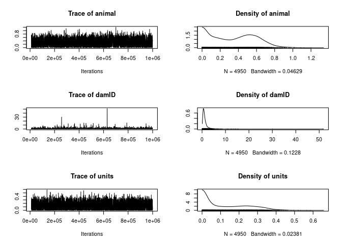

Estimating Heritability Example - Larval Growth
================
adowneywall
1/9/2021

  - [Overview](#overview)
      - [Data](#data)
  - [Estimating Heritability](#estimating-heritability)
      - [Priors](#priors)
          - [Inverse gamme prior](#inverse-gamme-prior)
          - [Chi square prior](#chi-square-prior)
  - [Model 1 - Simple model no added fixed or random effects and
    uninformative
    prior](#model-1---simple-model-no-added-fixed-or-random-effects-and-uninformative-prior)
      - [Model 1 - Diagnostics](#model-1---diagnostics)
  - [Model 2 - Changing to slightly more informative
    prior](#model-2---changing-to-slightly-more-informative-prior)
      - [Model 2 - Diagnostics](#model-2---diagnostics)
  - [Model 3 - Adding fixed effects - dam and
    sire](#model-3---adding-fixed-effects---dam-and-sire)
      - [Model 3 - Diagnostics](#model-3---diagnostics)
  - [Model 4 - Including dam and sire as random
    effects](#model-4---including-dam-and-sire-as-random-effects)
      - [Model 4 - Diagnostics](#model-4---diagnostics)
  - [Model 5 - Including Egg Diameter and Jar Chemistry as fixed
    effects](#model-5---including-egg-diameter-and-jar-chemistry-as-fixed-effects)
      - [Model 5 - Diagnostics](#model-5---diagnostics)
  - [Model 6 - Includes eggdiam and pCO2 as fixed effects and damID as
    random
    effect](#model-6---includes-eggdiam-and-pco2-as-fixed-effects-and-damid-as-random-effect)
      - [Model 6 - Diagnostics](#model-6---diagnostics)
  - [Model 7 - Includes damID as random
    effect](#model-7---includes-damid-as-random-effect)
      - [Model 7 - Diagnostics](#model-7---diagnostics)
  - [Summary of heritability by
    model](#summary-of-heritability-by-model)

# Overview

Here I look at estimating heritability of larvae growth using a bayesian
mixed modelling approach implemented in MCMCglmm. I specifically look at
the impact of an uninformative prior (inverse-gamma) vs. a slightly more
informative prior (Chi2), as well as the effect of including dam, sire,
and environment into the model.

After some initial testing I determined that 1 million iterations
(`nitt`), 10,000 generation burnin (`burnin=10000`), and 200 generation
thinning steps (`thin=200`) were mostly sufficient for reducing
autocorrelation (auto correlation \< 0.1) and generating a sufficient
effective population size (Ne \> 2000) for all models.

### Data

``` r
jr <- readRDS("~/Github/2018OAExp_larvae/input_files/JarHeritabilityData.RDS")
ind <- readRDS("~/Github/2018OAExp_larvae/input_files/IndHeritabilityData.RDS")

ped1 <- jr$ped
jrp <- jr$pheno

# Control Parents - Control Offspring 
jr_cc <- subset(jr$pheno, jr$pheno$JarTrt == "Control" & jr$pheno$ParentTrt == 400)
dam_cc <- data.frame(id=unique(jr_cc$damID),dam=NA,sire=NA)
sire_cc <- data.frame(id=unique(jr_cc$sireID),dam=NA,sire=NA)
ped_cc <- rbind(dam_cc,sire_cc,data.frame(id=jr_cc$animal,dam=jr_cc$damID,sire=jr_cc$sireID))
```

# Estimating Heritability

\#\#\#Assumptions of the animal model 1) The Y trait is normally
distributed (this assumption can be drop using generalized models) 2)
The breeding values ai are normally distributed and correlated among
related individuals. 3) The function of the pedigree is to structure the
correlation between individuals by taking into account their kinship. 4)
The residuals ei are normally distributed and uncorrelated. They also
are independent from the breeding values (e.g. no environment-genotype
interaction).

Things to remember \* Scale the phenotypes otherwise estimate of the
priors can be errorneous

**Scale Growth**

``` r
jr_cc$GrowthScale <- scale(jr_cc$Growth)
hist(jr_cc$GrowthScale,main="Scaled Growth",xlab="Scaled Growth")
```

<!-- -->
y-variable is mostly normal and is now scaled about 0.

## Priors

### Inverse gamme prior

Classic uninformative prior used in animal model. This prior doesn’t
inform posterior distribution estimates, meaning estimates shouls be
largely determined by the data (usefull when we do not have strong a
priori expectations).

``` r
prior1 <- list(R = list(V=1, nu=0.002), G = list(G1 = list(V=1, nu=0.002)))
```

### Chi square prior

Can be used when variance in data is small, slightly more informative
than inverse gamma prior.

``` r
prior2<-list(R=list(V=1,nu=1),
                G=list(G1=list(V=1,nu=1,alpha.mu=0,alpha.V=1000)))
```

**Chi-squared with two random effects with identical priors**

``` r
prior2.2 <- list(R = list(V=1, nu=0.002), G = list(G1 = list(V=1,nu=1,alpha.mu=0,alpha.V=1000),
                                                 G2 = list(V=1,nu=1,alpha.mu=0,alpha.V=1000)))
```

**Chi-squared with three random effects with identical priors**

``` r
prior2.3<-list(R=list(V=1,nu=1),
             G=list(G1=list(V=1,nu=1,alpha.mu=0,alpha.V=1000),
                    G2=list(V=1,nu=1,alpha.mu=0,alpha.V=1000),
                    G3=list(V=1,nu=1,alpha.mu=0,alpha.V=1000)))
```

# Model 1 - Simple model no added fixed or random effects and uninformative prior

Estimate heritability of larvae growth (jar-level) in absence of
treatment (i.e. control-control).

``` r
# Simple model with no fixed effects or additional random effects
model_mcmc  <- MCMCglmm(GrowthScale ~ 1,
                        random = ~ animal,
                        family = "gaussian",
                        prior = prior1,
                        pedigree = ped_cc,
                        data = jr_cc,
                        nitt = 1000000,
                        burnin = 10000,
                        thin = 200,
                        verbose = F)
```

    ## 
    ##  Iterations = 10001:999801
    ##  Thinning interval  = 200
    ##  Sample size  = 4950 
    ## 
    ##  DIC: -130.6399 
    ## 
    ##  G-structure:  ~animal
    ## 
    ##        post.mean l-95% CI u-95% CI eff.samp
    ## animal    0.7804   0.5199    1.079     5182
    ## 
    ##  R-structure:  ~units
    ## 
    ##       post.mean  l-95% CI u-95% CI eff.samp
    ## units    0.0212 0.0001696  0.08425     4551
    ## 
    ##  Location effects: GrowthScale ~ 1 
    ## 
    ##             post.mean l-95% CI u-95% CI eff.samp pMCMC
    ## (Intercept)   0.01118 -0.51512  0.50982     4950 0.959

## Model 1 - Diagnostics

<!-- --><!-- -->

    ##             (Intercept)
    ## Lag 0      1.0000000000
    ## Lag 200    0.0011707279
    ## Lag 1000  -0.0007529958
    ## Lag 2000   0.0279156649
    ## Lag 10000 -0.0213597216

    ##                 animal        units
    ## Lag 0      1.000000000  1.000000000
    ## Lag 200   -0.022983248  0.010339005
    ## Lag 1000  -0.022072673 -0.008993247
    ## Lag 2000   0.010534178  0.020593276
    ## Lag 10000 -0.006221704 -0.035187384

    ## (Intercept) 
    ##        4950

    ##   animal    units 
    ## 5181.839 4551.243

    ##                                      
    ##        Stationarity start     p-value
    ##        test         iteration        
    ## animal passed       1         0.496  
    ## units  passed       1         0.458  
    ##                                  
    ##        Halfwidth Mean   Halfwidth
    ##        test                      
    ## animal passed    0.7804 0.003933 
    ## units  passed    0.0212 0.000924

# Model 2 - Changing to slightly more informative prior

``` r
# Simple model with no fixed effects or additional random effects
model2_mcmc  <- MCMCglmm(GrowthScale ~ 1,
                        random = ~ animal,
                        family = "gaussian",
                        prior = prior2,
                        pedigree = ped_cc,
                        data = jr_cc,
                        nitt = 1000000,
                        burnin = 10000,
                        thin = 200,
                        verbose = F)
```

    ## 
    ##  Iterations = 10001:999801
    ##  Thinning interval  = 200
    ##  Sample size  = 4950 
    ## 
    ##  DIC: 109.4951 
    ## 
    ##  G-structure:  ~animal
    ## 
    ##        post.mean l-95% CI u-95% CI eff.samp
    ## animal    0.6714    0.392   0.9845     4950
    ## 
    ##  R-structure:  ~units
    ## 
    ##       post.mean l-95% CI u-95% CI eff.samp
    ## units    0.1672  0.06159   0.2982     4493
    ## 
    ##  Location effects: GrowthScale ~ 1 
    ## 
    ##             post.mean l-95% CI u-95% CI eff.samp pMCMC
    ## (Intercept)   0.01212 -0.45811  0.50851     4950 0.981

## Model 2 - Diagnostics

<!-- --><!-- -->

    ##            (Intercept)
    ## Lag 0      1.000000000
    ## Lag 200   -0.012827539
    ## Lag 1000   0.009448347
    ## Lag 2000   0.002386010
    ## Lag 10000  0.009487555

    ##                 animal        units
    ## Lag 0      1.000000000  1.000000000
    ## Lag 200   -0.001046061  0.016120542
    ## Lag 1000   0.005837736 -0.002730065
    ## Lag 2000  -0.007183069 -0.001174510
    ## Lag 10000  0.010607673 -0.006852505

    ## (Intercept) 
    ##        4950

    ##   animal    units 
    ## 4950.000 4493.001

    ##                                      
    ##        Stationarity start     p-value
    ##        test         iteration        
    ## animal passed       1         0.943  
    ## units  passed       1         0.757  
    ##                                 
    ##        Halfwidth Mean  Halfwidth
    ##        test                     
    ## animal passed    0.671 0.00434  
    ## units  passed    0.167 0.00193

# Model 3 - Adding fixed effects - dam and sire

``` r
model3_mcmc  <- MCMCglmm(GrowthScale ~ 1 + damID + sireID,
                         random = ~ animal,
                         family = "gaussian",
                         prior = prior2,
                         pedigree = ped_cc,
                         data = jr_cc,
                         nitt = 1000000,
                         burnin = 10000,
                         thin = 200,
                         verbose = F)
```

    ## 
    ##  Iterations = 10001:999801
    ##  Thinning interval  = 200
    ##  Sample size  = 4950 
    ## 
    ##  DIC: 124.626 
    ## 
    ##  G-structure:  ~animal
    ## 
    ##        post.mean  l-95% CI u-95% CI eff.samp
    ## animal    0.1355 6.886e-10   0.4214     5748
    ## 
    ##  R-structure:  ~units
    ## 
    ##       post.mean l-95% CI u-95% CI eff.samp
    ## units    0.2735   0.1139   0.4254     4950
    ## 
    ##  Location effects: GrowthScale ~ 1 + damID + sireID 
    ## 
    ##              post.mean   l-95% CI   u-95% CI eff.samp   pMCMC   
    ## (Intercept) -0.0001998 -0.7238863  0.6924366     4950 0.99273   
    ## damIDCF02    1.0892437  0.3224347  1.9030123     5207 0.01051 * 
    ## damIDCF03   -0.9979606 -1.7849214 -0.2337448     5925 0.01818 * 
    ## damIDCF04    0.8800645  0.1173786  1.7407225     4950 0.04040 * 
    ## damIDCF05    1.3632045  0.5837389  2.1286579     5118 0.00364 **
    ## damIDCF06   -0.8753799 -1.6345181 -0.0855219     4977 0.03152 * 
    ## damIDCF07    0.7359905 -0.0179548  1.5393071     4950 0.06101 . 
    ## damIDCF08    0.2285355 -0.5650827  0.9995590     4950 0.54465   
    ## sireIDCM02  -0.1911097 -0.9070889  0.5040798     5531 0.55677   
    ## sireIDCM03  -0.3623378 -1.0807583  0.3380931     5501 0.27475   
    ## sireIDCM04  -0.2540995 -1.0112363  0.4747829     5184 0.46586   
    ## sireIDCM05  -0.6370843 -1.4260968  0.0955282     5195 0.09010 . 
    ## ---
    ## Signif. codes:  0 '***' 0.001 '**' 0.01 '*' 0.05 '.' 0.1 ' ' 1

### Model 3 - Diagnostics

<!-- --><!-- --><!-- --><!-- --><!-- -->

    ## (Intercept)   damIDCF02   damIDCF03   damIDCF04   damIDCF05   damIDCF06 
    ##    4950.000    5206.997    5924.530    4950.000    5118.478    4976.645 
    ##   damIDCF07   damIDCF08  sireIDCM02  sireIDCM03  sireIDCM04  sireIDCM05 
    ##    4950.000    4950.000    5531.202    5500.757    5184.261    5194.558

    ##   animal    units 
    ## 5748.413 4950.000

    ##                                      
    ##        Stationarity start     p-value
    ##        test         iteration        
    ## animal passed       1         0.669  
    ## units  passed       1         0.934  
    ##                                 
    ##        Halfwidth Mean  Halfwidth
    ##        test                     
    ## animal passed    0.136 0.00358  
    ## units  passed    0.274 0.00224

# Model 4 - Including dam and sire as random effects

``` r
model4_mcmc  <- MCMCglmm(GrowthScale ~ 1,
                         random = ~ animal + damID + sireID,
                         family = "gaussian",
                         prior = prior2.3,
                         pedigree = ped_cc,
                         data = jr_cc,
                         nitt = 1000000,
                         burnin = 10000,
                         thin = 200,
                         verbose = F)
```

    ## 
    ##  Iterations = 10001:999801
    ##  Thinning interval  = 200
    ##  Sample size  = 4950 
    ## 
    ##  DIC: 125.0471 
    ## 
    ##  G-structure:  ~animal
    ## 
    ##        post.mean  l-95% CI u-95% CI eff.samp
    ## animal    0.1099 5.527e-09   0.3655     4950
    ## 
    ##                ~damID
    ## 
    ##       post.mean l-95% CI u-95% CI eff.samp
    ## damID     1.279   0.1906    3.279     4950
    ## 
    ##                ~sireID
    ## 
    ##        post.mean  l-95% CI u-95% CI eff.samp
    ## sireID     0.149 1.241e-08   0.4977     4950
    ## 
    ##  R-structure:  ~units
    ## 
    ##       post.mean l-95% CI u-95% CI eff.samp
    ## units    0.2811   0.1195   0.4267     4949
    ## 
    ##  Location effects: GrowthScale ~ 1 
    ## 
    ##             post.mean l-95% CI u-95% CI eff.samp pMCMC
    ## (Intercept)    0.0165  -0.8684   0.9115     4950 0.974

## Model 4 - Diagnostics

<!-- --><!-- -->

    ## (Intercept) 
    ##        4950

    ##   animal    damID   sireID    units 
    ## 4950.000 4950.000 4950.000 4949.191

    ##            (Intercept)
    ## Lag 0      1.000000000
    ## Lag 200    0.014760857
    ## Lag 1000  -0.001923193
    ## Lag 2000  -0.018830904
    ## Lag 10000  0.017406060

    ##                 animal        damID       sireID         units
    ## Lag 0      1.000000000  1.000000000  1.000000000  1.0000000000
    ## Lag 200   -0.009426528  0.005252327  0.002498747 -0.0067008455
    ## Lag 1000   0.003949244 -0.002545586  0.005716284  0.0001457465
    ## Lag 2000   0.007379726  0.008158577 -0.002965709  0.0101040753
    ## Lag 10000  0.030913636  0.017530258  0.001790496  0.0099362952

    ##                                      
    ##        Stationarity start     p-value
    ##        test         iteration        
    ## animal passed          1      0.107  
    ## damID  passed       1486      0.145  
    ## sireID passed          1      0.968  
    ## units  passed          1      0.374  
    ##                                 
    ##        Halfwidth Mean  Halfwidth
    ##        test                     
    ## animal passed    0.110 0.00340  
    ## damID  passed    1.249 0.03958  
    ## sireID failed    0.149 0.02231  
    ## units  passed    0.281 0.00217

# Model 5 - Including Egg Diameter and Jar Chemistry as fixed effects

``` r
model5_mcmc  <- MCMCglmm(GrowthScale ~ 1 + EggDiamum + JarpCO2_SW,
                         random = ~ animal,
                         family = "gaussian",
                         prior = prior2,
                         pedigree = ped_cc,
                         data = jr_cc,
                         nitt = 1000000,
                         burnin = 10000,
                         thin = 200,
                         verbose = F)
```

    ## 
    ##  Iterations = 10001:999801
    ##  Thinning interval  = 200
    ##  Sample size  = 4950 
    ## 
    ##  DIC: 112.9408 
    ## 
    ##  G-structure:  ~animal
    ## 
    ##        post.mean  l-95% CI u-95% CI eff.samp
    ## animal    0.1627 4.067e-07   0.3516     4999
    ## 
    ##  R-structure:  ~units
    ## 
    ##       post.mean l-95% CI u-95% CI eff.samp
    ## units    0.2344  0.09996   0.3866     4950
    ## 
    ##  Location effects: GrowthScale ~ 1 + EggDiamum + JarpCO2_SW 
    ## 
    ##             post.mean  l-95% CI  u-95% CI eff.samp  pMCMC    
    ## (Intercept) 22.034948 16.712850 27.034864     4950 <2e-04 ***
    ## EggDiamum   -0.315292 -0.389337 -0.233019     4950 <2e-04 ***
    ## JarpCO2_SW  -0.002969 -0.004822 -0.001271     4950 <2e-04 ***
    ## ---
    ## Signif. codes:  0 '***' 0.001 '**' 0.01 '*' 0.05 '.' 0.1 ' ' 1

## Model 5 - Diagnostics

<!-- --><!-- -->

    ## (Intercept)   EggDiamum  JarpCO2_SW 
    ##        4950        4950        4950

    ##   animal    units 
    ## 4999.486 4950.000

    ##            (Intercept)    EggDiamum   JarpCO2_SW
    ## Lag 0      1.000000000  1.000000000  1.000000000
    ## Lag 200   -0.005287452 -0.010555054  0.006914619
    ## Lag 1000   0.018821773  0.023363102  0.006888916
    ## Lag 2000  -0.009227510 -0.012525896 -0.001787837
    ## Lag 10000  0.004176343  0.008272884 -0.004428335

    ##                 animal        units
    ## Lag 0      1.000000000  1.000000000
    ## Lag 200   -0.015799255 -0.010449354
    ## Lag 1000   0.027736454  0.021572657
    ## Lag 2000   0.003701659 -0.003093982
    ## Lag 10000  0.002373306  0.012688333

    ##                                      
    ##        Stationarity start     p-value
    ##        test         iteration        
    ## animal passed       1         0.359  
    ## units  passed       1         0.279  
    ##                                 
    ##        Halfwidth Mean  Halfwidth
    ##        test                     
    ## animal passed    0.163 0.00286  
    ## units  passed    0.234 0.00214

# Model 6 - Includes eggdiam and pCO2 as fixed effects and damID as random effect

``` r
model6_mcmc  <- MCMCglmm(GrowthScale ~ 1 + EggDiamum + JarpCO2_SW,
                         random = ~ animal + damID,
                         family = "gaussian",
                         prior = prior2.2,
                         pedigree = ped_cc,
                         data = jr_cc,
                         nitt = 1000000,
                         burnin = 10000,
                         thin = 200,
                         verbose = F)
```

    ## 
    ##  Iterations = 10001:999801
    ##  Thinning interval  = 200
    ##  Sample size  = 4950 
    ## 
    ##  DIC: -0.623141 
    ## 
    ##  G-structure:  ~animal
    ## 
    ##        post.mean  l-95% CI u-95% CI eff.samp
    ## animal    0.2656 2.744e-09   0.5715     3177
    ## 
    ##                ~damID
    ## 
    ##       post.mean  l-95% CI u-95% CI eff.samp
    ## damID    0.1464 6.582e-08   0.5063     4432
    ## 
    ##  R-structure:  ~units
    ## 
    ##       post.mean  l-95% CI u-95% CI eff.samp
    ## units    0.1356 0.0002839   0.3118     3137
    ## 
    ##  Location effects: GrowthScale ~ 1 + EggDiamum + JarpCO2_SW 
    ## 
    ##             post.mean  l-95% CI  u-95% CI eff.samp   pMCMC    
    ## (Intercept) 21.969803 13.253129 31.115459     4950 0.00121 ** 
    ## EggDiamum   -0.314626 -0.451635 -0.175500     4950 0.00202 ** 
    ## JarpCO2_SW  -0.002931 -0.004583 -0.001215     4875 < 2e-04 ***
    ## ---
    ## Signif. codes:  0 '***' 0.001 '**' 0.01 '*' 0.05 '.' 0.1 ' ' 1

## Model 6 - Diagnostics

<!-- --><!-- -->

    ##            (Intercept)    EggDiamum   JarpCO2_SW
    ## Lag 0      1.000000000  1.000000000  1.000000000
    ## Lag 200    0.005874992  0.002092484 -0.017991975
    ## Lag 1000   0.001125120  0.002883255  0.008956848
    ## Lag 2000   0.005773174  0.005960009  0.023043970
    ## Lag 10000 -0.015232611 -0.014038078 -0.004535536

    ##                  animal        damID        units
    ## Lag 0      1.0000000000  1.000000000  1.000000000
    ## Lag 200    0.1877364060  0.022515560  0.196322347
    ## Lag 1000   0.0295067003 -0.004760158  0.012768141
    ## Lag 2000  -0.0009870043  0.018767679 -0.004352459
    ## Lag 10000  0.0282792845 -0.003185815  0.027649915

    ##                                      
    ##        Stationarity start     p-value
    ##        test         iteration        
    ## animal passed       1         0.825  
    ## damID  passed       1         0.670  
    ## units  passed       1         0.919  
    ##                                 
    ##        Halfwidth Mean  Halfwidth
    ##        test                     
    ## animal passed    0.266 0.00664  
    ## damID  passed    0.146 0.00770  
    ## units  passed    0.136 0.00377

# Model 7 - Includes damID as random effect

``` r
model7_mcmc  <- MCMCglmm(GrowthScale ~ 1,
                         random = ~ animal + damID,
                         family = "gaussian",
                         prior = prior2.2,
                         pedigree = ped_cc,
                         data = jr_cc,
                         nitt = 1000000,
                         burnin = 10000,
                         thin = 200,
                         verbose = F)
```

    ## 
    ##  Iterations = 10001:999801
    ##  Thinning interval  = 200
    ##  Sample size  = 4950 
    ## 
    ##  DIC: -0.623141 
    ## 
    ##  G-structure:  ~animal
    ## 
    ##        post.mean  l-95% CI u-95% CI eff.samp
    ## animal    0.2656 2.744e-09   0.5715     3177
    ## 
    ##                ~damID
    ## 
    ##       post.mean  l-95% CI u-95% CI eff.samp
    ## damID    0.1464 6.582e-08   0.5063     4432
    ## 
    ##  R-structure:  ~units
    ## 
    ##       post.mean  l-95% CI u-95% CI eff.samp
    ## units    0.1356 0.0002839   0.3118     3137
    ## 
    ##  Location effects: GrowthScale ~ 1 + EggDiamum + JarpCO2_SW 
    ## 
    ##             post.mean  l-95% CI  u-95% CI eff.samp   pMCMC    
    ## (Intercept) 21.969803 13.253129 31.115459     4950 0.00121 ** 
    ## EggDiamum   -0.314626 -0.451635 -0.175500     4950 0.00202 ** 
    ## JarpCO2_SW  -0.002931 -0.004583 -0.001215     4875 < 2e-04 ***
    ## ---
    ## Signif. codes:  0 '***' 0.001 '**' 0.01 '*' 0.05 '.' 0.1 ' ' 1

## Model 7 - Diagnostics

<!-- --><!-- -->

    ##             (Intercept)
    ## Lag 0      1.0000000000
    ## Lag 200    0.0111313827
    ## Lag 1000   0.0003285822
    ## Lag 2000   0.0073114765
    ## Lag 10000 -0.0079114396

    ##                 animal        damID        units
    ## Lag 0      1.000000000  1.000000000  1.000000000
    ## Lag 200    0.202521009  0.082190950  0.212267078
    ## Lag 1000  -0.007637932  0.009160797 -0.013153812
    ## Lag 2000  -0.010495170 -0.015454198 -0.011385729
    ## Lag 10000  0.007216331  0.006034340 -0.002135591

    ##                                      
    ##        Stationarity start     p-value
    ##        test         iteration        
    ## animal passed       1486      0.0587 
    ## damID  passed          1      0.5198 
    ## units  passed       1486      0.0563 
    ##                                 
    ##        Halfwidth Mean  Halfwidth
    ##        test                     
    ## animal passed    0.364 0.01007  
    ## damID  passed    1.206 0.04560  
    ## units  passed    0.135 0.00516

# Summary of heritability by model

| method  | prior         | fixed\_effects                             | random\_effects           |          DIC |  H2\_mean | H2\_lower | H2\_upper |
| :------ | :------------ | :----------------------------------------- | :------------------------ | -----------: | --------: | --------: | --------: |
| Model 1 | Inverse-Gamma | GrowthScale \~ 1                           | \~animal                  | \-130.639911 | 0.9728703 | 0.8546034 | 0.9992725 |
| Model 2 | Chi-squared   | GrowthScale \~ 1                           | \~animal                  |   109.495121 | 0.7968553 | 0.6142423 | 0.9158351 |
| Model 3 | Chi-squared   | GrowthScale \~ 1 + damID + sireID          | \~animal                  |   124.626012 | 0.2886267 | 0.0008539 | 0.7779996 |
| Model 4 | Chi-squared   | GrowthScale \~ 1                           | \~animal + damID + sireID |   125.047074 | 0.0762336 | 0.0001219 | 0.3307456 |
| Model 5 | Chi-squared   | GrowthScale \~ 1 + EggDiamum + JarpCO2\_SW | \~animal                  |   112.940765 | 0.3932160 | 0.0145460 | 0.7645400 |
| Model 6 | Chi-squared   | GrowthScale \~ 1 + EggDiamum + JarpCO2\_SW | \~animal + damID          |   \-0.623141 | 0.4899237 | 0.0032417 | 0.9817851 |
| Model 6 | Chi-squared   | GrowthScale \~ 1 + EggDiamum + JarpCO2\_SW | \~animal + damID          |   \-0.623141 | 0.2625436 | 0.0014714 | 0.7117893 |
