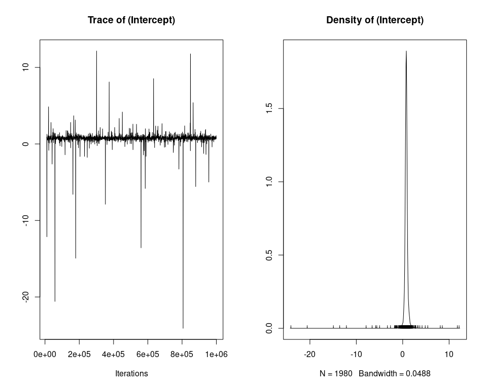
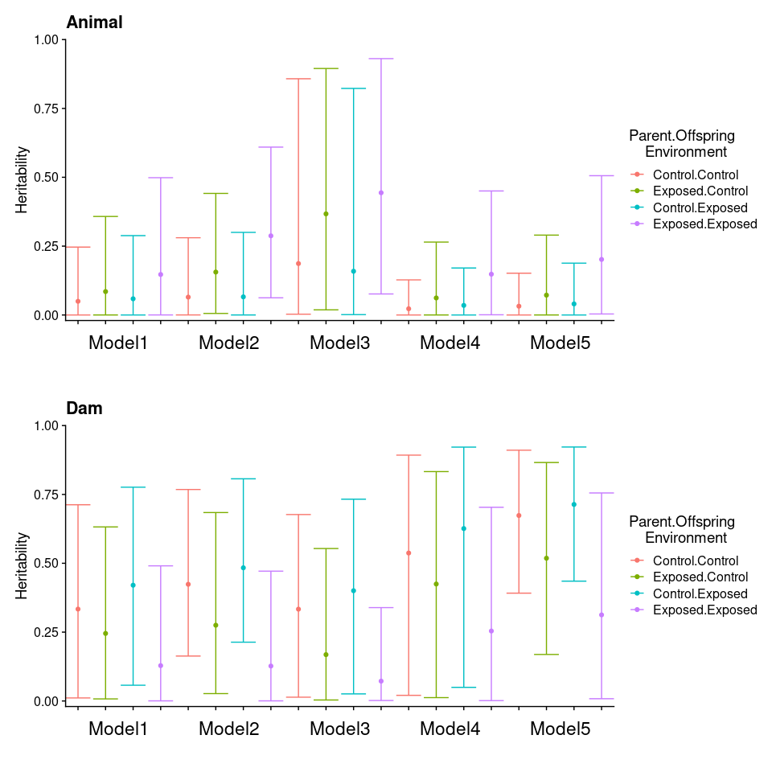

Heritability Growth Estimate
================

## Overview

In this markdown I use an animal model to estimate narrow-sense
heritability and a measure of maternal inheritance. In both cases these
estimates were measured as:


Where σ<sub>a</sub> is the additive genetic variance (or variance
associated with `damID`) and σ<sub>P</sub> is the total phenotypic
variance (calculated by summing all sources of estimated variance).

I explore 5 different models that examine the inclusion of different
random effects, priors, and input data (individual vs. mean family
summary by jar). Table of models:

|  Model  | Data Input  |  Prior Type   | Prior Name |                 Random Effects                 |
| :-----: | :---------: | :-----------: | :--------: | :--------------------------------------------: |
| Model 1 | Individual  |      Chi      |  Prior2.5  | \~ animal + DamID + SireID + JarTrt + SeaTable |
| Model 2 | Individual  |      Chi      |  Prior2.3  |           \~ animal + DamID + JarTrt           |
| Model 3 | Individual  | Inverse-Gamma |  Prior1.3  |           \~ animal + DamID + JarTrt           |
| Model 4 | Mean Family |      Chi      |  Prior2.3  |          \~ animal + DamID + SeaTable          |
| Model 5 | Mean Family |      Chi      |  Prior2.2  |               \~ animal + DamID                |

  - **Model 1** : Complete model with all random effects.
  - **Model 2** : Model with Sire and SeaTable removed. This was done
    because Sire explained very littl variation and SeaTable was also
    largely uninformative, but would occasionaly generate a very large
    estimate. I am not sure what is generating this pattern, but it
    caused the mean phenotypic variance to become greatly inflated.
  - **Model 3** : Model with reduced random effects and uninformative
    prior (inverse-gamma)
  - **Model 4** : Model using growth data summarized (mean) for each
    Jar. This greatly reduced replication, but I was interested in
    seeing how it impacted heritability estimates compared to the more
    traditional animal model. In this model i included all possible
    random effects (no Jar).
  - **Model 5** : Continuation of Model 4 but without SeaTable as random
    effect (same rationale as Model 2).

## Data

``` r
jr <- readRDS("~/Github/2018OAExp_larvae/input_files/JarHeritabilityData.RDS")
ind <- readRDS("~/Github/2018OAExp_larvae/input_files/IndHeritabilityData.RDS")

pheno <- ind$pheno
hist(pheno$GrowthPerDay)
pheno$GrowthScale <-scale(pheno$GrowthPerDay)
ped1 <- jr$ped
jrp <- jr$pheno
jrp$GrowthScale <-scale(jrp$Growth)

# Control Parents - Control Offspring 
cc <- subset(pheno, pheno$JarTrt == "Control" & pheno$ParentTrt == 400)
dam_cc <- data.frame(id=unique(cc$damID),dam=NA,sire=NA)
sire_cc <- data.frame(id=unique(cc$sireID),dam=NA,sire=NA)
ped_cc <- rbind(dam_cc,sire_cc,data.frame(id=cc$animal,dam=cc$damID,sire=cc$sireID))

ped_cc_brms <- ped_cc
ped_cc_brms$dam[ped_cc$dam == 0] <- NA
ped_cc_brms$sire[ped_cc$sire == 0] <- NA

jr_cc <- subset(jrp, jrp$JarTrt == "Control" & jrp$ParentTrt == 400)
dam_jr_cc <- data.frame(id=unique(jr_cc$damID),dam=NA,sire=NA)
sire_jr_cc <- data.frame(id=unique(jr_cc$sireID),dam=NA,sire=NA)
ped_jr_cc <- rbind(dam_jr_cc,sire_jr_cc,data.frame(id=jr_cc$animal,dam=jr_cc$damID,sire=jr_cc$sireID))

# Control Parents - Exposed Offspring 
ce <- subset(pheno, pheno$JarTrt == "Exposed" & pheno$ParentTrt == 400)
dam_ce <- data.frame(id=unique(ce$damID),dam=NA,sire=NA)
sire_ce <- data.frame(id=unique(ce$sireID),dam=NA,sire=NA)
ped_ce <- rbind(dam_ce,sire_ce,data.frame(id=ce$animal,dam=ce$damID,sire=ce$sireID))

ped_ce_brms <- ped_ce
ped_ce_brms$dam[ped_ce$dam == 0] <- NA
ped_ce_brms$sire[ped_ce$sire == 0] <- NA

jr_ce <- subset(jrp, jrp$JarTrt == "Exposed" & jrp$ParentTrt == 400)
dam_jr_ce <- data.frame(id=unique(jr_ce$damID),dam=NA,sire=NA)
sire_jr_ce <- data.frame(id=unique(jr_ce$sireID),dam=NA,sire=NA)
ped_jr_ce <- rbind(dam_jr_ce,sire_jr_ce,data.frame(id=jr_ce$animal,dam=jr_ce$damID,sire=jr_ce$sireID))

# Exposed Parents - Control Offspring 
ec <- subset(pheno, pheno$JarTrt == "Control" & pheno$ParentTrt == 2600)
dam_ec <- data.frame(id=unique(ec$damID),dam=NA,sire=NA)
sire_ec <- data.frame(id=unique(ec$sireID),dam=NA,sire=NA)
ped_ec <- rbind(dam_ec,sire_ec,data.frame(id=ec$animal,dam=ec$damID,sire=ec$sireID))

ped_ec_brms <- ped_ec
ped_ec_brms$dam[ped_ec$dam == 0] <- NA
ped_ec_brms$sire[ped_ec$sire == 0] <- NA

jr_ec <- subset(jrp, jrp$JarTrt == "Control" & jrp$ParentTrt == 2600)
dam_jr_ec <- data.frame(id=unique(jr_ec$damID),dam=NA,sire=NA)
sire_jr_ec <- data.frame(id=unique(jr_ec$sireID),dam=NA,sire=NA)
ped_jr_ec <- rbind(dam_jr_ec,sire_jr_ec,data.frame(id=jr_ec$animal,dam=jr_ec$damID,sire=jr_ec$sireID))

# Exposed Parents - Exposed Offspring 
ee <- subset(pheno, pheno$JarTrt == "Exposed" & pheno$ParentTrt == 2600)
dam_ee <- data.frame(id=unique(ee$damID),dam=NA,sire=NA)
sire_ee <- data.frame(id=unique(ee$sireID),dam=NA,sire=NA)
ped_ee <- rbind(dam_ee,sire_ee,data.frame(id=ee$animal,dam=ee$damID,sire=ee$sireID))

ped_ee_brms <- ped_ee
ped_ee_brms$dam[ped_ee$dam == 0] <- NA
ped_ee_brms$sire[ped_ee$sire == 0] <- NA

jr_ee <- subset(jrp, jrp$JarTrt == "Exposed" & jrp$ParentTrt == 2600)
dam_jr_ee <- data.frame(id=unique(jr_ee$damID),dam=NA,sire=NA)
sire_jr_ee <- data.frame(id=unique(jr_ee$sireID),dam=NA,sire=NA)
ped_jr_ee <- rbind(dam_jr_ee,sire_jr_ee,data.frame(id=jr_ee$animal,dam=jr_ee$damID,sire=jr_ee$sireID))
```

## Priors

``` r
# Inverse-Gamma (uninformative)
prior1.3 <- list(R = list(V=1, nu=0.002), G = list(G1 = list(V=1, nu=0.002),
                                                   G2 = list(V=1, nu=0.002),
                                                   G3 = list(V=1, nu=0.002)))
# Chi-Square (mildly informative)
prior2.2<-list(R=list(V=1,nu=1),
               G=list(G1=list(V=1,nu=1,alpha.mu=0,alpha.V=1000),
                      G2=list(V=1,nu=1,alpha.mu=0,alpha.V=1000)))

prior2.3<-list(R=list(V=1,nu=1),
               G=list(G1=list(V=1,nu=1,alpha.mu=0,alpha.V=1000),
                      G2=list(V=1,nu=1,alpha.mu=0,alpha.V=1000),
                      G3=list(V=1,nu=1,alpha.mu=0,alpha.V=1000)))

prior2.5<-list(R=list(V=1,nu=1),
               G=list(G1=list(V=1,nu=1,alpha.mu=0,alpha.V=1000),
                      G2=list(V=1,nu=1,alpha.mu=0,alpha.V=1000),
                      G3=list(V=1,nu=1,alpha.mu=0,alpha.V=1000),
                      G4=list(V=1,nu=1,alpha.mu=0,alpha.V=1000),
                      G5=list(V=1,nu=1,alpha.mu=0,alpha.V=1000)))
```

## Model Function

``` r
runModel <- function(pheno,ped,prior,model_name,parentTrt,offspringTrt){
  if(model_name == "Model1"){
    model_mcmc  <- MCMCglmm(GrowthScale ~ 1,
                            random = ~ animal + damID + sireID + JarID + JarSeatable,
                            family = "gaussian",
                            prior = prior,
                            pedigree = ped,
                            data = pheno,
                            nitt = 5000000,
                            burnin = 10000,
                            thin = 1000)
  }
  if(model_name == "Model2"){
    model_mcmc  <- MCMCglmm(GrowthScale ~ 1,
                             random = ~ animal + damID + JarID ,
                             family = "gaussian",
                             prior = prior,
                             pedigree = ped,
                             data = pheno,
                             nitt = 1000000,
                             burnin = 10000,
                             thin = 1000)
  }
  if(model_name == "Model3"){
    model_mcmc  <- MCMCglmm(GrowthScale ~ 1,
                             random = ~ animal + damID + JarID,
                             family = "gaussian",
                             prior = prior,
                             pedigree = ped,
                             data = pheno,
                             nitt = 5000000,
                             burnin = 10000,
                             thin = 1000)
  }
  if(model_name == "Model4"){
    model_mcmc  <- MCMCglmm(GrowthScale ~ 1,
                             random = ~ animal + damID + SeaTable,
                             family = "gaussian",
                             prior = prior,
                             pedigree = ped,
                             data = pheno,
                             nitt = 5000000,
                             burnin = 10000,
                             thin = 1000)
  }
  if(model_name == "Model5"){
    model_mcmc  <- MCMCglmm(GrowthScale ~ 1,
                             random = ~ animal + damID,
                             family = "gaussian",
                             prior = prior,
                             pedigree = ped,
                             data = pheno,
                             nitt = 5000000,
                             burnin = 10000,
                             thin = 1000)
  }
  
  model_sum <- summary(model_mcmc)
  list_var <- list()
  for(i in 1:ncol(model_mcmc$VCV)){
    list_var[[i]] <- model_mcmc$VCV[,colnames(model_mcmc$VCV)[i]]
  }
  names(list_var)<-colnames(model_mcmc$VCV)
  mt1 <- data.frame(matrix(unlist(list_var), ncol = length(colnames(model_mcmc$VCV)), byrow = F))
  colnames(mt1)<-colnames(model_mcmc$VCV)
  mt1$Pheno <- rowSums(mt1)
  mt1$animal_H2 <- mt1$animal / mt1$Pheno
  mt1$damID <- mt1$damID / mt1$Pheno
  
  eff <- c("animal","damID","sireID","JarID","JarSeatable","Pheno")
  values <- NULL
  for(i in eff){
    if(!is.na(match(i,colnames(mt1)))){
      values <- c(values,mean(mt1[,i]))
      values <- c(values,quantile(mt1[,i],0.025))
      values <- c(values,quantile(mt1[,i],0.975))
    }else{
      values <- c(values,NA)
      values <- c(values,NA)
      values <- c(values,NA)
    }
  }
  col_names <- paste0(rep(eff,each=3),c("_mean","_lower","_upper"))
  values <- data.frame(round(t(as.matrix(values)),5))
  colnames(values) <- col_names
  summary_table <- data.frame(model=model_name,Parent_Env=parentTrt,Offspring_Env=offspringTrt,values)
  
  return(list(model=model_mcmc,model_summary=model_sum,variance_output=mt1,summary_table))
}
```

## Model Runs

``` r
# Control - Control
cc_mod1 <- runModel(cc,ped_cc,prior2.2,"Model1","Control","Control")
cc_mod2 <- runModel(cc,ped_cc,prior2.2,"Model2","Control","Control")
cc_mod3 <- runModel(cc,ped_cc,prior2.2,"Model3","Control","Control")
cc_mod4 <- runModel(jr_cc,ped_jr_cc,prior2.2,"Model4","Control","Control")
cc_mod5 <- runModel(jr_cc,ped_jr_cc,prior2.2,"Model5","Control","Control")
cc <- list(mod1=cc_mod1,mod2=cc_mod1,mod3=cc_mod1,mod4=cc_mod1,mod5=cc_mod1) 
# Control - Exposed
ce_mod1 <- runModel(ce,ped_ce,prior2.2,"Model1","Control","Exposed")
ce_mod2 <- runModel(ce,ped_ce,prior2.2,"Model2","Control","Exposed")
ce_mod3 <- runModel(ce,ped_ce,prior2.2,"Model3","Control","Exposed")
ce_mod4 <- runModel(jr_ce,ped_jr_ce,prior2.2,"Model4","Control","Exposed")
ce_mod5 <- runModel(jr_ce,ped_jr_ce,prior2.2,"Model5","Control","Exposed")
ce <- list(mod1=ce_mod1,mod2=ce_mod1,mod3=ce_mod1,mod4=ce_mod1,mod5=ce_mod1) 
# Exposed - Control
ec_mod1 <- runModel(ec,ped_ec,prior2.2,"Model1","Exposed","Control")
ec_mod2 <- runModel(ec,ped_ec,prior2.2,"Model2","Exposed","Control")
ec_mod3 <- runModel(ec,ped_ec,prior2.2,"Model3","Exposed","Control")
ec_mod4 <- runModel(jr_ec,ped_jr_ec,prior2.2,"Model4","Exposed","Control")
ec_mod5 <- runModel(jr_ec,ped_jr_ec,prior2.2,"Model5","Exposed","Control")
ec <- list(mod1=ec_mod1,mod2=ec_mod1,mod3=ec_mod1,mod4=ec_mod1,mod5=ec_mod1) 
# Exposed - Exposed
ee_mod1 <- runModel(ee,ped_ee,prior2.2,"Model1","Exposed","Exposed")
ee_mod2 <- runModel(ee,ped_ee,prior2.2,"Model2","Exposed","Exposed")
ee_mod3 <- runModel(ee,ped_ee,prior2.2,"Model3","Exposed","Exposed")
ee_mod4 <- runModel(jr_ee,ped_jr_ee,prior2.2,"Model4","Exposed","Exposed")
ee_mod5 <- runModel(jr_ee,ped_jr_ee,prior2.2,"Model5","Exposed","Exposed")
ee <- list(mod1=ee_mod1,mod2=ee_mod1,mod3=ee_mod1,mod4=ee_mod1,mod5=ee_mod1)

mod_output <- list(cc=cc,ce=ce,ec=ec,ee=ee)
```

## Diagnostic Outputs

    ## [1] " "
    ## [1] "#########################     Model1     #########################" 
    ## [2] "#########################     Control     #########################"
    ## [3] "#########################     Control     #########################"
    ## [1] " "
    ## 
    ##  Iterations = 10001:4999001
    ##  Thinning interval  = 1000
    ##  Sample size  = 4990 
    ## 
    ##  DIC: 635.3476 
    ## 
    ##  G-structure:  ~animal
    ## 
    ##        post.mean  l-95% CI u-95% CI eff.samp
    ## animal   0.01963 1.164e-08  0.07093     4990
    ## 
    ##                ~damID
    ## 
    ##       post.mean l-95% CI u-95% CI eff.samp
    ## damID    0.1592  0.01966   0.4161     4990
    ## 
    ##                ~sireID
    ## 
    ##        post.mean l-95% CI u-95% CI eff.samp
    ## sireID   0.01932 1.66e-09  0.06441     4990
    ## 
    ##                ~JarID
    ## 
    ##       post.mean l-95% CI u-95% CI eff.samp
    ## JarID   0.02213  0.01025  0.03665     5205
    ## 
    ##                ~JarSeatable
    ## 
    ##             post.mean  l-95% CI u-95% CI eff.samp
    ## JarSeatable     4.005 8.092e-10    2.392     4398
    ## 
    ##  R-structure:  ~units
    ## 
    ##       post.mean l-95% CI u-95% CI eff.samp
    ## units    0.1279  0.09657   0.1519     4990
    ## 
    ##  Location effects: GrowthScale ~ 1 
    ## 
    ##             post.mean l-95% CI u-95% CI eff.samp  pMCMC  
    ## (Intercept)    0.6980  -0.1455   1.3650     6267 0.0593 .
    ## ---
    ## Signif. codes:  0 '***' 0.001 '**' 0.01 '*' 0.05 '.' 0.1 ' ' 1
    ## [1] " "

<!-- -->

    ## [1] " "

<!-- --><!-- -->

    ## [1] " "
    ##            (Intercept)
    ## Lag 0      1.000000000
    ## Lag 1000  -0.113511113
    ## Lag 5000  -0.002357284
    ## Lag 10000  0.004838469
    ## Lag 50000  0.014652296
    ## [1] " "
    ##                  animal        damID       sireID        JarID   JarSeatable
    ## Lag 0      1.0000000000  1.000000000  1.000000000  1.000000000  1.0000000000
    ## Lag 1000   0.0064973358 -0.003378813 -0.004219674 -0.021236236  0.0629403055
    ## Lag 5000  -0.0112692402  0.008357186  0.007807068  0.006722314 -0.0014268481
    ## Lag 10000  0.0018780447  0.018480530  0.005327502 -0.019839897 -0.0011306192
    ## Lag 50000 -0.0001700902 -0.003093153  0.016524508  0.016072152 -0.0009195543
    ##                  units
    ## Lag 0      1.000000000
    ## Lag 1000  -0.001175398
    ## Lag 5000   0.004465481
    ## Lag 10000 -0.021924110
    ## Lag 50000  0.018151669
    ## [1] " "
    ## (Intercept) 
    ##     6266.64 
    ## [1] " "
    ##      animal       damID      sireID       JarID JarSeatable       units 
    ##    4990.000    4990.000    4990.000    5205.492    4398.169    4990.000 
    ## [1] " "
    ##                                           
    ##             Stationarity start     p-value
    ##             test         iteration        
    ## animal      passed       1         0.920  
    ## damID       passed       1         0.213  
    ## sireID      passed       1         0.745  
    ## JarID       passed       1         0.785  
    ## JarSeatable passed       1         0.430  
    ## units       passed       1         0.518  
    ##                                       
    ##             Halfwidth Mean   Halfwidth
    ##             test                      
    ## animal      passed    0.0196 0.000675 
    ## damID       passed    0.1592 0.004462 
    ## sireID      failed    0.0193 0.002942 
    ## JarID       passed    0.0221 0.000189 
    ## JarSeatable failed    4.0050 3.059886 
    ## units       passed    0.1279 0.000392 
    ## [1] " "
    ## [1] " "
    ## [1] " "
    ## [1] " "
    ## [1] "#########################     Model2     #########################" 
    ## [2] "#########################     Control     #########################"
    ## [3] "#########################     Control     #########################"
    ## [1] " "
    ## 
    ##  Iterations = 10001:4999001
    ##  Thinning interval  = 1000
    ##  Sample size  = 4990 
    ## 
    ##  DIC: 637.4525 
    ## 
    ##  G-structure:  ~animal
    ## 
    ##        post.mean l-95% CI u-95% CI eff.samp
    ## animal   0.01984 8.27e-09  0.06702     4990
    ## 
    ##                ~damID
    ## 
    ##       post.mean l-95% CI u-95% CI eff.samp
    ## damID    0.1637  0.01411   0.4184     4990
    ## 
    ##                ~JarID
    ## 
    ##       post.mean l-95% CI u-95% CI eff.samp
    ## JarID   0.02656  0.01261  0.04205     4990
    ## 
    ##  R-structure:  ~units
    ## 
    ##       post.mean l-95% CI u-95% CI eff.samp
    ## units    0.1277  0.09982   0.1522     4990
    ## 
    ##  Location effects: GrowthScale ~ 1 
    ## 
    ##             post.mean l-95% CI u-95% CI eff.samp    pMCMC    
    ## (Intercept)    0.6915   0.4014   0.9904     5291 0.000802 ***
    ## ---
    ## Signif. codes:  0 '***' 0.001 '**' 0.01 '*' 0.05 '.' 0.1 ' ' 1
    ## [1] " "

<!-- -->

    ## [1] " "

<!-- -->

    ## [1] " "
    ##             (Intercept)
    ## Lag 0      1.0000000000
    ## Lag 1000  -0.0293723191
    ## Lag 5000   0.0071589176
    ## Lag 10000 -0.0047960088
    ## Lag 50000 -0.0006350793
    ## [1] " "
    ##                 animal        damID        JarID         units
    ## Lag 0      1.000000000  1.000000000  1.000000000  1.0000000000
    ## Lag 1000   0.005866532 -0.016071271 -0.015806369  0.0176340380
    ## Lag 5000   0.004115506  0.013279486 -0.002793244 -0.0003720989
    ## Lag 10000 -0.007555559 -0.001652921 -0.001712347 -0.0020014903
    ## Lag 50000  0.002635238 -0.017256860 -0.028774687 -0.0112299575
    ## [1] " "
    ## (Intercept) 
    ##    5290.946 
    ## [1] " "
    ## animal  damID  JarID  units 
    ##   4990   4990   4990   4990 
    ## [1] " "
    ##                                      
    ##        Stationarity start     p-value
    ##        test         iteration        
    ## animal passed       1         0.619  
    ## damID  passed       1         0.363  
    ## JarID  passed       1         0.111  
    ## units  passed       1         0.898  
    ##                                  
    ##        Halfwidth Mean   Halfwidth
    ##        test                      
    ## animal passed    0.0198 0.000644 
    ## damID  passed    0.1637 0.005151 
    ## JarID  passed    0.0266 0.000217 
    ## units  passed    0.1277 0.000380 
    ## [1] " "
    ## [1] " "
    ## [1] " "
    ## [1] " "
    ## [1] "#########################     Model3     #########################" 
    ## [2] "#########################     Control     #########################"
    ## [3] "#########################     Control     #########################"
    ## [1] " "
    ## 
    ##  Iterations = 10001:4999001
    ##  Thinning interval  = 1000
    ##  Sample size  = 4990 
    ## 
    ##  DIC: 300.2673 
    ## 
    ##  G-structure:  ~animal
    ## 
    ##        post.mean  l-95% CI u-95% CI eff.samp
    ## animal   0.05619 0.0001247   0.2508     1240
    ## 
    ##                ~damID
    ## 
    ##       post.mean l-95% CI u-95% CI eff.samp
    ## damID    0.1115  0.00028    0.289     4125
    ## 
    ##                ~JarID
    ## 
    ##       post.mean l-95% CI u-95% CI eff.samp
    ## JarID   0.02548   0.0125  0.04075     4990
    ## 
    ##  R-structure:  ~units
    ## 
    ##       post.mean l-95% CI u-95% CI eff.samp
    ## units     0.108 0.000822   0.1432     1257
    ## 
    ##  Location effects: GrowthScale ~ 1 
    ## 
    ##             post.mean l-95% CI u-95% CI eff.samp    pMCMC    
    ## (Intercept)    0.6865   0.4058   0.9524     4990 0.000401 ***
    ## ---
    ## Signif. codes:  0 '***' 0.001 '**' 0.01 '*' 0.05 '.' 0.1 ' ' 1
    ## [1] " "

<!-- -->

    ## [1] " "

<!-- -->

    ## [1] " "
    ##            (Intercept)
    ## Lag 0      1.000000000
    ## Lag 1000  -0.002611273
    ## Lag 5000   0.003628504
    ## Lag 10000 -0.002562404
    ## Lag 50000  0.006578452
    ## [1] " "
    ##                animal        damID        JarID        units
    ## Lag 0     1.000000000  1.000000000  1.000000000  1.000000000
    ## Lag 1000  0.579109036  0.005895518  0.017307484  0.562801639
    ## Lag 5000  0.116300722  0.028008060  0.009246256  0.113505964
    ## Lag 10000 0.022407774 -0.002476701 -0.002230904  0.025182656
    ## Lag 50000 0.002766007  0.006100631  0.003249069 -0.001376516
    ## [1] " "
    ## (Intercept) 
    ##        4990 
    ## [1] " "
    ##   animal    damID    JarID    units 
    ## 1240.113 4124.836 4990.000 1256.847 
    ## [1] " "
    ##                                      
    ##        Stationarity start     p-value
    ##        test         iteration        
    ## animal passed       1         0.553  
    ## damID  passed       1         0.200  
    ## JarID  passed       1         0.936  
    ## units  passed       1         0.480  
    ##                                  
    ##        Halfwidth Mean   Halfwidth
    ##        test                      
    ## animal passed    0.0562 0.004404 
    ## damID  passed    0.1115 0.003415 
    ## JarID  passed    0.0255 0.000204 
    ## units  passed    0.1080 0.002220 
    ## [1] " "
    ## [1] " "
    ## [1] " "
    ## [1] " "
    ## [1] "#########################     Model4     #########################" 
    ## [2] "#########################     Control     #########################"
    ## [3] "#########################     Control     #########################"
    ## [1] " "
    ## 
    ##  Iterations = 10001:999501
    ##  Thinning interval  = 500
    ##  Sample size  = 1980 
    ## 
    ##  DIC: -3.22251 
    ## 
    ##  G-structure:  ~animal
    ## 
    ##        post.mean  l-95% CI u-95% CI eff.samp
    ## animal  0.006275 3.449e-09  0.02263     1980
    ## 
    ##                ~damID
    ## 
    ##       post.mean l-95% CI u-95% CI eff.samp
    ## damID    0.2012  0.03012   0.5049     2133
    ## 
    ##                ~SeaTable
    ## 
    ##          post.mean  l-95% CI u-95% CI eff.samp
    ## SeaTable     4.589 3.601e-08    2.199     1980
    ## 
    ##  R-structure:  ~units
    ## 
    ##       post.mean l-95% CI u-95% CI eff.samp
    ## units   0.05895  0.03749   0.0819     1980
    ## 
    ##  Location effects: GrowthScale ~ 1 
    ## 
    ##             post.mean l-95% CI u-95% CI eff.samp  pMCMC  
    ## (Intercept)    0.7240   0.1059   1.5457     1980 0.0495 *
    ## ---
    ## Signif. codes:  0 '***' 0.001 '**' 0.01 '*' 0.05 '.' 0.1 ' ' 1
    ## [1] " "

<!-- -->

    ## [1] " "

<!-- -->

    ## [1] " "
    ##            (Intercept)
    ## Lag 0      1.000000000
    ## Lag 500   -0.009573243
    ## Lag 2500  -0.023605960
    ## Lag 5000  -0.002816401
    ## Lag 25000  0.006456628
    ## [1] " "
    ##                 animal       damID     SeaTable        units
    ## Lag 0      1.000000000  1.00000000  1.000000000  1.000000000
    ## Lag 500    0.006169853 -0.03735486  0.012270370 -0.006143074
    ## Lag 2500   0.037622159  0.03504519 -0.006139653  0.009371842
    ## Lag 5000  -0.007882645 -0.01531571 -0.005324064  0.014402432
    ## Lag 25000 -0.019657133  0.02677296 -0.006654381  0.010356057
    ## [1] " "
    ## (Intercept) 
    ##        1980 
    ## [1] " "
    ##   animal    damID SeaTable    units 
    ## 1980.000 2132.587 1980.000 1980.000 
    ## [1] " "
    ##                                        
    ##          Stationarity start     p-value
    ##          test         iteration        
    ## animal   passed       1         0.8098 
    ## damID    passed       1         0.1864 
    ## SeaTable passed       1         0.0633 
    ## units    passed       1         0.6830 
    ##                                     
    ##          Halfwidth Mean    Halfwidth
    ##          test                       
    ## animal   passed    0.00628 0.000368 
    ## damID    passed    0.20125 0.008853 
    ## SeaTable failed    4.58877 2.256465 
    ## units    passed    0.05895 0.000520 
    ## [1] " "
    ## [1] " "
    ## [1] " "
    ## [1] " "
    ## [1] "#########################     Model5     #########################" 
    ## [2] "#########################     Control     #########################"
    ## [3] "#########################     Control     #########################"
    ## [1] " "
    ## 
    ##  Iterations = 10001:999501
    ##  Thinning interval  = 500
    ##  Sample size  = 1980 
    ## 
    ##  DIC: -0.1237489 
    ## 
    ##  G-structure:  ~animal
    ## 
    ##        post.mean l-95% CI u-95% CI eff.samp
    ## animal  0.006884 1.25e-09  0.02303     1852
    ## 
    ##                ~damID
    ## 
    ##       post.mean l-95% CI u-95% CI eff.samp
    ## damID    0.1961  0.02971    0.508     1773
    ## 
    ##  R-structure:  ~units
    ## 
    ##       post.mean l-95% CI u-95% CI eff.samp
    ## units   0.06315  0.04202  0.09042     1980
    ## 
    ##  Location effects: GrowthScale ~ 1 
    ## 
    ##             post.mean l-95% CI u-95% CI eff.samp   pMCMC   
    ## (Intercept)    0.7521   0.4004   1.0207     1980 0.00101 **
    ## ---
    ## Signif. codes:  0 '***' 0.001 '**' 0.01 '*' 0.05 '.' 0.1 ' ' 1
    ## [1] " "

<!-- -->

    ## [1] " "

<!-- -->

    ## [1] " "
    ##            (Intercept)
    ## Lag 0      1.000000000
    ## Lag 500   -0.012725486
    ## Lag 2500   0.006790790
    ## Lag 5000  -0.037474661
    ## Lag 25000 -0.006942916
    ## [1] " "
    ##                 animal        damID        units
    ## Lag 0      1.000000000  1.000000000  1.000000000
    ## Lag 500    0.033216065  0.054992223  0.008850595
    ## Lag 2500   0.006371048 -0.025546394 -0.003935345
    ## Lag 5000  -0.032961783 -0.003490581  0.005394909
    ## Lag 25000 -0.018388725 -0.006760505 -0.008568985
    ## [1] " "
    ## (Intercept) 
    ##        1980 
    ## [1] " "
    ##   animal    damID    units 
    ## 1851.757 1772.686 1980.000 
    ## [1] " "
    ##                                      
    ##        Stationarity start     p-value
    ##        test         iteration        
    ## animal passed       1         0.433  
    ## damID  passed       1         0.965  
    ## units  passed       1         0.975  
    ##                                   
    ##        Halfwidth Mean    Halfwidth
    ##        test                       
    ## animal passed    0.00688 0.000401 
    ## damID  passed    0.19614 0.009163 
    ## units  passed    0.06315 0.000556 
    ## [1] " "
    ## [1] " "
    ## [1] " "
    ## [1] " "
    ## [1] "#########################     Model1     #########################" 
    ## [2] "#########################     Control     #########################"
    ## [3] "#########################     Exposed     #########################"
    ## [1] " "
    ## 
    ##  Iterations = 10001:4999001
    ##  Thinning interval  = 1000
    ##  Sample size  = 4990 
    ## 
    ##  DIC: 1000.311 
    ## 
    ##  G-structure:  ~animal
    ## 
    ##        post.mean  l-95% CI u-95% CI eff.samp
    ## animal   0.04114 2.711e-11   0.1524     4928
    ## 
    ##                ~damID
    ## 
    ##       post.mean l-95% CI u-95% CI eff.samp
    ## damID    0.3649  0.03844   0.9312     4666
    ## 
    ##                ~sireID
    ## 
    ##        post.mean  l-95% CI u-95% CI eff.samp
    ## sireID   0.04079 2.604e-09   0.1319     4990
    ## 
    ##                ~JarID
    ## 
    ##       post.mean l-95% CI u-95% CI eff.samp
    ## JarID   0.06162  0.03179  0.09201     4990
    ## 
    ##                ~JarSeatable
    ## 
    ##             post.mean  l-95% CI u-95% CI eff.samp
    ## JarSeatable     2.566 2.168e-10   0.9383     4604
    ## 
    ##  R-structure:  ~units
    ## 
    ##       post.mean l-95% CI u-95% CI eff.samp
    ## units    0.2007   0.1396   0.2445     4987
    ## 
    ##  Location effects: GrowthScale ~ 1 
    ## 
    ##             post.mean l-95% CI u-95% CI eff.samp pMCMC  
    ## (Intercept)   -1.0289  -1.6514  -0.3005     4531 0.024 *
    ## ---
    ## Signif. codes:  0 '***' 0.001 '**' 0.01 '*' 0.05 '.' 0.1 ' ' 1
    ## [1] " "

<!-- -->

    ## [1] " "

<!-- --><!-- -->

    ## [1] " "
    ##            (Intercept)
    ## Lag 0     1.000000e+00
    ## Lag 1000  1.656692e-02
    ## Lag 5000  4.819116e-05
    ## Lag 10000 7.654076e-03
    ## Lag 50000 4.516328e-03
    ## [1] " "
    ##                 animal        damID        sireID        JarID  JarSeatable
    ## Lag 0      1.000000000  1.000000000  1.0000000000  1.000000000  1.000000000
    ## Lag 1000  -0.021425040 -0.021785221 -0.0018074804 -0.003606178  0.040187433
    ## Lag 5000   0.009210691 -0.011153342 -0.0022651832 -0.005860602 -0.002041261
    ## Lag 10000 -0.001955748 -0.009076332  0.0004622024  0.012600304 -0.002129422
    ## Lag 50000 -0.017543874 -0.018226370 -0.0022814659 -0.026441655 -0.002172051
    ##                 units
    ## Lag 0      1.00000000
    ## Lag 1000  -0.03034250
    ## Lag 5000   0.01535632
    ## Lag 10000 -0.00460740
    ## Lag 50000 -0.02186470
    ## [1] " "
    ## (Intercept) 
    ##    4530.844 
    ## [1] " "
    ##      animal       damID      sireID       JarID JarSeatable       units 
    ##    4928.345    4666.408    4990.000    4990.000    4603.502    4986.830 
    ## [1] " "
    ##                                           
    ##             Stationarity start     p-value
    ##             test         iteration        
    ## animal      passed          1      0.600  
    ## damID       passed          1      0.448  
    ## sireID      passed       1498      0.242  
    ## JarID       passed          1      0.742  
    ## JarSeatable passed          1      0.337  
    ## units       passed          1      0.426  
    ##                                       
    ##             Halfwidth Mean   Halfwidth
    ##             test                      
    ## animal      passed    0.0411 0.001419 
    ## damID       passed    0.3649 0.010901 
    ## sireID      failed    0.0344 0.004041 
    ## JarID       passed    0.0616 0.000438 
    ## JarSeatable failed    2.5657 1.537041 
    ## units       passed    0.2007 0.000768 
    ## [1] " "
    ## [1] " "
    ## [1] " "
    ## [1] " "
    ## [1] "#########################     Model2     #########################" 
    ## [2] "#########################     Control     #########################"
    ## [3] "#########################     Exposed     #########################"
    ## [1] " "
    ## 
    ##  Iterations = 10001:4999001
    ##  Thinning interval  = 1000
    ##  Sample size  = 4990 
    ## 
    ##  DIC: 1001.875 
    ## 
    ##  G-structure:  ~animal
    ## 
    ##        post.mean  l-95% CI u-95% CI eff.samp
    ## animal   0.03947 2.812e-10   0.1398     4664
    ## 
    ##                ~damID
    ## 
    ##       post.mean l-95% CI u-95% CI eff.samp
    ## damID    0.3659  0.03051   0.9072     4990
    ## 
    ##                ~JarID
    ## 
    ##       post.mean l-95% CI u-95% CI eff.samp
    ## JarID   0.06283  0.03452  0.09386     4990
    ## 
    ##  R-structure:  ~units
    ## 
    ##       post.mean l-95% CI u-95% CI eff.samp
    ## units    0.2011   0.1445   0.2442     4608
    ## 
    ##  Location effects: GrowthScale ~ 1 
    ## 
    ##             post.mean l-95% CI u-95% CI eff.samp   pMCMC   
    ## (Intercept)    -1.015   -1.457   -0.594     4990 0.00281 **
    ## ---
    ## Signif. codes:  0 '***' 0.001 '**' 0.01 '*' 0.05 '.' 0.1 ' ' 1
    ## [1] " "

<!-- -->

    ## [1] " "

<!-- -->

    ## [1] " "
    ##            (Intercept)
    ## Lag 0      1.000000000
    ## Lag 1000  -0.013077463
    ## Lag 5000   0.017096462
    ## Lag 10000  0.003467090
    ## Lag 50000 -0.004608894
    ## [1] " "
    ##                 animal         damID        JarID         units
    ## Lag 0      1.000000000  1.0000000000  1.000000000  1.0000000000
    ## Lag 1000   0.033718211  0.0154626901 -0.007386676  0.0397373455
    ## Lag 5000   0.001910489  0.0034059207 -0.018548778  0.0010093295
    ## Lag 10000 -0.010589839 -0.0064718761  0.005635800  0.0031104395
    ## Lag 50000 -0.006267688  0.0007506907 -0.006804836 -0.0002643978
    ## [1] " "
    ## (Intercept) 
    ##        4990 
    ## [1] " "
    ##   animal    damID    JarID    units 
    ## 4663.534 4990.000 4990.000 4607.654 
    ## [1] " "
    ##                                      
    ##        Stationarity start     p-value
    ##        test         iteration        
    ## animal passed          1      0.237  
    ## damID  passed          1      0.209  
    ## JarID  passed          1      0.747  
    ## units  passed       1498      0.101  
    ##                                  
    ##        Halfwidth Mean   Halfwidth
    ##        test                      
    ## animal passed    0.0395 0.001344 
    ## damID  passed    0.3659 0.009610 
    ## JarID  passed    0.0628 0.000440 
    ## units  passed    0.2007 0.000871 
    ## [1] " "
    ## [1] " "
    ## [1] " "
    ## [1] " "
    ## [1] "#########################     Model3     #########################" 
    ## [2] "#########################     Control     #########################"
    ## [3] "#########################     Exposed     #########################"
    ## [1] " "
    ## 
    ##  Iterations = 10001:4999001
    ##  Thinning interval  = 1000
    ##  Sample size  = 4990 
    ## 
    ##  DIC: 600.222 
    ## 
    ##  G-structure:  ~animal
    ## 
    ##        post.mean  l-95% CI u-95% CI eff.samp
    ## animal   0.09002 0.0002122   0.4181    951.5
    ## 
    ##                ~damID
    ## 
    ##       post.mean  l-95% CI u-95% CI eff.samp
    ## damID    0.2633 0.0003994   0.6699     4990
    ## 
    ##                ~JarID
    ## 
    ##       post.mean l-95% CI u-95% CI eff.samp
    ## JarID   0.06084  0.03299  0.09145     4990
    ## 
    ##  R-structure:  ~units
    ## 
    ##       post.mean l-95% CI u-95% CI eff.samp
    ## units     0.175  0.00049   0.2325      973
    ## 
    ##  Location effects: GrowthScale ~ 1 
    ## 
    ##             post.mean l-95% CI u-95% CI eff.samp    pMCMC    
    ## (Intercept)   -1.0118  -1.4177  -0.6182     4990 0.000802 ***
    ## ---
    ## Signif. codes:  0 '***' 0.001 '**' 0.01 '*' 0.05 '.' 0.1 ' ' 1
    ## [1] " "

<!-- -->

    ## [1] " "

<!-- -->

    ## [1] " "
    ##             (Intercept)
    ## Lag 0      1.000000e+00
    ## Lag 1000   5.259970e-03
    ## Lag 5000   2.907404e-05
    ## Lag 10000 -3.097129e-03
    ## Lag 50000  2.011611e-03
    ## [1] " "
    ##                 animal         damID        JarID        units
    ## Lag 0      1.000000000  1.0000000000  1.000000000  1.000000000
    ## Lag 1000   0.639624554  0.0002327105  0.019431851  0.625030378
    ## Lag 5000   0.182207609 -0.0100660282  0.001113553  0.180967739
    ## Lag 10000  0.050423260  0.0218833666 -0.005931579  0.054348994
    ## Lag 50000 -0.004240177  0.0541456628  0.010113108 -0.007298745
    ## [1] " "
    ## (Intercept) 
    ##        4990 
    ## [1] " "
    ##    animal     damID     JarID     units 
    ##  951.5303 4990.0000 4990.0000  973.0201 
    ## [1] " "
    ##                                      
    ##        Stationarity start     p-value
    ##        test         iteration        
    ## animal passed       1         0.793  
    ## damID  passed       1         0.525  
    ## JarID  passed       1         0.739  
    ## units  passed       1         0.790  
    ##                                  
    ##        Halfwidth Mean   Halfwidth
    ##        test                      
    ## animal passed    0.0900 0.008479 
    ## damID  passed    0.2633 0.007100 
    ## JarID  passed    0.0608 0.000433 
    ## units  passed    0.1750 0.004253 
    ## [1] " "
    ## [1] " "
    ## [1] " "
    ## [1] " "
    ## [1] "#########################     Model4     #########################" 
    ## [2] "#########################     Control     #########################"
    ## [3] "#########################     Exposed     #########################"
    ## [1] " "
    ## 
    ##  Iterations = 10001:999501
    ##  Thinning interval  = 500
    ##  Sample size  = 1980 
    ## 
    ##  DIC: 50.75239 
    ## 
    ##  G-structure:  ~animal
    ## 
    ##        post.mean  l-95% CI u-95% CI eff.samp
    ## animal   0.01842 3.742e-08  0.06476     2207
    ## 
    ##                ~damID
    ## 
    ##       post.mean l-95% CI u-95% CI eff.samp
    ## damID    0.4461   0.0718    1.158     1980
    ## 
    ##                ~SeaTable
    ## 
    ##          post.mean  l-95% CI u-95% CI eff.samp
    ## SeaTable     4.446 7.148e-09    1.381    847.2
    ## 
    ##  R-structure:  ~units
    ## 
    ##       post.mean l-95% CI u-95% CI eff.samp
    ## units    0.1105  0.06666   0.1544     1980
    ## 
    ##  Location effects: GrowthScale ~ 1 
    ## 
    ##             post.mean l-95% CI u-95% CI eff.samp  pMCMC  
    ## (Intercept)   -1.1021  -1.9475  -0.3831     2469 0.0333 *
    ## ---
    ## Signif. codes:  0 '***' 0.001 '**' 0.01 '*' 0.05 '.' 0.1 ' ' 1
    ## [1] " "

<!-- -->

    ## [1] " "

<!-- -->

    ## [1] " "
    ##           (Intercept)
    ## Lag 0      1.00000000
    ## Lag 500   -0.11529286
    ## Lag 2500  -0.06741895
    ## Lag 5000   0.01551303
    ## Lag 25000  0.01502683
    ## [1] " "
    ##                 animal        damID      SeaTable        units
    ## Lag 0      1.000000000  1.000000000  1.000000e+00  1.000000000
    ## Lag 500    0.001429999 -0.010519465  2.289669e-01  0.002176284
    ## Lag 2500  -0.018134744  0.010316358  4.973566e-05 -0.017201631
    ## Lag 5000  -0.012892261 -0.004700068 -7.701638e-04 -0.015934611
    ## Lag 25000  0.003583670 -0.028088590 -2.281726e-03 -0.003595853
    ## [1] " "
    ## (Intercept) 
    ##     2469.27 
    ## [1] " "
    ##    animal     damID  SeaTable     units 
    ## 2206.6820 1980.0000  847.2038 1980.0000 
    ## [1] " "
    ##                                        
    ##          Stationarity start     p-value
    ##          test         iteration        
    ## animal   passed         1       0.995  
    ## damID    passed         1       0.166  
    ## SeaTable passed       199       0.938  
    ## units    passed         1       0.608  
    ##                                    
    ##          Halfwidth Mean   Halfwidth
    ##          test                      
    ## animal   passed    0.0184 0.000956 
    ## damID    passed    0.4461 0.018148 
    ## SeaTable failed    1.8816 1.147895 
    ## units    passed    0.1105 0.001019 
    ## [1] " "
    ## [1] " "
    ## [1] " "
    ## [1] " "
    ## [1] "#########################     Model5     #########################" 
    ## [2] "#########################     Control     #########################"
    ## [3] "#########################     Exposed     #########################"
    ## [1] " "
    ## 
    ##  Iterations = 10001:999501
    ##  Thinning interval  = 500
    ##  Sample size  = 1980 
    ## 
    ##  DIC: 49.3783 
    ## 
    ##  G-structure:  ~animal
    ## 
    ##        post.mean  l-95% CI u-95% CI eff.samp
    ## animal   0.01816 2.469e-08  0.06299     2818
    ## 
    ##                ~damID
    ## 
    ##       post.mean l-95% CI u-95% CI eff.samp
    ## damID     0.435  0.05287    1.103     1980
    ## 
    ##  R-structure:  ~units
    ## 
    ##       post.mean l-95% CI u-95% CI eff.samp
    ## units    0.1099   0.0662    0.155     1980
    ## 
    ##  Location effects: GrowthScale ~ 1 
    ## 
    ##             post.mean l-95% CI u-95% CI eff.samp   pMCMC   
    ## (Intercept)    -1.113   -1.625   -0.669     1980 0.00404 **
    ## ---
    ## Signif. codes:  0 '***' 0.001 '**' 0.01 '*' 0.05 '.' 0.1 ' ' 1
    ## [1] " "

<!-- -->

    ## [1] " "

<!-- -->

    ## [1] " "
    ##           (Intercept)
    ## Lag 0     1.000000000
    ## Lag 500   0.014354724
    ## Lag 2500  0.001641230
    ## Lag 5000  0.003260645
    ## Lag 25000 0.003893064
    ## [1] " "
    ##                  animal        damID         units
    ## Lag 0      1.0000000000  1.000000000  1.0000000000
    ## Lag 500    0.0135323724  0.018379212 -0.0099923238
    ## Lag 2500  -0.0355121363 -0.054440430  0.0155777291
    ## Lag 5000  -0.0006517582 -0.011680169 -0.0003297457
    ## Lag 25000 -0.0120569501  0.009397063 -0.0014722105
    ## [1] " "
    ## (Intercept) 
    ##        1980 
    ## [1] " "
    ##   animal    damID    units 
    ## 2818.036 1980.000 1980.000 
    ## [1] " "
    ##                                      
    ##        Stationarity start     p-value
    ##        test         iteration        
    ## animal passed       1         0.508  
    ## damID  passed       1         0.829  
    ## units  passed       1         0.153  
    ##                                  
    ##        Halfwidth Mean   Halfwidth
    ##        test                      
    ## animal passed    0.0182 0.000813 
    ## damID  passed    0.4350 0.016682 
    ## units  passed    0.1099 0.001022 
    ## [1] " "
    ## [1] " "
    ## [1] " "
    ## [1] " "
    ## [1] "#########################     Model1     #########################" 
    ## [2] "#########################     Exposed     #########################"
    ## [3] "#########################     Control     #########################"
    ## [1] " "
    ## 
    ##  Iterations = 10001:4999001
    ##  Thinning interval  = 1000
    ##  Sample size  = 4990 
    ## 
    ##  DIC: 565.4806 
    ## 
    ##  G-structure:  ~animal
    ## 
    ##        post.mean  l-95% CI u-95% CI eff.samp
    ## animal   0.02663 2.371e-08  0.08455     4990
    ## 
    ##                ~damID
    ## 
    ##       post.mean  l-95% CI u-95% CI eff.samp
    ## damID   0.09955 6.543e-08   0.2666     4638
    ## 
    ##                ~sireID
    ## 
    ##        post.mean  l-95% CI u-95% CI eff.samp
    ## sireID    0.0201 1.808e-09  0.07436     4990
    ## 
    ##                ~JarID
    ## 
    ##       post.mean l-95% CI u-95% CI eff.samp
    ## JarID   0.02212 0.008687  0.03768     5248
    ## 
    ##                ~JarSeatable
    ## 
    ##             post.mean  l-95% CI u-95% CI eff.samp
    ## JarSeatable     1.489 8.026e-11   0.9976     4687
    ## 
    ##  R-structure:  ~units
    ## 
    ##       post.mean l-95% CI u-95% CI eff.samp
    ## units    0.1259  0.09276   0.1536     4990
    ## 
    ##  Location effects: GrowthScale ~ 1 
    ## 
    ##             post.mean l-95% CI u-95% CI eff.samp  pMCMC  
    ## (Intercept)    0.9640   0.4531   1.4991     5565 0.0212 *
    ## ---
    ## Signif. codes:  0 '***' 0.001 '**' 0.01 '*' 0.05 '.' 0.1 ' ' 1
    ## [1] " "

<!-- -->

    ## [1] " "

<!-- --><!-- -->

    ## [1] " "
    ##            (Intercept)
    ## Lag 0      1.000000000
    ## Lag 1000  -0.054576649
    ## Lag 5000   0.003557676
    ## Lag 10000 -0.002053475
    ## Lag 50000 -0.010275288
    ## [1] " "
    ##                 animal         damID       sireID        JarID   JarSeatable
    ## Lag 0      1.000000000  1.0000000000  1.000000000  1.000000000  1.0000000000
    ## Lag 1000   0.018051021  0.0029712847  0.018101032 -0.025262255  0.0311703569
    ## Lag 5000  -0.005298455 -0.0046415073  0.004557845 -0.001255736 -0.0011405653
    ## Lag 10000  0.024968943 -0.0009092111 -0.001038964 -0.001211378 -0.0010402030
    ## Lag 50000 -0.010719838  0.0072058145 -0.014203165 -0.003384549 -0.0008970047
    ##                  units
    ## Lag 0      1.000000000
    ## Lag 1000   0.005838094
    ## Lag 5000  -0.005377038
    ## Lag 10000  0.018150591
    ## Lag 50000 -0.005877048
    ## [1] " "
    ## (Intercept) 
    ##    5565.002 
    ## [1] " "
    ##      animal       damID      sireID       JarID JarSeatable       units 
    ##    4990.000    4638.036    4990.000    5247.599    4687.383    4990.000 
    ## [1] " "
    ##                                           
    ##             Stationarity start     p-value
    ##             test         iteration        
    ## animal      passed       1         0.437  
    ## damID       passed       1         0.639  
    ## sireID      passed       1         0.301  
    ## JarID       passed       1         0.949  
    ## JarSeatable passed       1         0.819  
    ## units       passed       1         0.606  
    ##                                       
    ##             Halfwidth Mean   Halfwidth
    ##             test                      
    ## animal      passed    0.0266 0.000801 
    ## damID       passed    0.0996 0.007897 
    ## sireID      passed    0.0201 0.001078 
    ## JarID       passed    0.0221 0.000211 
    ## JarSeatable failed    1.4886 0.977069 
    ## units       passed    0.1259 0.000441 
    ## [1] " "
    ## [1] " "
    ## [1] " "
    ## [1] " "
    ## [1] "#########################     Model2     #########################" 
    ## [2] "#########################     Exposed     #########################"
    ## [3] "#########################     Control     #########################"
    ## [1] " "
    ## 
    ##  Iterations = 10001:4999001
    ##  Thinning interval  = 1000
    ##  Sample size  = 4990 
    ## 
    ##  DIC: 558.2906 
    ## 
    ##  G-structure:  ~animal
    ## 
    ##        post.mean  l-95% CI u-95% CI eff.samp
    ## animal   0.03977 2.788e-06   0.0967     4990
    ## 
    ##                ~damID
    ## 
    ##       post.mean  l-95% CI u-95% CI eff.samp
    ## damID   0.09157 5.096e-08   0.2714     4990
    ## 
    ##                ~JarID
    ## 
    ##       post.mean l-95% CI u-95% CI eff.samp
    ## JarID   0.02373 0.009122  0.03922     5232
    ## 
    ##  R-structure:  ~units
    ## 
    ##       post.mean l-95% CI u-95% CI eff.samp
    ## units    0.1194  0.08665   0.1483     4990
    ## 
    ##  Location effects: GrowthScale ~ 1 
    ## 
    ##             post.mean l-95% CI u-95% CI eff.samp    pMCMC    
    ## (Intercept)    0.9616   0.7206   1.2240     4990 0.000401 ***
    ## ---
    ## Signif. codes:  0 '***' 0.001 '**' 0.01 '*' 0.05 '.' 0.1 ' ' 1
    ## [1] " "

<!-- -->

    ## [1] " "

<!-- -->

    ## [1] " "
    ##            (Intercept)
    ## Lag 0      1.000000000
    ## Lag 1000  -0.009645500
    ## Lag 5000   0.002541637
    ## Lag 10000  0.017764619
    ## Lag 50000  0.004264477
    ## [1] " "
    ##                 animal        damID        JarID        units
    ## Lag 0     1.0000000000  1.000000000  1.000000000  1.000000000
    ## Lag 1000  0.0041327786 -0.016734976 -0.023775057 -0.008078159
    ## Lag 5000  0.0086002802 -0.009155824  0.013224689  0.007521544
    ## Lag 10000 0.0045192029  0.014543602 -0.004564297 -0.007371904
    ## Lag 50000 0.0007308959 -0.007666980 -0.007148136  0.001704522
    ## [1] " "
    ## (Intercept) 
    ##        4990 
    ## [1] " "
    ##   animal    damID    JarID    units 
    ## 4990.000 4990.000 5232.005 4990.000 
    ## [1] " "
    ##                                      
    ##        Stationarity start     p-value
    ##        test         iteration        
    ## animal passed       1         0.665  
    ## damID  passed       1         0.181  
    ## JarID  passed       1         0.312  
    ## units  passed       1         0.944  
    ##                                  
    ##        Halfwidth Mean   Halfwidth
    ##        test                      
    ## animal passed    0.0398 0.000806 
    ## damID  passed    0.0916 0.003443 
    ## JarID  passed    0.0237 0.000217 
    ## units  passed    0.1194 0.000446 
    ## [1] " "
    ## [1] " "
    ## [1] " "
    ## [1] " "
    ## [1] "#########################     Model3     #########################" 
    ## [2] "#########################     Exposed     #########################"
    ## [3] "#########################     Control     #########################"
    ## [1] " "
    ## 
    ##  Iterations = 10001:4999001
    ##  Thinning interval  = 1000
    ##  Sample size  = 4990 
    ## 
    ##  DIC: 155.9001 
    ## 
    ##  G-structure:  ~animal
    ## 
    ##        post.mean l-95% CI u-95% CI eff.samp
    ## animal   0.09826 0.000549   0.2613     2375
    ## 
    ##                ~damID
    ## 
    ##       post.mean  l-95% CI u-95% CI eff.samp
    ## damID   0.05049 0.0001766     0.16     4990
    ## 
    ##                ~JarID
    ## 
    ##       post.mean l-95% CI u-95% CI eff.samp
    ## JarID   0.02237  0.00887  0.03766     4990
    ## 
    ##  R-structure:  ~units
    ## 
    ##       post.mean l-95% CI u-95% CI eff.samp
    ## units   0.08819 0.000623   0.1375     2569
    ## 
    ##  Location effects: GrowthScale ~ 1 
    ## 
    ##             post.mean l-95% CI u-95% CI eff.samp  pMCMC    
    ## (Intercept)    0.9580   0.7266   1.2148     4990 <2e-04 ***
    ## ---
    ## Signif. codes:  0 '***' 0.001 '**' 0.01 '*' 0.05 '.' 0.1 ' ' 1
    ## [1] " "

<!-- -->

    ## [1] " "

<!-- -->

    ## [1] " "
    ##             (Intercept)
    ## Lag 0      1.0000000000
    ## Lag 1000  -0.0055794822
    ## Lag 5000  -0.0009782508
    ## Lag 10000 -0.0036691457
    ## Lag 50000 -0.0130524269
    ## [1] " "
    ##                 animal        damID        JarID        units
    ## Lag 0      1.000000000  1.000000000  1.000000000  1.000000000
    ## Lag 1000   0.323608222  0.011288466  0.010143253  0.316979842
    ## Lag 5000  -0.004214186 -0.010099179 -0.001732279 -0.007624186
    ## Lag 10000  0.001612925 -0.011589229  0.010321041 -0.002287060
    ## Lag 50000  0.006400523 -0.006047866  0.014452571  0.010682141
    ## [1] " "
    ## (Intercept) 
    ##        4990 
    ## [1] " "
    ##   animal    damID    JarID    units 
    ## 2374.533 4990.000 4990.000 2568.503 
    ## [1] " "
    ##                                      
    ##        Stationarity start     p-value
    ##        test         iteration        
    ## animal passed       1         0.843  
    ## damID  passed       1         0.621  
    ## JarID  passed       1         0.457  
    ## units  passed       1         0.896  
    ##                                  
    ##        Halfwidth Mean   Halfwidth
    ##        test                      
    ## animal passed    0.0983 0.003321 
    ## damID  passed    0.0505 0.002096 
    ## JarID  passed    0.0224 0.000213 
    ## units  passed    0.0882 0.001620 
    ## [1] " "
    ## [1] " "
    ## [1] " "
    ## [1] " "
    ## [1] "#########################     Model4     #########################" 
    ## [2] "#########################     Exposed     #########################"
    ## [3] "#########################     Control     #########################"
    ## [1] " "
    ## 
    ##  Iterations = 10001:999501
    ##  Thinning interval  = 500
    ##  Sample size  = 1980 
    ## 
    ##  DIC: 2.522978 
    ## 
    ##  G-structure:  ~animal
    ## 
    ##        post.mean  l-95% CI u-95% CI eff.samp
    ## animal   0.01196 5.948e-10  0.03641     2002
    ## 
    ##                ~damID
    ## 
    ##       post.mean  l-95% CI u-95% CI eff.samp
    ## damID     0.118 0.0001943    0.323     1841
    ## 
    ##                ~SeaTable
    ## 
    ##          post.mean  l-95% CI u-95% CI eff.samp
    ## SeaTable       1.4 1.172e-08    1.064     1980
    ## 
    ##  R-structure:  ~units
    ## 
    ##       post.mean l-95% CI u-95% CI eff.samp
    ## units   0.06431  0.03845  0.09212     1980
    ## 
    ##  Location effects: GrowthScale ~ 1 
    ## 
    ##             post.mean l-95% CI u-95% CI eff.samp  pMCMC  
    ## (Intercept)    1.0830   0.4824   1.7518     1980 0.0232 *
    ## ---
    ## Signif. codes:  0 '***' 0.001 '**' 0.01 '*' 0.05 '.' 0.1 ' ' 1
    ## [1] " "

<!-- -->

    ## [1] " "

<!-- -->

    ## [1] " "
    ##            (Intercept)
    ## Lag 0      1.000000000
    ## Lag 500    0.011332295
    ## Lag 2500  -0.030370604
    ## Lag 5000   0.037160474
    ## Lag 25000  0.003151662
    ## [1] " "
    ##                animal       damID     SeaTable        units
    ## Lag 0      1.00000000  1.00000000  1.000000000  1.000000000
    ## Lag 500   -0.01734513 -0.01908950 -0.002417652  0.009350069
    ## Lag 2500  -0.01004336  0.07552868  0.006666518  0.015679577
    ## Lag 5000   0.02342078 -0.02045287  0.002252262 -0.017736082
    ## Lag 25000  0.02227966 -0.01576468 -0.003572581  0.020654219
    ## [1] " "
    ## (Intercept) 
    ##        1980 
    ## [1] " "
    ##   animal    damID SeaTable    units 
    ## 2001.687 1841.461 1980.000 1980.000 
    ## [1] " "
    ##                                        
    ##          Stationarity start     p-value
    ##          test         iteration        
    ## animal   passed       1         0.5891 
    ## damID    passed       1         0.1959 
    ## SeaTable passed       1         0.0918 
    ## units    passed       1         0.7929 
    ##                                    
    ##          Halfwidth Mean   Halfwidth
    ##          test                      
    ## animal   passed    0.0120 0.000531 
    ## damID    passed    0.1180 0.007471 
    ## SeaTable failed    1.4005 0.988027 
    ## units    passed    0.0643 0.000625 
    ## [1] " "
    ## [1] " "
    ## [1] " "
    ## [1] " "
    ## [1] "#########################     Model5     #########################" 
    ## [2] "#########################     Exposed     #########################"
    ## [3] "#########################     Control     #########################"
    ## [1] " "
    ## 
    ##  Iterations = 10001:999501
    ##  Thinning interval  = 500
    ##  Sample size  = 1980 
    ## 
    ##  DIC: 1.593879 
    ## 
    ##  G-structure:  ~animal
    ## 
    ##        post.mean  l-95% CI u-95% CI eff.samp
    ## animal   0.01146 3.934e-09  0.03515     2127
    ## 
    ##                ~damID
    ## 
    ##       post.mean l-95% CI u-95% CI eff.samp
    ## damID    0.1204 0.009517   0.3421     1692
    ## 
    ##  R-structure:  ~units
    ## 
    ##       post.mean l-95% CI u-95% CI eff.samp
    ## units   0.06481  0.03976  0.09443     2150
    ## 
    ##  Location effects: GrowthScale ~ 1 
    ## 
    ##             post.mean l-95% CI u-95% CI eff.samp  pMCMC    
    ## (Intercept)    1.0511   0.8053   1.3377     1980 <5e-04 ***
    ## ---
    ## Signif. codes:  0 '***' 0.001 '**' 0.01 '*' 0.05 '.' 0.1 ' ' 1
    ## [1] " "

<!-- -->

    ## [1] " "

<!-- -->

    ## [1] " "
    ##           (Intercept)
    ## Lag 0      1.00000000
    ## Lag 500   -0.02154208
    ## Lag 2500  -0.03556208
    ## Lag 5000   0.01781257
    ## Lag 25000  0.01191141
    ## [1] " "
    ##                 animal        damID        units
    ## Lag 0      1.000000000  1.000000000  1.000000000
    ## Lag 500   -0.036043583  0.078237292 -0.041393031
    ## Lag 2500  -0.009676378  0.002296767 -0.004119031
    ## Lag 5000  -0.005637928  0.007393641 -0.015417410
    ## Lag 25000 -0.004574158 -0.032167501 -0.006032234
    ## [1] " "
    ## (Intercept) 
    ##        1980 
    ## [1] " "
    ##   animal    damID    units 
    ## 2126.994 1691.806 2149.907 
    ## [1] " "
    ##                                      
    ##        Stationarity start     p-value
    ##        test         iteration        
    ## animal passed       1         0.117  
    ## damID  passed       1         0.388  
    ## units  passed       1         0.590  
    ##                                  
    ##        Halfwidth Mean   Halfwidth
    ##        test                      
    ## animal passed    0.0115 0.000513 
    ## damID  passed    0.1204 0.007585 
    ## units  passed    0.0648 0.000600 
    ## [1] " "
    ## [1] " "
    ## [1] " "
    ## [1] " "
    ## [1] "#########################     Model1     #########################" 
    ## [2] "#########################     Exposed     #########################"
    ## [3] "#########################     Exposed     #########################"
    ## [1] " "
    ## 
    ##  Iterations = 10001:4999001
    ##  Thinning interval  = 1000
    ##  Sample size  = 4990 
    ## 
    ##  DIC: 915.0453 
    ## 
    ##  G-structure:  ~animal
    ## 
    ##        post.mean  l-95% CI u-95% CI eff.samp
    ## animal   0.07747 6.264e-08   0.2148     4990
    ## 
    ##                ~damID
    ## 
    ##       post.mean  l-95% CI u-95% CI eff.samp
    ## damID   0.08189 6.038e-11   0.2705     4990
    ## 
    ##                ~sireID
    ## 
    ##        post.mean  l-95% CI u-95% CI eff.samp
    ## sireID   0.04875 1.019e-10     0.17     4990
    ## 
    ##                ~JarID
    ## 
    ##       post.mean l-95% CI u-95% CI eff.samp
    ## JarID   0.02357 0.003532  0.04561     4990
    ## 
    ##                ~JarSeatable
    ## 
    ##             post.mean  l-95% CI u-95% CI eff.samp
    ## JarSeatable     2.416 3.158e-13    2.838     4372
    ## 
    ##  R-structure:  ~units
    ## 
    ##       post.mean l-95% CI u-95% CI eff.samp
    ## units    0.2131   0.1325   0.2734     4990
    ## 
    ##  Location effects: GrowthScale ~ 1 
    ## 
    ##             post.mean l-95% CI u-95% CI eff.samp  pMCMC  
    ## (Intercept)   -0.5485  -1.3540   0.2202     4990 0.0798 .
    ## ---
    ## Signif. codes:  0 '***' 0.001 '**' 0.01 '*' 0.05 '.' 0.1 ' ' 1
    ## [1] " "

<!-- -->

    ## [1] " "

<!-- --><!-- -->

    ## [1] " "
    ##           (Intercept)
    ## Lag 0     1.000000000
    ## Lag 1000  0.013300254
    ## Lag 5000  0.022421843
    ## Lag 10000 0.006260313
    ## Lag 50000 0.014342485
    ## [1] " "
    ##                 animal        damID       sireID        JarID   JarSeatable
    ## Lag 0      1.000000000  1.000000000  1.000000000  1.000000000  1.0000000000
    ## Lag 1000  -0.007851079 -0.013272645 -0.010716892 -0.014507239  0.0659143087
    ## Lag 5000   0.028535566 -0.008400873  0.002029132  0.001789507 -0.0013481586
    ## Lag 10000  0.001184964  0.014076240 -0.008227199 -0.037599904 -0.0043883227
    ## Lag 50000 -0.024067418  0.004608989  0.003236903 -0.004424705 -0.0001619635
    ##                  units
    ## Lag 0      1.000000000
    ## Lag 1000   0.003860753
    ## Lag 5000   0.026250903
    ## Lag 10000  0.016918238
    ## Lag 50000 -0.026927132
    ## [1] " "
    ## (Intercept) 
    ##        4990 
    ## [1] " "
    ##      animal       damID      sireID       JarID JarSeatable       units 
    ##    4990.000    4990.000    4990.000    4990.000    4371.977    4990.000 
    ## [1] " "
    ##                                           
    ##             Stationarity start     p-value
    ##             test         iteration        
    ## animal      passed       1         0.434  
    ## damID       passed       1         0.196  
    ## sireID      passed       1         0.922  
    ## JarID       passed       1         0.722  
    ## JarSeatable passed       1         0.789  
    ## units       passed       1         0.853  
    ##                                       
    ##             Halfwidth Mean   Halfwidth
    ##             test                      
    ## animal      passed    0.0775 0.001929 
    ## damID       passed    0.0819 0.004539 
    ## sireID      passed    0.0488 0.002947 
    ## JarID       passed    0.0236 0.000307 
    ## JarSeatable failed    2.4160 0.948643 
    ## units       passed    0.2131 0.001035 
    ## [1] " "
    ## [1] " "
    ## [1] " "
    ## [1] " "
    ## [1] "#########################     Model2     #########################" 
    ## [2] "#########################     Exposed     #########################"
    ## [3] "#########################     Exposed     #########################"
    ## [1] " "
    ## 
    ##  Iterations = 10001:4999001
    ##  Thinning interval  = 1000
    ##  Sample size  = 4990 
    ## 
    ##  DIC: 902.4518 
    ## 
    ##  G-structure:  ~animal
    ## 
    ##        post.mean l-95% CI u-95% CI eff.samp
    ## animal    0.1141  0.01395   0.2465     5403
    ## 
    ##                ~damID
    ## 
    ##       post.mean  l-95% CI u-95% CI eff.samp
    ## damID   0.06119 7.581e-09   0.2083     4990
    ## 
    ##                ~JarID
    ## 
    ##       post.mean l-95% CI u-95% CI eff.samp
    ## JarID   0.02842   0.0079  0.05042     4990
    ## 
    ##  R-structure:  ~units
    ## 
    ##       post.mean l-95% CI u-95% CI eff.samp
    ## units    0.1944   0.1219   0.2521     4990
    ## 
    ##  Location effects: GrowthScale ~ 1 
    ## 
    ##             post.mean l-95% CI u-95% CI eff.samp    pMCMC    
    ## (Intercept)   -0.5701  -0.8430  -0.3047     4990 0.000401 ***
    ## ---
    ## Signif. codes:  0 '***' 0.001 '**' 0.01 '*' 0.05 '.' 0.1 ' ' 1
    ## [1] " "

<!-- -->

    ## [1] " "

<!-- -->

    ## [1] " "
    ##            (Intercept)
    ## Lag 0      1.000000000
    ## Lag 1000  -0.009354395
    ## Lag 5000  -0.011988578
    ## Lag 10000  0.007144028
    ## Lag 50000  0.018909048
    ## [1] " "
    ##                 animal        damID         JarID         units
    ## Lag 0      1.000000000  1.000000000  1.0000000000  1.0000000000
    ## Lag 1000  -0.014208869 -0.001765550  0.0004030028  0.0034760110
    ## Lag 5000   0.011462673  0.004720779 -0.0105661541  0.0096910532
    ## Lag 10000 -0.012910271 -0.005794514 -0.0087697963 -0.0004371483
    ## Lag 50000  0.009563837 -0.003339924 -0.0114175490  0.0048008131
    ## [1] " "
    ## (Intercept) 
    ##        4990 
    ## [1] " "
    ##   animal    damID    JarID    units 
    ## 5403.379 4990.000 4990.000 4990.000 
    ## [1] " "
    ##                                      
    ##        Stationarity start     p-value
    ##        test         iteration        
    ## animal passed       1         0.4336 
    ## damID  passed       1         0.0748 
    ## JarID  passed       1         0.4968 
    ## units  passed       1         0.4031 
    ##                                  
    ##        Halfwidth Mean   Halfwidth
    ##        test                      
    ## animal passed    0.1141 0.001686 
    ## damID  passed    0.0612 0.002899 
    ## JarID  passed    0.0284 0.000320 
    ## units  passed    0.1944 0.000936 
    ## [1] " "
    ## [1] " "
    ## [1] " "
    ## [1] " "
    ## [1] "#########################     Model3     #########################" 
    ## [2] "#########################     Exposed     #########################"
    ## [3] "#########################     Exposed     #########################"
    ## [1] " "
    ## 
    ##  Iterations = 10001:4999001
    ##  Thinning interval  = 1000
    ##  Sample size  = 4990 
    ## 
    ##  DIC: 485.0374 
    ## 
    ##  G-structure:  ~animal
    ## 
    ##        post.mean l-95% CI u-95% CI eff.samp
    ## animal    0.1925  0.02279   0.4875     2493
    ## 
    ##                ~damID
    ## 
    ##       post.mean l-95% CI u-95% CI eff.samp
    ## damID   0.03285 0.000186   0.1233     4466
    ## 
    ##                ~JarID
    ## 
    ##       post.mean l-95% CI u-95% CI eff.samp
    ## JarID   0.02664 0.007757  0.04944     5236
    ## 
    ##  R-structure:  ~units
    ## 
    ##       post.mean  l-95% CI u-95% CI eff.samp
    ## units    0.1532 0.0002972   0.2388     2544
    ## 
    ##  Location effects: GrowthScale ~ 1 
    ## 
    ##             post.mean l-95% CI u-95% CI eff.samp  pMCMC   
    ## (Intercept)   -0.5662  -0.8638  -0.2812     5803 0.0016 **
    ## ---
    ## Signif. codes:  0 '***' 0.001 '**' 0.01 '*' 0.05 '.' 0.1 ' ' 1
    ## [1] " "

<!-- -->

    ## [1] " "

<!-- -->

    ## [1] " "
    ##            (Intercept)
    ## Lag 0      1.000000000
    ## Lag 1000   0.002970457
    ## Lag 5000  -0.026801217
    ## Lag 10000 -0.009892648
    ## Lag 50000 -0.023111674
    ## [1] " "
    ##                 animal        damID        JarID        units
    ## Lag 0      1.000000000  1.000000000  1.000000000  1.000000000
    ## Lag 1000   0.291078790  0.014372727 -0.024183978  0.288196035
    ## Lag 5000  -0.001477604 -0.003861597  0.015467371 -0.002194443
    ## Lag 10000 -0.018497586 -0.018886938 -0.002791981 -0.020385311
    ## Lag 50000 -0.007017279  0.012373012 -0.009643699 -0.007874699
    ## [1] " "
    ## (Intercept) 
    ##     5802.87 
    ## [1] " "
    ##   animal    damID    JarID    units 
    ## 2492.792 4465.699 5236.288 2544.185 
    ## [1] " "
    ##                                      
    ##        Stationarity start     p-value
    ##        test         iteration        
    ## animal passed       1         0.983  
    ## damID  passed       1         0.821  
    ## JarID  passed       1         0.195  
    ## units  passed       1         0.994  
    ##                                  
    ##        Halfwidth Mean   Halfwidth
    ##        test                      
    ## animal passed    0.1925 0.005439 
    ## damID  passed    0.0328 0.001823 
    ## JarID  passed    0.0266 0.000298 
    ## units  passed    0.1532 0.002769 
    ## [1] " "
    ## [1] " "
    ## [1] " "
    ## [1] " "
    ## [1] "#########################     Model4     #########################" 
    ## [2] "#########################     Exposed     #########################"
    ## [3] "#########################     Exposed     #########################"
    ## [1] " "
    ## 
    ##  Iterations = 10001:999501
    ##  Thinning interval  = 500
    ##  Sample size  = 1980 
    ## 
    ##  DIC: 24.51554 
    ## 
    ##  G-structure:  ~animal
    ## 
    ##        post.mean  l-95% CI u-95% CI eff.samp
    ## animal   0.03484 4.977e-07  0.07951     1702
    ## 
    ##                ~damID
    ## 
    ##       post.mean  l-95% CI u-95% CI eff.samp
    ## damID   0.07977 3.753e-07   0.2508     1980
    ## 
    ##                ~SeaTable
    ## 
    ##          post.mean  l-95% CI u-95% CI eff.samp
    ## SeaTable     6.499 2.202e-09    2.705     1980
    ## 
    ##  R-structure:  ~units
    ## 
    ##       post.mean l-95% CI u-95% CI eff.samp
    ## units   0.08024   0.0448   0.1229     1670
    ## 
    ##  Location effects: GrowthScale ~ 1 
    ## 
    ##             post.mean l-95% CI u-95% CI eff.samp  pMCMC  
    ## (Intercept)   -0.6241  -1.4604   0.1406     1980 0.0778 .
    ## ---
    ## Signif. codes:  0 '***' 0.001 '**' 0.01 '*' 0.05 '.' 0.1 ' ' 1
    ## [1] " "

<!-- -->

    ## [1] " "

<!-- -->

    ## [1] " "
    ##            (Intercept)
    ## Lag 0      1.000000000
    ## Lag 500    0.018476715
    ## Lag 2500  -0.008048203
    ## Lag 5000  -0.008462558
    ## Lag 25000  0.007678133
    ## [1] " "
    ##                 animal         damID     SeaTable        units
    ## Lag 0      1.000000000  1.0000000000  1.000000000  1.000000000
    ## Lag 500   -0.008015045 -0.0013050516  0.001755974  0.031481511
    ## Lag 2500   0.017837100 -0.0097906874 -0.001462667  0.007441366
    ## Lag 5000  -0.013545099  0.0001841933 -0.000957724 -0.014994726
    ## Lag 25000 -0.020861710  0.0028376221 -0.001386749 -0.002865028
    ## [1] " "
    ## (Intercept) 
    ##        1980 
    ## [1] " "
    ##   animal    damID SeaTable    units 
    ## 1702.290 1980.000 1980.000 1670.308 
    ## [1] " "
    ##                                        
    ##          Stationarity start     p-value
    ##          test         iteration        
    ## animal   passed         1       0.0833 
    ## damID    passed         1       0.2306 
    ## SeaTable passed       595       0.5842 
    ## units    passed         1       0.5790 
    ##                                    
    ##          Halfwidth Mean   Halfwidth
    ##          test                      
    ## animal   passed    0.0348 0.00113  
    ## damID    passed    0.0798 0.00455  
    ## SeaTable failed    2.6552 1.46572  
    ## units    passed    0.0802 0.00102  
    ## [1] " "
    ## [1] " "
    ## [1] " "
    ## [1] " "
    ## [1] "#########################     Model5     #########################" 
    ## [2] "#########################     Exposed     #########################"
    ## [3] "#########################     Exposed     #########################"
    ## [1] " "
    ## 
    ##  Iterations = 10001:999501
    ##  Thinning interval  = 500
    ##  Sample size  = 1980 
    ## 
    ##  DIC: 25.6413 
    ## 
    ##  G-structure:  ~animal
    ## 
    ##        post.mean  l-95% CI u-95% CI eff.samp
    ## animal   0.03579 1.398e-07  0.08191     1980
    ## 
    ##                ~damID
    ## 
    ##       post.mean  l-95% CI u-95% CI eff.samp
    ## damID   0.07537 8.727e-07   0.2463     1980
    ## 
    ##  R-structure:  ~units
    ## 
    ##       post.mean l-95% CI u-95% CI eff.samp
    ## units   0.08362   0.0474   0.1261     1980
    ## 
    ##  Location effects: GrowthScale ~ 1 
    ## 
    ##             post.mean l-95% CI u-95% CI eff.samp  pMCMC    
    ## (Intercept)   -0.6211  -0.8450  -0.3813     2152 <5e-04 ***
    ## ---
    ## Signif. codes:  0 '***' 0.001 '**' 0.01 '*' 0.05 '.' 0.1 ' ' 1
    ## [1] " "

<!-- -->

    ## [1] " "

<!-- -->

    ## [1] " "
    ##            (Intercept)
    ## Lag 0      1.000000000
    ## Lag 500   -0.041871096
    ## Lag 2500  -0.005203785
    ## Lag 5000  -0.013983655
    ## Lag 25000  0.009194267
    ## [1] " "
    ##                  animal        damID       units
    ## Lag 0      1.0000000000  1.000000000  1.00000000
    ## Lag 500   -0.0299353222 -0.007056958 -0.02560227
    ## Lag 2500   0.0270283857  0.017829634  0.00324923
    ## Lag 5000  -0.0001312113 -0.011645990 -0.03287497
    ## Lag 25000  0.0023065866  0.006104246  0.00372933
    ## [1] " "
    ## (Intercept) 
    ##    2151.968 
    ## [1] " "
    ## animal  damID  units 
    ##   1980   1980   1980 
    ## [1] " "
    ##                                      
    ##        Stationarity start     p-value
    ##        test         iteration        
    ## animal passed       1         0.0837 
    ## damID  passed       1         0.1170 
    ## units  passed       1         0.8151 
    ##                                  
    ##        Halfwidth Mean   Halfwidth
    ##        test                      
    ## animal passed    0.0358 0.001073 
    ## damID  passed    0.0754 0.004290 
    ## units  passed    0.0836 0.000928 
    ## [1] " "
    ## [1] " "
    ## [1] " "

## Summary Tables

### Model Information (same table as above)

|  Model  | Data Input  |  Prior Type   | Prior Name |                 Random Effects                 |
| :-----: | :---------: | :-----------: | :--------: | :--------------------------------------------: |
| Model 1 | Individual  |      Chi      |  Prior2.5  | \~ animal + DamID + SireID + JarTrt + SeaTable |
| Model 2 | Individual  |      Chi      |  Prior2.3  |           \~ animal + DamID + JarTrt           |
| Model 3 | Individual  | Inverse-Gamma |  Prior1.3  |           \~ animal + DamID + JarTrt           |
| Model 4 | Mean Family |      Chi      |  Prior2.3  |          \~ animal + DamID + SeaTable          |
| Model 5 | Mean Family |      Chi      |  Prior2.2  |               \~ animal + DamID                |

### Mode Outputs

| model  | Parent\_Env | Offspring\_Env | animal\_mean | animal\_lower | animal\_upper | damID\_mean | damID\_lower | damID\_upper | sireID\_mean | sireID\_lower | sireID\_upper | JarID\_mean | JarID\_lower | JarID\_upper | JarSeatable\_mean | JarSeatable\_lower | JarSeatable\_upper | Pheno\_mean | Pheno\_lower | Pheno\_upper | animal\_H2\_mean | animal\_H2\_lower | animal\_H2\_upper | dam\_H2\_mean | dam\_H2\_lower | dam\_H2\_upper |
| :----- | :---------- | :------------- | -----------: | ------------: | ------------: | ----------: | -----------: | -----------: | -----------: | ------------: | ------------: | ----------: | -----------: | -----------: | ----------------: | -----------------: | -----------------: | ----------: | -----------: | -----------: | ---------------: | ----------------: | ----------------: | ------------: | -------------: | -------------: |
| Model1 | Control     | Control        |      0.01963 |       0.00003 |       0.08824 |     0.15925 |      0.03481 |      0.52426 |      0.01932 |         1e-05 |       0.11713 |     0.02213 |      0.01094 |      0.03771 |           4.00501 |            0.00043 |            8.89928 |     4.35324 |      0.22467 |      9.21201 |          0.04973 |           0.00004 |           0.24650 |       0.33370 |        0.01107 |        0.71248 |
| Model2 | Control     | Control        |      0.01984 |       0.00005 |       0.08343 |     0.16375 |      0.03520 |      0.57025 |           NA |            NA |            NA |     0.02656 |      0.01386 |      0.04477 |                NA |                 NA |                 NA |     0.33782 |      0.20705 |      0.74359 |          0.06490 |           0.00014 |           0.28045 |       0.42367 |        0.16321 |        0.76793 |
| Model3 | Control     | Control        |      0.05619 |       0.00091 |       0.26674 |     0.11154 |      0.00376 |      0.36166 |           NA |            NA |            NA |     0.02548 |      0.01337 |      0.04243 |                NA |                 NA |                 NA |     0.30118 |      0.20192 |      0.55746 |          0.18678 |           0.00294 |           0.85767 |       0.33342 |        0.01380 |        0.67696 |
| Model4 | Control     | Control        |      0.00628 |       0.00001 |       0.02996 |     0.20125 |      0.04883 |      0.65450 |           NA |            NA |            NA |          NA |           NA |           NA |                NA |                 NA |                 NA |     4.85524 |      0.12823 |     10.71314 |          0.02267 |           0.00001 |           0.12752 |       0.53719 |        0.02056 |        0.89269 |
| Model5 | Control     | Control        |      0.00688 |       0.00001 |       0.03072 |     0.19614 |      0.04906 |      0.63215 |           NA |            NA |            NA |          NA |           NA |           NA |                NA |                 NA |                 NA |     0.26617 |      0.11635 |      0.69628 |          0.03195 |           0.00002 |           0.15171 |       0.67349 |        0.39151 |        0.91056 |
| Model1 | Control     | Exposed        |      0.04114 |       0.00006 |       0.18719 |     0.36488 |      0.08442 |      1.23014 |      0.04079 |         2e-05 |       0.22535 |     0.06162 |      0.03581 |      0.09769 |           2.56570 |            0.00002 |            3.37205 |     3.27485 |      0.40905 |      4.58757 |          0.05886 |           0.00006 |           0.28816 |       0.42037 |        0.05728 |        0.77626 |
| Model2 | Control     | Exposed        |      0.03947 |       0.00006 |       0.17172 |     0.36587 |      0.08573 |      1.25439 |           NA |            NA |            NA |     0.06283 |      0.03721 |      0.09816 |                NA |                 NA |                 NA |     0.66931 |      0.38801 |      1.56330 |          0.06583 |           0.00009 |           0.29988 |       0.48362 |        0.21356 |        0.80672 |
| Model3 | Control     | Exposed        |      0.09002 |       0.00081 |       0.43685 |     0.26329 |      0.01242 |      0.83874 |           NA |            NA |            NA |     0.06084 |      0.03508 |      0.09605 |                NA |                 NA |                 NA |     0.58912 |      0.37347 |      1.14819 |          0.15877 |           0.00140 |           0.82267 |       0.40040 |        0.02577 |        0.73272 |
| Model4 | Control     | Exposed        |      0.01842 |       0.00003 |       0.07908 |     0.44608 |      0.10160 |      1.55397 |           NA |            NA |            NA |          NA |           NA |           NA |                NA |                 NA |                 NA |     5.02115 |      0.24533 |      6.21356 |          0.03480 |           0.00002 |           0.17061 |       0.62606 |        0.04952 |        0.92171 |
| Model5 | Control     | Exposed        |      0.01816 |       0.00003 |       0.07762 |     0.43498 |      0.10698 |      1.44957 |           NA |            NA |            NA |          NA |           NA |           NA |                NA |                 NA |                 NA |     0.56300 |      0.23052 |      1.58423 |          0.04020 |           0.00005 |           0.18821 |       0.71360 |        0.43513 |        0.92214 |
| Model1 | Exposed     | Control        |      0.02663 |       0.00003 |       0.10499 |     0.09955 |      0.00921 |      0.36563 |      0.02010 |         4e-05 |       0.11107 |     0.02212 |      0.00977 |      0.03970 |           1.48861 |            0.00002 |            3.81308 |     1.78293 |      0.19655 |      4.16779 |          0.08505 |           0.00007 |           0.35773 |       0.24528 |        0.00761 |        0.63197 |
| Model2 | Exposed     | Control        |      0.03977 |       0.00171 |       0.11199 |     0.09157 |      0.00537 |      0.38972 |           NA |            NA |            NA |     0.02373 |      0.01111 |      0.04231 |                NA |                 NA |                 NA |     0.27443 |      0.18573 |      0.57564 |          0.15583 |           0.00561 |           0.44143 |       0.27511 |        0.02689 |        0.68418 |
| Model3 | Exposed     | Control        |      0.09826 |       0.00445 |       0.27501 |     0.05049 |      0.00085 |      0.23564 |           NA |            NA |            NA |     0.02237 |      0.01016 |      0.04004 |                NA |                 NA |                 NA |     0.25932 |      0.18313 |      0.44324 |          0.36711 |           0.01866 |           0.89491 |       0.16832 |        0.00359 |        0.55361 |
| Model4 | Exposed     | Control        |      0.01196 |       0.00004 |       0.04324 |     0.11797 |      0.01746 |      0.42119 |           NA |            NA |            NA |          NA |           NA |           NA |                NA |                 NA |                 NA |     1.59470 |      0.09558 |      5.70016 |          0.06191 |           0.00009 |           0.26468 |       0.42470 |        0.01225 |        0.83287 |
| Model5 | Exposed     | Control        |      0.01146 |       0.00002 |       0.04162 |     0.12044 |      0.01797 |      0.44685 |           NA |            NA |            NA |          NA |           NA |           NA |                NA |                 NA |                 NA |     0.19670 |      0.09092 |      0.53487 |          0.07203 |           0.00012 |           0.29004 |       0.51837 |        0.16890 |        0.86587 |
| Model1 | Exposed     | Exposed        |      0.07747 |       0.00018 |       0.24633 |     0.08189 |      0.00045 |      0.36797 |      0.04875 |         7e-05 |       0.24684 |     0.02357 |      0.00597 |      0.04870 |           2.41605 |            0.00020 |            9.71500 |     2.86087 |      0.32863 |     10.13671 |          0.14707 |           0.00022 |           0.49842 |       0.12838 |        0.00049 |        0.49070 |
| Model2 | Exposed     | Exposed        |      0.11414 |       0.02381 |       0.26736 |     0.06119 |      0.00016 |      0.29198 |           NA |            NA |            NA |     0.02842 |      0.01023 |      0.05448 |                NA |                 NA |                 NA |     0.39817 |      0.30510 |      0.64427 |          0.28742 |           0.06237 |           0.60952 |       0.12689 |        0.00046 |        0.47143 |
| Model3 | Exposed     | Exposed        |      0.19251 |       0.02615 |       0.49461 |     0.03285 |      0.00073 |      0.18130 |           NA |            NA |            NA |     0.02664 |      0.00903 |      0.05166 |                NA |                 NA |                 NA |     0.40516 |      0.30208 |      0.59617 |          0.44381 |           0.07638 |           0.93081 |       0.07213 |        0.00181 |        0.33905 |
| Model4 | Exposed     | Exposed        |      0.03484 |       0.00096 |       0.09111 |     0.07977 |      0.00169 |      0.32943 |           NA |            NA |            NA |          NA |           NA |           NA |                NA |                 NA |                 NA |     6.69401 |      0.11937 |      8.08924 |          0.14813 |           0.00083 |           0.45031 |       0.25411 |        0.00131 |        0.70336 |
| Model5 | Exposed     | Exposed        |      0.03579 |       0.00063 |       0.09386 |     0.07537 |      0.00114 |      0.32948 |           NA |            NA |            NA |          NA |           NA |           NA |                NA |                 NA |                 NA |     0.19478 |      0.10729 |      0.43784 |          0.20173 |           0.00370 |           0.50581 |       0.31263 |        0.00830 |        0.75531 |

## Summary Plot

<!-- -->
