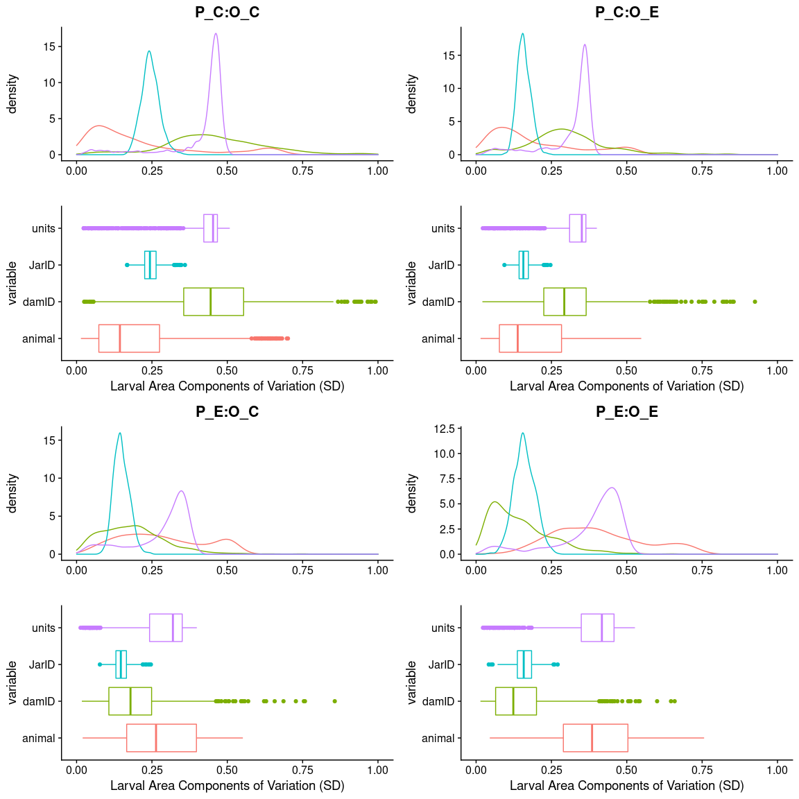
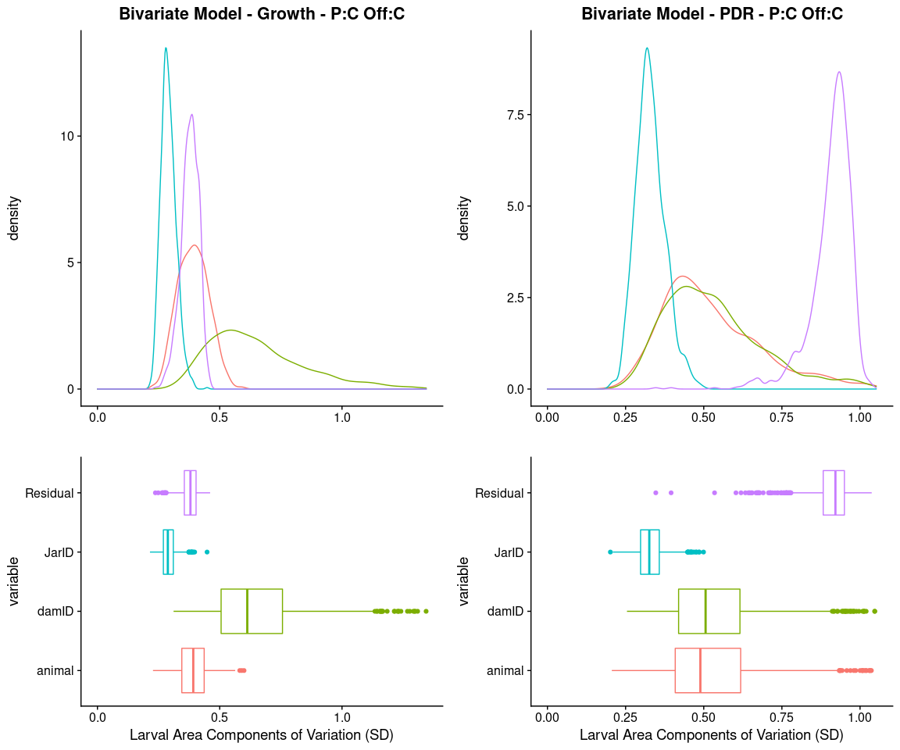
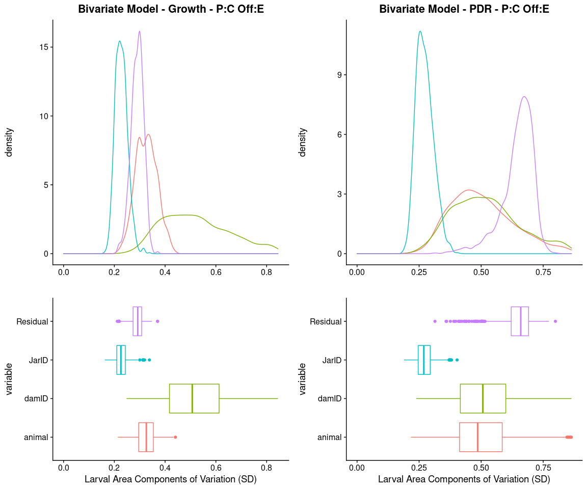
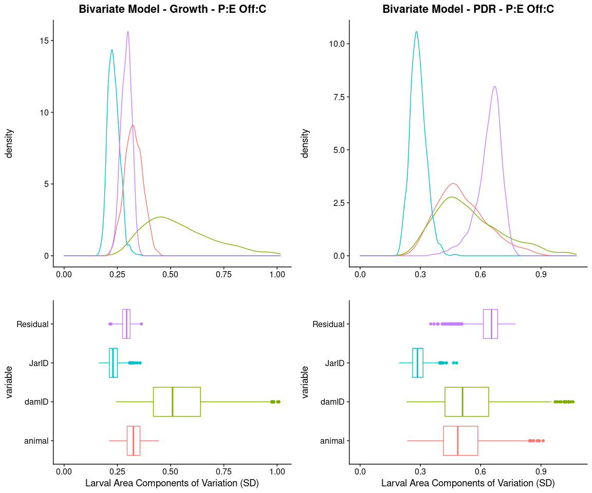
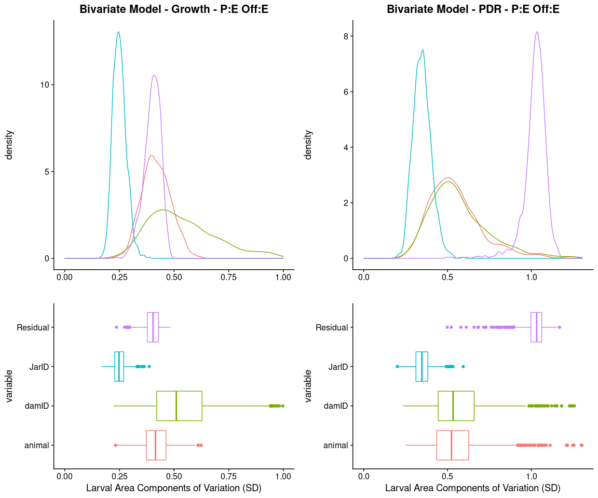
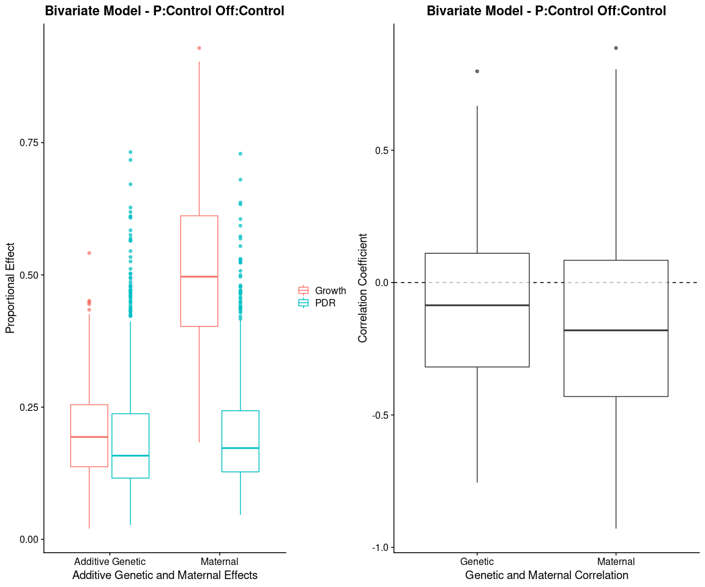
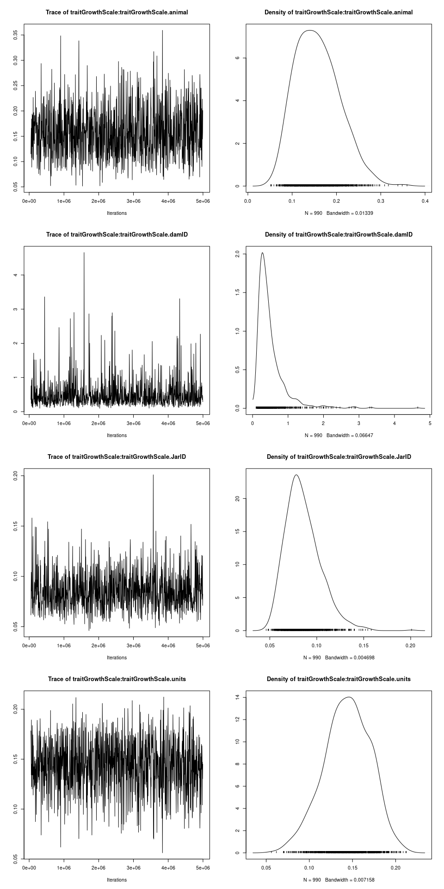
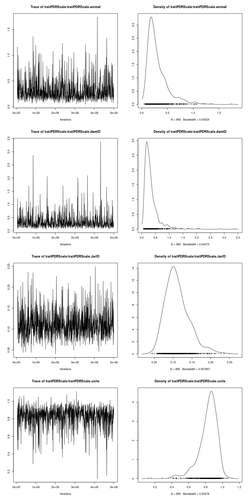
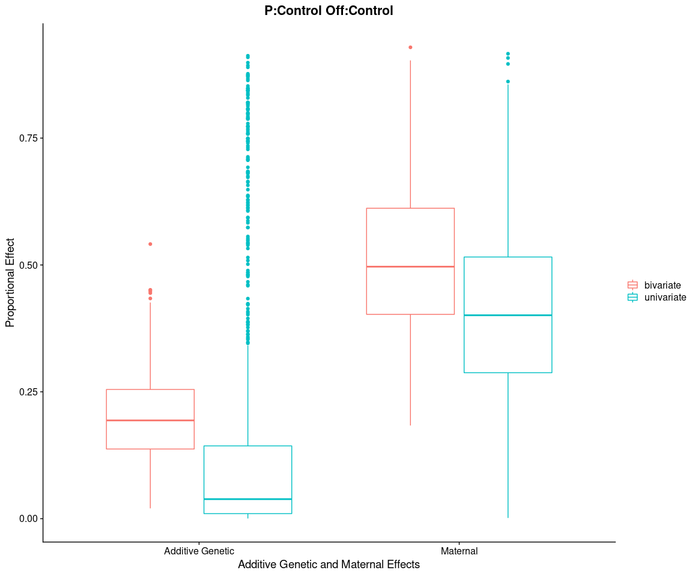
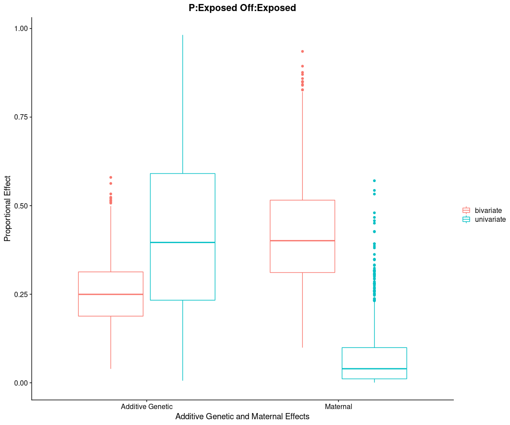

L18 visualization of May2021
================

-   [Overview](#overview)
    -   [Main model parameters](#main-model-parameters)
-   [Univariate model(s) for larval
    growth](#univariate-models-for-larval-growth)
    -   [Variance Components](#variance-components)
    -   [Model Check](#model-check)
-   [Bivariate model looking at both growth and
    morphology](#bivariate-model-looking-at-both-growth-and-morphology)
    -   [Plotting Variance Components](#plotting-variance-components)
    -   [Estimate heritability and maternal
        effects](#estimate-heritability-and-maternal-effects)
    -   [Plotting Heritability, Maternal Effects, and Correlation among
        Traits](#plotting-heritability-maternal-effects-and-correlation-among-traits)
    -   [Bivariate model checks](#bivariate-model-checks)
-   [Model comparison - univariate vs
    bivariate](#model-comparison---univariate-vs-bivariate)
    -   [The Estimated variance components for growth from each
        model](#the-estimated-variance-components-for-growth-from-each-model)
-   [General Thoughts](#general-thoughts)
-   [Next Steps](#next-steps)

## Overview

Reran animal model to partition sources of larval growth variance. Based
on preliminary testing I used a model that included
,
, and
 as random
effects in the model for a final model that looked like this:


While the focus for this model will be larval growth I also examined a
bivariate model that included larval growth and morphology (represented
as the perimeter/diameter ratio) as response variables and the same
explanatory variables as the univariate model above. The rationale here
was that we could see if there was a genetic correlation between these
two traits. I also ran this model as a sanity check thinking that the
partitioning of variance among the three main explanatory effects should
be the same for growth regardless of the model run (univariate
vs. bivariate).

### Main model parameters

Iterations : 5000000 Burnin : 50000 Thinning interval : 5000

Based on this we expect an effective population size of 990 if there is
no autocorrelation Calculation - (5000000-50000)/5000

**Priors** Inverse-wishart : V=1, nu=0.002 (for each random effect and
residual variation)

    ## Loading required package: Matrix

    ## Loading required package: coda

    ## Loading required package: ape

## Univariate model(s) for larval growth

### Variance Components

    ## No id variables; using all as measure variables

    ## Warning: Removed 13 rows containing non-finite values (stat_density).

    ## Warning: Removed 13 rows containing non-finite values (stat_boxplot).

    ## No id variables; using all as measure variables

    ## Warning: Removed 2 rows containing non-finite values (stat_density).

    ## Warning: Removed 2 rows containing non-finite values (stat_boxplot).

    ## No id variables; using all as measure variables
    ## No id variables; using all as measure variables

<!-- -->

### Model Check

Lets look at summary outputs for each model

``` r
summary(cc_growth_mod)
```

    ## 
    ##  Iterations = 50001:4995001
    ##  Thinning interval  = 5000
    ##  Sample size  = 990 
    ## 
    ##  DIC: 662.472 
    ## 
    ##  G-structure:  ~animal
    ## 
    ##        post.mean  l-95% CI u-95% CI eff.samp
    ## animal   0.07921 0.0002062   0.4094    422.2
    ## 
    ##                ~damID
    ## 
    ##       post.mean  l-95% CI u-95% CI eff.samp
    ## damID    0.2565 0.0006354   0.6176    806.4
    ## 
    ##                ~JarID
    ## 
    ##       post.mean l-95% CI u-95% CI eff.samp
    ## JarID   0.06092  0.03264  0.08919      990
    ## 
    ##  R-structure:  ~units
    ## 
    ##       post.mean l-95% CI u-95% CI eff.samp
    ## units    0.1808 0.002378   0.2353      435
    ## 
    ##  Location effects: GrowthScale ~ 1 
    ## 
    ##             post.mean l-95% CI u-95% CI eff.samp  pMCMC   
    ## (Intercept)   -0.9954  -1.3747  -0.6222      990 <0.001 **
    ## ---
    ## Signif. codes:  0 '***' 0.001 '**' 0.01 '*' 0.05 '.' 0.1 ' ' 1

``` r
summary(ce_growth_mod)
```

    ## 
    ##  Iterations = 50001:4995001
    ##  Thinning interval  = 5000
    ##  Sample size  = 990 
    ## 
    ##  DIC: 269.7285 
    ## 
    ##  G-structure:  ~animal
    ## 
    ##        post.mean  l-95% CI u-95% CI eff.samp
    ## animal   0.06009 0.0002192    0.255    519.2
    ## 
    ##                ~damID
    ## 
    ##       post.mean  l-95% CI u-95% CI eff.samp
    ## damID    0.1134 0.0004382   0.2997      990
    ## 
    ##                ~JarID
    ## 
    ##       post.mean l-95% CI u-95% CI eff.samp
    ## JarID   0.02566  0.01318  0.04013      990
    ## 
    ##  R-structure:  ~units
    ## 
    ##       post.mean l-95% CI u-95% CI eff.samp
    ## units    0.1062  0.00333   0.1451    515.1
    ## 
    ##  Location effects: GrowthScale ~ 1 
    ## 
    ##             post.mean l-95% CI u-95% CI eff.samp  pMCMC   
    ## (Intercept)    0.6832   0.4263   0.9681      990 <0.001 **
    ## ---
    ## Signif. codes:  0 '***' 0.001 '**' 0.01 '*' 0.05 '.' 0.1 ' ' 1

``` r
summary(ec_growth_mod)
```

    ## 
    ##  Iterations = 50001:4995001
    ##  Thinning interval  = 5000
    ##  Sample size  = 990 
    ## 
    ##  DIC: 83.57639 
    ## 
    ##  G-structure:  ~animal
    ## 
    ##        post.mean  l-95% CI u-95% CI eff.samp
    ## animal   0.09949 0.0004067   0.2638    799.2
    ## 
    ##                ~damID
    ## 
    ##       post.mean  l-95% CI u-95% CI eff.samp
    ## damID   0.04897 0.0003045   0.1488      990
    ## 
    ##                ~JarID
    ## 
    ##       post.mean l-95% CI u-95% CI eff.samp
    ## JarID   0.02281 0.009912  0.03889      990
    ## 
    ##  R-structure:  ~units
    ## 
    ##       post.mean  l-95% CI u-95% CI eff.samp
    ## units   0.08772 0.0004104    0.138    805.4
    ## 
    ##  Location effects: GrowthScale ~ 1 
    ## 
    ##             post.mean l-95% CI u-95% CI eff.samp  pMCMC   
    ## (Intercept)    0.9624   0.7029   1.2107     1158 <0.001 **
    ## ---
    ## Signif. codes:  0 '***' 0.001 '**' 0.01 '*' 0.05 '.' 0.1 ' ' 1

``` r
summary(ee_growth_mod)
```

    ## 
    ##  Iterations = 50001:4995001
    ##  Thinning interval  = 5000
    ##  Sample size  = 990 
    ## 
    ##  DIC: 519.0387 
    ## 
    ##  G-structure:  ~animal
    ## 
    ##        post.mean l-95% CI u-95% CI eff.samp
    ## animal    0.1862   0.0133   0.4845    821.1
    ## 
    ##                ~damID
    ## 
    ##       post.mean  l-95% CI u-95% CI eff.samp
    ## damID   0.03256 0.0002083   0.1216     1119
    ## 
    ##                ~JarID
    ## 
    ##       post.mean l-95% CI u-95% CI eff.samp
    ## JarID   0.02689 0.005965  0.04851      990
    ## 
    ##  R-structure:  ~units
    ## 
    ##       post.mean  l-95% CI u-95% CI eff.samp
    ## units    0.1575 0.0005165   0.2389    820.9
    ## 
    ##  Location effects: GrowthScale ~ 1 
    ## 
    ##             post.mean l-95% CI u-95% CI eff.samp   pMCMC   
    ## (Intercept)   -0.5669  -0.8798  -0.3088      990 0.00202 **
    ## ---
    ## Signif. codes:  0 '***' 0.001 '**' 0.01 '*' 0.05 '.' 0.1 ' ' 1

Notice a relative small number of effective samples for each random
effect (&lt;990) compared to the number of iterations I ran.

**Lag**

``` r
level_of_autoCorr <- 0.15
autoCorrIssues <- sum(autocorr(cc_growth_mod$VCV)["Lag 5000",,] > level_of_autoCorr)
autoCorrIssues
```

    ## [1] 2

``` r
max(autocorr(cc_bi_mod$VCV)["Lag 5000",,])
```

    ## [1] 0.1163288

Running this for each model yields similar results, only small evidence
of correlation with a thinning interval of 5000.

## Bivariate model looking at both growth and morphology

### Plotting Variance Components

    ## No id variables; using all as measure variables
    ## No id variables; using all as measure variables

<!-- -->

    ## No id variables; using all as measure variables
    ## No id variables; using all as measure variables

<!-- -->

    ## No id variables; using all as measure variables
    ## No id variables; using all as measure variables

<!-- -->

    ## No id variables; using all as measure variables
    ## No id variables; using all as measure variables

<!-- -->

### Estimate heritability and maternal effects

Table of heritability, maternal effects for each trait, as well as the
correlations in genetic and maternal effects among traits. Each metric
is presented as the mode and the 95% confidence interval (lower and
upper).

| Comparison           |       Mode |  Lower\_CI | Upper\_CI |
|:---------------------|-----------:|-----------:|----------:|
| Growth Heritability  |  0.1699331 |  0.0491864 | 0.3464115 |
| PDR Heritability     |  0.1206005 |  0.0482781 | 0.4387860 |
| Growth Maternal      |  0.4731394 |  0.2427706 | 0.7821618 |
| PDR Maternal         |  0.1314876 |  0.0510817 | 0.4058072 |
| Genetic Correlation  |  0.0103279 | -0.6145814 | 0.4381952 |
| Maternal Correlation | -0.3954239 | -0.7934594 | 0.5205157 |

### Plotting Heritability, Maternal Effects, and Correlation among Traits

Visualization of table from previous section

<!-- -->

### Bivariate model checks

Lets look at summary outputs for each model

``` r
summary(cc_bi_mod)
```

    ## 
    ##  Iterations = 50001:4995001
    ##  Thinning interval  = 5000
    ##  Sample size  = 990 
    ## 
    ##  DIC: 2875.507 
    ## 
    ##  G-structure:  ~us(trait):animal
    ## 
    ##                                          post.mean l-95% CI u-95% CI eff.samp
    ## traitGrowthScale:traitGrowthScale.animal   0.15758  0.06955  0.25067    990.0
    ## traitPDRScale:traitGrowthScale.animal     -0.02617 -0.18036  0.09936   1152.3
    ## traitGrowthScale:traitPDRScale.animal     -0.02617 -0.18036  0.09936   1152.3
    ## traitPDRScale:traitPDRScale.animal         0.30676  0.06235  0.75285    968.6
    ## 
    ##                ~us(trait):damID
    ## 
    ##                                         post.mean l-95% CI u-95% CI eff.samp
    ## traitGrowthScale:traitGrowthScale.damID   0.50518  0.09904   1.2392    990.0
    ## traitPDRScale:traitGrowthScale.damID     -0.07244 -0.53297   0.2547    823.5
    ## traitGrowthScale:traitPDRScale.damID     -0.07244 -0.53297   0.2547    823.5
    ## traitPDRScale:traitPDRScale.damID         0.33680  0.06473   0.8627    902.9
    ## 
    ##                ~us(trait):JarID
    ## 
    ##                                         post.mean l-95% CI u-95% CI eff.samp
    ## traitGrowthScale:traitGrowthScale.JarID  0.085482  0.05345  0.12102     1165
    ## traitPDRScale:traitGrowthScale.JarID    -0.006266 -0.03984  0.02608      990
    ## traitGrowthScale:traitPDRScale.JarID    -0.006266 -0.03984  0.02608      990
    ## traitPDRScale:traitPDRScale.JarID        0.110988  0.05663  0.17519      990
    ## 
    ##  R-structure:  ~us(trait):units
    ## 
    ##                                         post.mean l-95% CI u-95% CI eff.samp
    ## traitGrowthScale:traitGrowthScale.units    0.1437  0.08957  0.19258    990.0
    ## traitPDRScale:traitGrowthScale.units      -0.1258 -0.20374 -0.04409   1364.6
    ## traitGrowthScale:traitPDRScale.units      -0.1258 -0.20374 -0.04409   1364.6
    ## traitPDRScale:traitPDRScale.units          0.8276  0.58074  0.99572    761.2
    ## 
    ##  Location effects: cbind(GrowthScale, PDRScale) ~ trait - 1 
    ## 
    ##                  post.mean l-95% CI u-95% CI eff.samp   pMCMC   
    ## traitGrowthScale   -1.0094  -1.6025  -0.5123   1140.8 0.00202 **
    ## traitPDRScale      -0.2164  -0.7748   0.2766    795.2 0.38990   
    ## ---
    ## Signif. codes:  0 '***' 0.001 '**' 0.01 '*' 0.05 '.' 0.1 ' ' 1

``` r
summary(ce_bi_mod)
```

    ## 
    ##  Iterations = 50001:4995001
    ##  Thinning interval  = 5000
    ##  Sample size  = 990 
    ## 
    ##  DIC: 2099.399 
    ## 
    ##  G-structure:  ~us(trait):animal
    ## 
    ##                                          post.mean l-95% CI u-95% CI eff.samp
    ## traitGrowthScale:traitGrowthScale.animal  0.107827  0.05618  0.16202    813.8
    ## traitPDRScale:traitGrowthScale.animal    -0.009581 -0.09388  0.07369    990.0
    ## traitGrowthScale:traitPDRScale.animal    -0.009581 -0.09388  0.07369    990.0
    ## traitPDRScale:traitPDRScale.animal        0.277563  0.06254  0.59050    990.0
    ## 
    ##                ~us(trait):damID
    ## 
    ##                                         post.mean l-95% CI u-95% CI eff.samp
    ## traitGrowthScale:traitGrowthScale.damID   0.34431  0.06956   0.7866      990
    ## traitPDRScale:traitGrowthScale.damID     -0.04824 -0.40536   0.2892      990
    ## traitGrowthScale:traitPDRScale.damID     -0.04824 -0.40536   0.2892      990
    ## traitPDRScale:traitPDRScale.damID         0.33146  0.06299   0.8106      990
    ## 
    ##                ~us(trait):JarID
    ## 
    ##                                          post.mean l-95% CI u-95% CI eff.samp
    ## traitGrowthScale:traitGrowthScale.JarID  0.0524520  0.03250  0.07436    955.2
    ## traitPDRScale:traitGrowthScale.JarID    -0.0003958 -0.02410  0.01791    990.0
    ## traitGrowthScale:traitPDRScale.JarID    -0.0003958 -0.02410  0.01791    990.0
    ## traitPDRScale:traitPDRScale.JarID        0.0755336  0.04494  0.11688    990.0
    ## 
    ##  R-structure:  ~us(trait):units
    ## 
    ##                                         post.mean l-95% CI u-95% CI eff.samp
    ## traitGrowthScale:traitGrowthScale.units   0.08484  0.05776  0.11021    990.0
    ## traitPDRScale:traitGrowthScale.units     -0.01936 -0.06076  0.02952    990.0
    ## traitGrowthScale:traitPDRScale.units     -0.01936 -0.06076  0.02952    990.0
    ## traitPDRScale:traitPDRScale.units         0.42229  0.25078  0.55541    892.8
    ## 
    ##  Location effects: cbind(GrowthScale, PDRScale) ~ trait - 1 
    ## 
    ##                  post.mean l-95% CI u-95% CI eff.samp  pMCMC  
    ## traitGrowthScale    0.6936   0.2187   1.1586      990 0.0141 *
    ## traitPDRScale       0.3235  -0.1553   0.8550      990 0.1859  
    ## ---
    ## Signif. codes:  0 '***' 0.001 '**' 0.01 '*' 0.05 '.' 0.1 ' ' 1

``` r
summary(ce_bi_mod)
```

    ## 
    ##  Iterations = 50001:4995001
    ##  Thinning interval  = 5000
    ##  Sample size  = 990 
    ## 
    ##  DIC: 2099.399 
    ## 
    ##  G-structure:  ~us(trait):animal
    ## 
    ##                                          post.mean l-95% CI u-95% CI eff.samp
    ## traitGrowthScale:traitGrowthScale.animal  0.107827  0.05618  0.16202    813.8
    ## traitPDRScale:traitGrowthScale.animal    -0.009581 -0.09388  0.07369    990.0
    ## traitGrowthScale:traitPDRScale.animal    -0.009581 -0.09388  0.07369    990.0
    ## traitPDRScale:traitPDRScale.animal        0.277563  0.06254  0.59050    990.0
    ## 
    ##                ~us(trait):damID
    ## 
    ##                                         post.mean l-95% CI u-95% CI eff.samp
    ## traitGrowthScale:traitGrowthScale.damID   0.34431  0.06956   0.7866      990
    ## traitPDRScale:traitGrowthScale.damID     -0.04824 -0.40536   0.2892      990
    ## traitGrowthScale:traitPDRScale.damID     -0.04824 -0.40536   0.2892      990
    ## traitPDRScale:traitPDRScale.damID         0.33146  0.06299   0.8106      990
    ## 
    ##                ~us(trait):JarID
    ## 
    ##                                          post.mean l-95% CI u-95% CI eff.samp
    ## traitGrowthScale:traitGrowthScale.JarID  0.0524520  0.03250  0.07436    955.2
    ## traitPDRScale:traitGrowthScale.JarID    -0.0003958 -0.02410  0.01791    990.0
    ## traitGrowthScale:traitPDRScale.JarID    -0.0003958 -0.02410  0.01791    990.0
    ## traitPDRScale:traitPDRScale.JarID        0.0755336  0.04494  0.11688    990.0
    ## 
    ##  R-structure:  ~us(trait):units
    ## 
    ##                                         post.mean l-95% CI u-95% CI eff.samp
    ## traitGrowthScale:traitGrowthScale.units   0.08484  0.05776  0.11021    990.0
    ## traitPDRScale:traitGrowthScale.units     -0.01936 -0.06076  0.02952    990.0
    ## traitGrowthScale:traitPDRScale.units     -0.01936 -0.06076  0.02952    990.0
    ## traitPDRScale:traitPDRScale.units         0.42229  0.25078  0.55541    892.8
    ## 
    ##  Location effects: cbind(GrowthScale, PDRScale) ~ trait - 1 
    ## 
    ##                  post.mean l-95% CI u-95% CI eff.samp  pMCMC  
    ## traitGrowthScale    0.6936   0.2187   1.1586      990 0.0141 *
    ## traitPDRScale       0.3235  -0.1553   0.8550      990 0.1859  
    ## ---
    ## Signif. codes:  0 '***' 0.001 '**' 0.01 '*' 0.05 '.' 0.1 ' ' 1

``` r
summary(ee_bi_mod)
```

    ## 
    ##  Iterations = 50001:4995001
    ##  Thinning interval  = 5000
    ##  Sample size  = 990 
    ## 
    ##  DIC: 2659.396 
    ## 
    ##  G-structure:  ~us(trait):animal
    ## 
    ##                                          post.mean l-95% CI u-95% CI eff.samp
    ## traitGrowthScale:traitGrowthScale.animal   0.17937  0.08591  0.29308      990
    ## traitPDRScale:traitGrowthScale.animal     -0.04189 -0.22384  0.09375     1114
    ## traitGrowthScale:traitPDRScale.animal     -0.04189 -0.22384  0.09375     1114
    ## traitPDRScale:traitPDRScale.animal         0.33074  0.07104  0.75057      990
    ## 
    ##                ~us(trait):damID
    ## 
    ##                                         post.mean l-95% CI u-95% CI eff.samp
    ## traitGrowthScale:traitGrowthScale.damID    0.3670  0.06130   0.9009      990
    ## traitPDRScale:traitGrowthScale.damID      -0.0140 -0.38182   0.4199      990
    ## traitGrowthScale:traitPDRScale.damID      -0.0140 -0.38182   0.4199      990
    ## traitPDRScale:traitPDRScale.damID          0.3757  0.05473   0.8900      990
    ## 
    ##                ~us(trait):JarID
    ## 
    ##                                         post.mean l-95% CI u-95% CI eff.samp
    ## traitGrowthScale:traitGrowthScale.JarID   0.06380  0.03770  0.09398      990
    ## traitPDRScale:traitGrowthScale.JarID     -0.01334 -0.04920  0.01995      990
    ## traitGrowthScale:traitPDRScale.JarID     -0.01334 -0.04920  0.01995      990
    ## traitPDRScale:traitPDRScale.JarID         0.12433  0.06066  0.19995      990
    ## 
    ##  R-structure:  ~us(trait):units
    ## 
    ##                                         post.mean l-95% CI u-95% CI eff.samp
    ## traitGrowthScale:traitGrowthScale.units    0.1617   0.1047  0.21828    900.7
    ## traitPDRScale:traitGrowthScale.units      -0.1728  -0.2681 -0.08667    990.0
    ## traitGrowthScale:traitPDRScale.units      -0.1728  -0.2681 -0.08667    990.0
    ## traitPDRScale:traitPDRScale.units          1.0485   0.8184  1.32288    990.0
    ## 
    ##  Location effects: cbind(GrowthScale, PDRScale) ~ trait - 1 
    ## 
    ##                  post.mean l-95% CI u-95% CI eff.samp  pMCMC  
    ## traitGrowthScale   -0.5756  -1.1417  -0.1080      990 0.0364 *
    ## traitPDRScale      -0.4480  -1.0299   0.1019      990 0.0990 .
    ## ---
    ## Signif. codes:  0 '***' 0.001 '**' 0.01 '*' 0.05 '.' 0.1 ' ' 1

Effective sample sizes are actually larger in the bivariate model
compared to the univariate model.

**Lag**

    ## [1] 0

    ## [1] 0.1163288

Minimal evidence of autocorrelation with a thinning interval of 5000.

**Posterior Distributions**

Growth

<!-- -->

PDR

<!-- -->

The model appears to be behaving better than the univariate model from
the perspective of a norm(ish) posterior distribution for most models

## Model comparison - univariate vs bivariate

### The Estimated variance components for growth from each model

<!-- -->

<!-- -->

## General Thoughts

1.  The univariate model examining growth appears similar to the results
    from the last time I ran this model using the same priors and
    explanatory variables. Overall additive genetic effects appear to
    explain only a small to moderate amount of the total phenotypic
    variance, but interesting the relative contribution of additive
    genetic vs. maternal effects flips depending on parental environment
    (i.e., maternal effects are larger than additive genetic effects
    when parents were kept at control conditions but not OA conditions).
2.  In the bivariate model there was not evidence of significant
    correlation among the two traits, suggesting that we should be able
    to run the model seperately for each trait.
3.  Despite using the same parameters the two models had different
    estimates for for the larval growth variance components. Overall
    maternal effect was higher in the bivariate model and we did not see
    the same switch in relative contribution of additive genetic and
    maternal effects in the bivariate model like we saw in the
    univariate model.
4.  Comparing outputs it seems like the model is still struggling to
    estimate the effect of additive genetic variation (wide
    distribution) and particularly in the univariate model there appears
    to be a tendency to flip between attributing more growth variance to
    additive genetic variation vs maternal effects in one iteration of
    the model and vice versa in another iteration, suggesting that these
    two effects may be somewhat confounded. (more thoughts on this in
    the next steps section).

## Next Steps

1.  I am currently running this same model with brms for the parental
    control : offspring control subset of data. After some
    troubleshooting I am actively running a version of the model that is
    expected to take abuot 24 hours. The idea is to examine how the
    estimates of the variance components from this model compare to
    those from the MCMCglmm as a final sanity check.
2.  From some of the literature it appears one of the issues that I may
    be having is that the pedigree is not particularly well connect due
    to the assumption that all adults are unrelated. This means the
    large majority of pairwise larval comparisons are unrelated. This
    could be remedied by creating a kinship matrix from SNP data
    acquired from the WGBS data.
