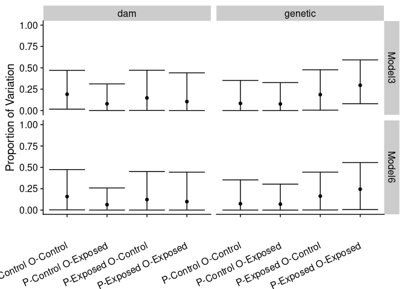
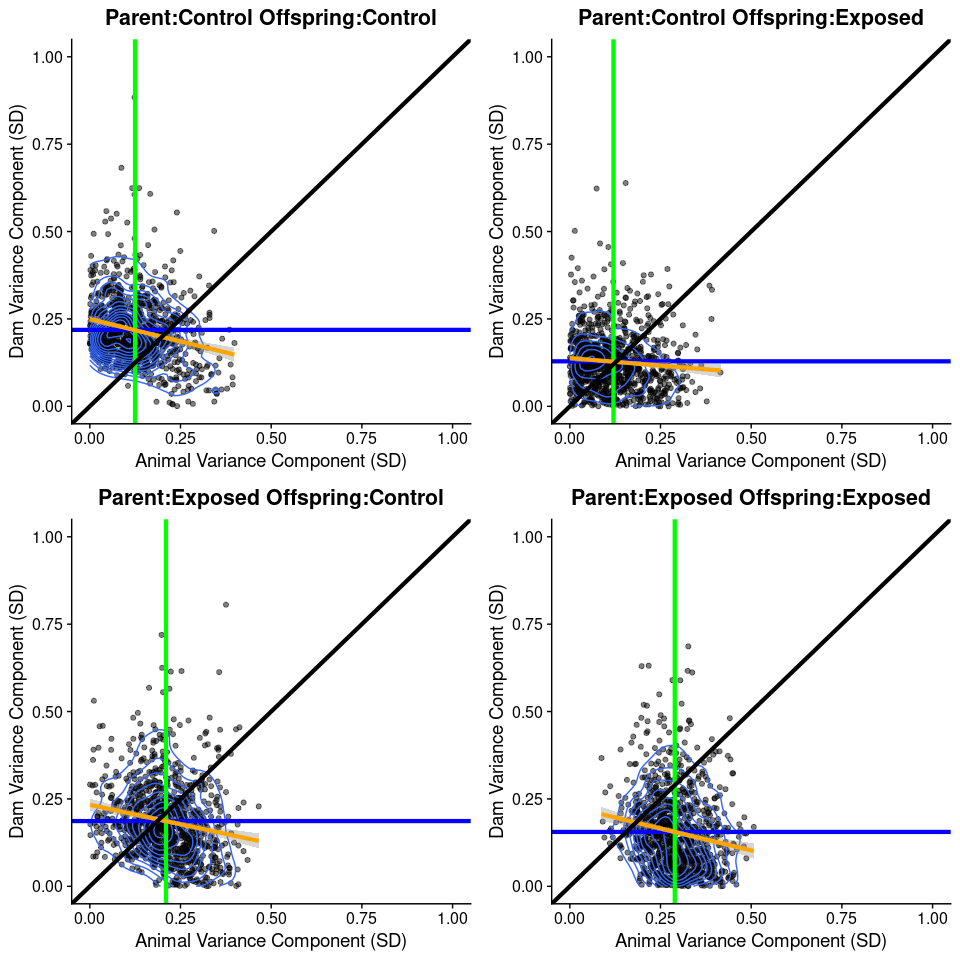
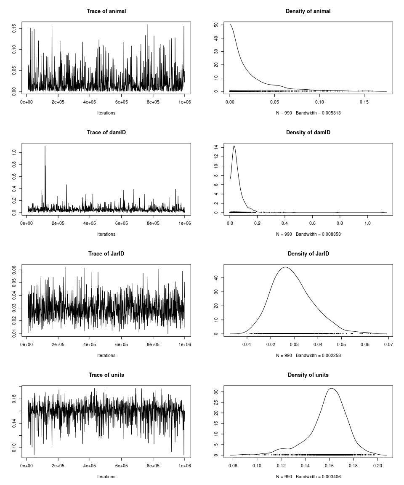
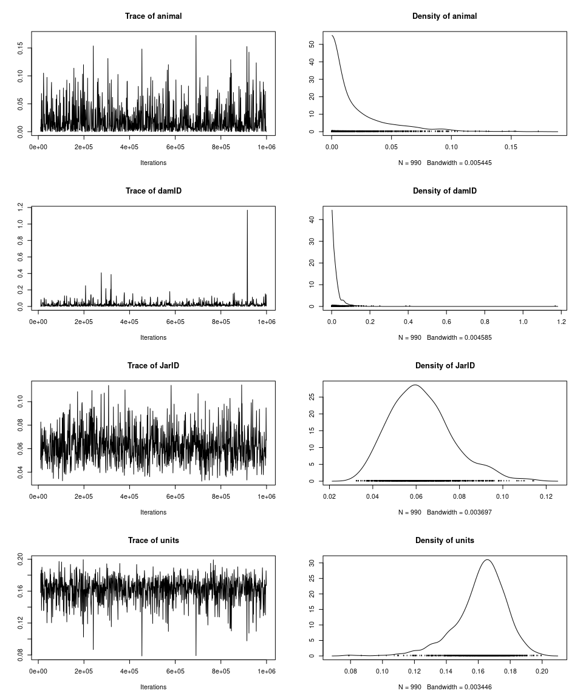
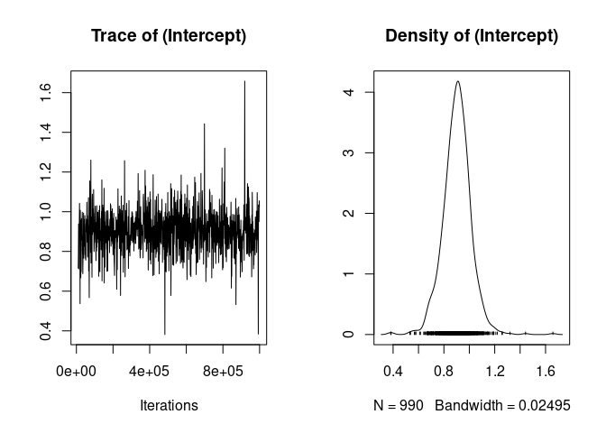
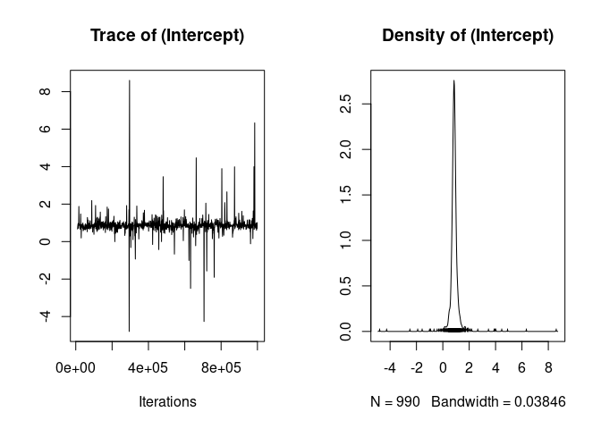

Larval Growth Heritability Estimation
================

-   [Data](#data)
-   [Libraries](#libraries)
-   [Summary of Models](#summary-of-models)
-   [Parameterization](#parameterization)
    -   [Priors](#priors)
-   [Complete Summary Output Table](#complete-summary-output-table)
-   [Across Model Heritability
    Comparisons](#across-model-heritability-comparisons)
-   [Variance and Heritability Comparisons for “Full Model” (Model 6)
    and “Best Model”
    (Model 3)](#variance-and-heritability-comparisons-for-full-model-model-6-and-best-model-model-3)
-   [Main Observations](#main-observations)
-   [Future Directions](#future-directions)
-   [Model Diagnostics](#model-diagnostics)
    -   [Model 3 (Partial Model)](#model-3-partial-model)
    -   [Model 6 (Full Model)](#model-6-full-model)

## Data

``` r
mod_output <- readRDS("~/Desktop/GrowthHeritabilityEstimate.RDS")
```

## Libraries

``` r
library(ggplot2)
library(cowplot)
library(knitr)
library(rmarkdown)
library(MCMCglmm)
```

    ## Loading required package: Matrix

    ## Loading required package: coda

    ## Loading required package: ape

# Summary of Models

| Model   | Fixed Effects | Random Effects                          | Description                                             |
|:--------|:--------------|:----------------------------------------|:--------------------------------------------------------|
| Model 1 | \~ 1          | \~ animal, dam, sire, Jar, and Seatable | Full Model (including sire which is not typically done) |
| Model 2 | \~ 1          | \~ animal                               | Simply model                                            |
| Model 3 | \~ 1          | \~ animal, dam, and Jar                 | Single experimental effect, jar                         |
| Model 4 | \~ 1          | \~ animal, dam, and Seatable            | Single experiment effect, Seatable                      |
| Model 5 | \~ 1          | \~ animal and dam                       | Typical animal model with dam (no experimental effect)  |
| Model 6 | \~ 1          | \~ animal, dam, jar, and Seatable       | Full model alternative (no sire)                        |

# Parameterization

All models used the same set of parameters. Prior and random effects
varied for each model.

-   **Iterations** - 1,000,000
-   **Burn-in** - 10,000
-   **Thinning parameter** - 1,000

## Priors

The same prior was applied to each random effect, the specific type of
prior depends on the model.

-   **Cauchy Prior** - Used in some heritability models. Favored when
    estimated variance of the components is small.
    -   Parameters (Same parameters used by Hadley et al. 2010 for this
        prior)
        -   V : 1
        -   nu : 1
        -   alpha.mu : 0
        -   alpha.V : 1000
-   **Inverse-Wilshart** - Standard uninformative prior used in many
    bayesian models. May misbehave when variance is small.
    -   Parameters
        -   V : 1
        -   nu : 0.002 (very small belief in prior means it should not
            inform posterior distribution)

# Complete Summary Output Table

**Note** : Model 4 and 5 were run twice for each data subset. The second
use was performed using the family level summarized data (growth
averaged by jar). This was done to examine the effect of estimating
heritability on family level rather than individual level estimates.
This approach was recent used by Tasoff et al. (2018) to look a family
level heritability in Grunion in ambient and OA conditions.

| model        | Prior        | ResponseVariable | Parent\_Env | Offspring\_Env | animal\_mean | animal\_lower | animal\_upper | damID\_mean | damID\_lower | damID\_upper | sireID\_mean | sireID\_lower | sireID\_upper | JarID\_mean | JarID\_lower | JarID\_upper | JarSeatable\_mean | JarSeatable\_lower | JarSeatable\_upper | Pheno\_mean | Pheno\_lower | Pheno\_upper | animal\_H2\_mean | animal\_H2\_lower | animal\_H2\_upper | dam\_H2\_mean | dam\_H2\_lower | dam\_H2\_upper |
|:-------------|:-------------|:-----------------|:------------|:---------------|-------------:|--------------:|--------------:|------------:|-------------:|-------------:|-------------:|--------------:|--------------:|------------:|-------------:|-------------:|------------------:|-------------------:|-------------------:|------------:|-------------:|-------------:|-----------------:|------------------:|------------------:|--------------:|---------------:|---------------:|
| Model1       | Cauchy       | Area             | Control     | Control        |      0.02449 |       0.00004 |       0.11410 |     0.06198 |      0.00341 |      0.24003 |      0.01902 |       0.00000 |       0.13730 |     0.02512 |      0.01164 |      0.04306 |           0.95020 |            0.00057 |            7.39608 |     1.23827 |      0.22527 |      7.64472 |          0.06604 |           0.00008 |           0.32070 |       0.15769 |        0.00256 |        0.49069 |
| Model2       | Cauchy       | Area             | Control     | Control        |      0.11307 |       0.04956 |       0.20615 |          NA |           NA |           NA |           NA |            NA |            NA |          NA |           NA |           NA |                NA |                 NA |                 NA |     0.25056 |      0.21009 |      0.30172 |          0.44181 |           0.22809 |           0.69322 |            NA |             NA |             NA |
| Model3       | Cauchy       | Area             | Control     | Control        |      0.02229 |       0.00004 |       0.10428 |     0.05704 |      0.00384 |      0.18289 |           NA |            NA |            NA |     0.02935 |      0.01440 |      0.04840 |                NA |                 NA |                 NA |     0.26763 |      0.21062 |      0.39876 |          0.08359 |           0.00014 |           0.35230 |       0.19086 |        0.01578 |        0.47046 |
| Model3\_InvW | Inv-Wilshart | Area             | Control     | Control        |      0.02316 |       0.00005 |       0.11210 |     0.06207 |      0.00491 |      0.21480 |           NA |            NA |            NA |     0.02935 |      0.01547 |      0.04929 |                NA |                 NA |                 NA |     0.27240 |      0.21090 |      0.42816 |          0.08520 |           0.00019 |           0.37249 |       0.19746 |        0.02016 |        0.52095 |
| Model4       | Cauchy       | Area             | Control     | Control        |      0.04148 |       0.00281 |       0.14312 |     0.05766 |      0.00113 |      0.20188 |           NA |            NA |            NA |          NA |           NA |           NA |           4.61319 |            0.00171 |           13.82171 |     4.88015 |      0.21903 |     14.06200 |          0.11740 |           0.00076 |           0.43018 |       0.14560 |        0.00045 |        0.43875 |
| Model5       | Cauchy       | Area             | Control     | Control        |      0.04076 |       0.00265 |       0.13983 |     0.06411 |      0.00299 |      0.24112 |           NA |            NA |            NA |          NA |           NA |           NA |                NA |                 NA |                 NA |     0.27691 |      0.21321 |      0.46011 |          0.14810 |           0.01036 |           0.48442 |       0.20571 |        0.01234 |        0.52881 |
| Model6       | Cauchy       | Area             | Control     | Control        |      0.02427 |       0.00005 |       0.10969 |     0.05868 |      0.00422 |      0.23187 |           NA |            NA |            NA |     0.02580 |      0.01244 |      0.04597 |           4.72551 |            0.00037 |            6.05789 |     4.99165 |      0.21840 |      6.33360 |          0.07400 |           0.00009 |           0.35358 |       0.15847 |        0.00261 |        0.47430 |
| Model4\_fam  | Cauchy       | Area             | Control     | Control        |      0.00709 |       0.00001 |       0.03334 |     0.07935 |      0.01330 |      0.31376 |           NA |            NA |            NA |          NA |           NA |           NA |           7.46780 |            0.00010 |            8.52460 |     7.61963 |      0.08906 |      8.63786 |          0.03835 |           0.00001 |           0.20179 |       0.32433 |        0.00648 |        0.75206 |
| Model5\_fam  | Cauchy       | Area             | Control     | Control        |      0.00767 |       0.00000 |       0.03902 |     0.07265 |      0.01239 |      0.25438 |           NA |            NA |            NA |          NA |           NA |           NA |                NA |                 NA |                 NA |     0.14975 |      0.08237 |      0.32963 |          0.05501 |           0.00002 |           0.27045 |       0.42806 |        0.13084 |        0.76647 |
| Model1       | Cauchy       | Area             | Control     | Exposed        |      0.02240 |       0.00006 |       0.10285 |     0.02486 |      0.00008 |      0.11592 |      0.01950 |       0.00001 |       0.11535 |     0.06397 |      0.03973 |      0.10105 |           0.33790 |            0.00001 |            1.58031 |     0.63010 |      0.23618 |      1.96084 |          0.06800 |           0.00016 |           0.30199 |       0.07129 |        0.00025 |        0.31200 |
| Model2       | Cauchy       | Area             | Control     | Exposed        |      0.08753 |       0.03209 |       0.19122 |          NA |           NA |           NA |           NA |            NA |            NA |          NA |           NA |           NA |                NA |                 NA |                 NA |     0.26665 |      0.22813 |      0.32391 |          0.31881 |           0.13203 |           0.60367 |            NA |             NA |             NA |
| Model3       | Cauchy       | Area             | Control     | Exposed        |      0.02140 |       0.00004 |       0.09293 |     0.02453 |      0.00007 |      0.11163 |           NA |            NA |            NA |     0.06240 |      0.03835 |      0.09513 |                NA |                 NA |                 NA |     0.27027 |      0.22238 |      0.36829 |          0.07676 |           0.00014 |           0.32699 |       0.07865 |        0.00029 |        0.31155 |
| Model3\_InvW | Inv-Wilshart | Area             | Control     | Exposed        |      0.02078 |       0.00002 |       0.08976 |     0.02225 |      0.00005 |      0.10003 |           NA |            NA |            NA |     0.06332 |      0.03945 |      0.09803 |                NA |                 NA |                 NA |     0.26857 |      0.22360 |      0.35187 |          0.07530 |           0.00010 |           0.31139 |       0.07480 |        0.00019 |        0.28443 |
| Model4       | Cauchy       | Area             | Control     | Exposed        |      0.05276 |       0.00478 |       0.15803 |     0.02969 |      0.00004 |      0.13139 |           NA |            NA |            NA |          NA |           NA |           NA |           0.86287 |            0.00000 |            1.50444 |     1.14186 |      0.23291 |      1.76639 |          0.17193 |           0.01020 |           0.49360 |       0.08867 |        0.00012 |        0.32313 |
| Model5       | Cauchy       | Area             | Control     | Exposed        |      0.05100 |       0.00682 |       0.15055 |     0.03119 |      0.00021 |      0.12333 |           NA |            NA |            NA |          NA |           NA |           NA |                NA |                 NA |                 NA |     0.27911 |      0.23037 |      0.36608 |          0.17969 |           0.02563 |           0.48656 |       0.09797 |        0.00085 |        0.34076 |
| Model6       | Cauchy       | Area             | Control     | Exposed        |      0.02122 |       0.00002 |       0.09279 |     0.02090 |      0.00008 |      0.09495 |           NA |            NA |            NA |     0.06543 |      0.04040 |      0.09864 |           2.19401 |            0.00000 |            2.47250 |     2.46362 |      0.22945 |      2.73436 |          0.06934 |           0.00004 |           0.30401 |       0.06327 |        0.00016 |        0.25921 |
| Model4\_fam  | Cauchy       | Area             | Control     | Exposed        |      0.01383 |       0.00001 |       0.06217 |     0.02678 |      0.00005 |      0.11839 |           NA |            NA |            NA |          NA |           NA |           NA |           0.46150 |            0.00001 |            1.63806 |     0.60798 |      0.09717 |      1.82103 |          0.07882 |           0.00008 |           0.35556 |       0.13096 |        0.00017 |        0.49211 |
| Model5\_fam  | Cauchy       | Area             | Control     | Exposed        |      0.01357 |       0.00001 |       0.05817 |     0.02614 |      0.00011 |      0.13926 |           NA |            NA |            NA |          NA |           NA |           NA |                NA |                 NA |                 NA |     0.14366 |      0.09487 |      0.25810 |          0.09315 |           0.00007 |           0.39238 |       0.15214 |        0.00088 |        0.56992 |
| Model1       | Cauchy       | Area             | Exposed     | Control        |      0.03661 |       0.00021 |       0.12273 |     0.05976 |      0.00049 |      0.28764 |      0.02595 |       0.00005 |       0.13066 |     0.03898 |      0.02068 |      0.06582 |           2.02973 |            0.00001 |            5.18819 |     2.33614 |      0.22732 |      5.46341 |          0.10876 |           0.00033 |           0.39752 |       0.14365 |        0.00077 |        0.50724 |
| Model2       | Cauchy       | Area             | Exposed     | Control        |      0.10987 |       0.04867 |       0.20340 |          NA |           NA |           NA |           NA |            NA |            NA |          NA |           NA |           NA |                NA |                 NA |                 NA |     0.24955 |      0.21087 |      0.30225 |          0.43096 |           0.22158 |           0.68393 |            NA |             NA |             NA |
| Model3       | Cauchy       | Area             | Exposed     | Control        |      0.05125 |       0.00113 |       0.14091 |     0.04665 |      0.00022 |      0.19674 |           NA |            NA |            NA |     0.04022 |      0.02151 |      0.06902 |                NA |                 NA |                 NA |     0.27576 |      0.21169 |      0.42602 |          0.18584 |           0.00438 |           0.47697 |       0.14725 |        0.00091 |        0.47176 |
| Model3\_InvW | Inv-Wilshart | Area             | Exposed     | Control        |      0.05148 |       0.00113 |       0.13779 |     0.04572 |      0.00014 |      0.18738 |           NA |            NA |            NA |     0.04055 |      0.02113 |      0.07041 |                NA |                 NA |                 NA |     0.27554 |      0.21381 |      0.40948 |          0.18841 |           0.00393 |           0.46333 |       0.13991 |        0.00062 |        0.45698 |
| Model4       | Cauchy       | Area             | Exposed     | Control        |      0.08007 |       0.02055 |       0.18238 |     0.04763 |      0.00008 |      0.20211 |           NA |            NA |            NA |          NA |           NA |           NA |           4.03435 |            0.00008 |            2.54934 |     4.31539 |      0.22343 |      2.81669 |          0.25441 |           0.02141 |           0.56754 |       0.12589 |        0.00013 |        0.44336 |
| Model5       | Cauchy       | Area             | Exposed     | Control        |      0.07676 |       0.02098 |       0.17423 |     0.05293 |      0.00029 |      0.24236 |           NA |            NA |            NA |          NA |           NA |           NA |                NA |                 NA |                 NA |     0.28586 |      0.21722 |      0.47697 |          0.27434 |           0.07425 |           0.58639 |       0.15053 |        0.00117 |        0.50239 |
| Model6       | Cauchy       | Area             | Exposed     | Control        |      0.05100 |       0.00126 |       0.13498 |     0.04532 |      0.00013 |      0.20668 |           NA |            NA |            NA |     0.04060 |      0.02191 |      0.06912 |           0.68087 |            0.00001 |            3.96098 |     0.95649 |      0.21870 |      4.20029 |          0.16299 |           0.00152 |           0.44428 |       0.12336 |        0.00036 |        0.45205 |
| Model4\_fam  | Cauchy       | Area             | Exposed     | Control        |      0.02053 |       0.00006 |       0.06887 |     0.05893 |      0.00083 |      0.24340 |           NA |            NA |            NA |          NA |           NA |           NA |           1.81378 |            0.00001 |            2.68569 |     1.97769 |      0.09936 |      2.85790 |          0.11022 |           0.00021 |           0.38578 |       0.25160 |        0.00248 |        0.69203 |
| Model5\_fam  | Cauchy       | Area             | Exposed     | Control        |      0.02039 |       0.00008 |       0.07073 |     0.06725 |      0.00133 |      0.28843 |           NA |            NA |            NA |          NA |           NA |           NA |                NA |                 NA |                 NA |     0.17039 |      0.09110 |      0.40190 |          0.13373 |           0.00063 |           0.44778 |       0.30744 |        0.01106 |        0.75886 |
| Model1       | Cauchy       | Area             | Exposed     | Exposed        |      0.05324 |       0.00007 |       0.17305 |     0.04818 |      0.00034 |      0.21741 |      0.04041 |       0.00012 |       0.20351 |     0.01790 |      0.00389 |      0.03671 |           1.04967 |            0.00010 |            3.36206 |     1.38166 |      0.25238 |      3.69518 |          0.13985 |           0.00012 |           0.46757 |       0.10839 |        0.00045 |        0.40710 |
| Model2       | Cauchy       | Area             | Exposed     | Exposed        |      0.12491 |       0.05534 |       0.22756 |          NA |           NA |           NA |           NA |            NA |            NA |          NA |           NA |           NA |                NA |                 NA |                 NA |     0.27730 |      0.23307 |      0.33381 |          0.44111 |           0.22851 |           0.69302 |            NA |             NA |             NA |
| Model3       | Cauchy       | Area             | Exposed     | Exposed        |      0.08900 |       0.02458 |       0.19226 |     0.03696 |      0.00003 |      0.19801 |           NA |            NA |            NA |     0.02044 |      0.00657 |      0.04134 |                NA |                 NA |                 NA |     0.30121 |      0.23765 |      0.46047 |          0.29557 |           0.07921 |           0.59250 |       0.10466 |        0.00014 |        0.44127 |
| Model3\_InvW | Inv-Wilshart | Area             | Exposed     | Exposed        |      0.08963 |       0.02103 |       0.19626 |     0.04014 |      0.00004 |      0.20671 |           NA |            NA |            NA |     0.02099 |      0.00715 |      0.04329 |                NA |                 NA |                 NA |     0.30537 |      0.23951 |      0.46595 |          0.29466 |           0.07210 |           0.58747 |       0.10814 |        0.00013 |        0.43493 |
| Model4       | Cauchy       | Area             | Exposed     | Exposed        |      0.10426 |       0.03444 |       0.21437 |     0.04410 |      0.00006 |      0.23053 |           NA |            NA |            NA |          NA |           NA |           NA |           1.26967 |            0.00068 |            3.74946 |     1.57835 |      0.24673 |      4.34711 |          0.28324 |           0.02339 |           0.59081 |       0.09455 |        0.00010 |        0.41167 |
| Model5       | Cauchy       | Area             | Exposed     | Exposed        |      0.10418 |       0.03679 |       0.20206 |     0.03576 |      0.00010 |      0.18063 |           NA |            NA |            NA |          NA |           NA |           NA |                NA |                 NA |                 NA |     0.30267 |      0.23799 |      0.44348 |          0.34335 |           0.12983 |           0.61237 |       0.10211 |        0.00036 |        0.40896 |
| Model6       | Cauchy       | Area             | Exposed     | Exposed        |      0.08852 |       0.02439 |       0.19871 |     0.04761 |      0.00011 |      0.25871 |           NA |            NA |            NA |     0.01792 |      0.00446 |      0.03676 |           7.69997 |            0.00009 |            9.49220 |     8.00894 |      0.24547 |      9.76201 |          0.24440 |           0.00615 |           0.55656 |       0.09913 |        0.00015 |        0.44397 |
| Model4\_fam  | Cauchy       | Area             | Exposed     | Exposed        |      0.02737 |       0.00050 |       0.07300 |     0.04923 |      0.00074 |      0.22298 |           NA |            NA |            NA |          NA |           NA |           NA |           1.23146 |            0.00006 |            5.64630 |     1.37585 |      0.09112 |      5.74623 |          0.15286 |           0.00105 |           0.43807 |       0.21870 |        0.00111 |        0.66696 |
| Model5\_fam  | Cauchy       | Area             | Exposed     | Exposed        |      0.02731 |       0.00070 |       0.07147 |     0.04772 |      0.00043 |      0.23000 |           NA |            NA |            NA |          NA |           NA |           NA |                NA |                 NA |                 NA |     0.14592 |      0.08535 |      0.33198 |          0.20059 |           0.00528 |           0.49918 |       0.26964 |        0.00396 |        0.68831 |

# Across Model Heritability Comparisons

<!-- -->

### Main Takeaways

1.  Not including dam (and to lesser extend one or both of the
    experimental random effects) has a substantial impact on the genetic
    component in the model (i.e. dam and other random effects consume a
    substantial amount of the variance explained by the genetic
    component when included in the model).
2.  The two priors do not seem to alter our estimate of heritability.
3.  Measuring heritability at the family vs. individual level leads to a
    downward estimate of heritability compared to the model that uses
    individuals.

# Variance and Heritability Comparisons for “Full Model” (Model 6) and “Best Model” (Model 3)

<!-- -->

# Main Observations

1.  Hard to draw many conclusions from the model. Mean heritability is
    low for all comparisons, but given the large credibility intervals
    around most of the variance components it is hard to draw
    conclusions.
2.  There isn’t a clearly dominant variance component (e.g. genetic,
    maternal, or experimental), and it looks like the model struggles to
    consistently converge on estimates for each of the components given
    the large credibility intervals.
3.  Looking at the model diagnostics it looks like including Seatable is
    problematic, given the posterior distribution, although not
    including it in the model doesn’t appear to impact heritability
    estimates much. As a result it seems like using a model with animal,
    dam, and jar may be the simplest, best model in this case (Model 3).

# Future Directions

1.  Finish reading through Hadley literature to identify an other things
    to consider when parameterizing the model. Specifically, is there a
    way to improve the posterior distributions for animal and dam
    effects (so they appear more normally distributed).
2.  Add measure of parental methylation (when we have it).
3.  **Extend Goal** : Estimate parental relatedness and use kinship
    matrix rather than traditional pedigree to improve our ability to
    estimate heritability (right now the assumption is that all parents
    are unrelated, the first step is to check how true this is).

# Model Diagnostics

## Model 3 (Partial Model)

### Data : Parent Control - Offspring Control

    ## 
    ##  Iterations = 10001:999001
    ##  Thinning interval  = 1000
    ##  Sample size  = 990 
    ## 
    ##  DIC: 786.1921 
    ## 
    ##  G-structure:  ~animal
    ## 
    ##        post.mean  l-95% CI u-95% CI eff.samp
    ## animal   0.02229 4.192e-08   0.0808    936.2
    ## 
    ##                ~damID
    ## 
    ##       post.mean  l-95% CI u-95% CI eff.samp
    ## damID   0.05704 4.385e-07   0.1474    647.2
    ## 
    ##                ~JarID
    ## 
    ##       post.mean l-95% CI u-95% CI eff.samp
    ## JarID   0.02935  0.01345  0.04642      990
    ## 
    ##  R-structure:  ~units
    ## 
    ##       post.mean l-95% CI u-95% CI eff.samp
    ## units    0.1589   0.1213   0.1875      990
    ## 
    ##  Location effects: Response ~ 1 
    ## 
    ##             post.mean l-95% CI u-95% CI eff.samp  pMCMC   
    ## (Intercept)    0.8601   0.6683   1.0631    556.8 <0.001 **
    ## ---
    ## Signif. codes:  0 '***' 0.001 '**' 0.01 '*' 0.05 '.' 0.1 ' ' 1

<!-- -->

    ##            (Intercept)
    ## Lag 0      1.000000000
    ## Lag 1000   0.038590655
    ## Lag 5000  -0.005933091
    ## Lag 10000  0.084532828
    ## Lag 50000  0.026927570

    ##                                           
    ##             Stationarity start     p-value
    ##             test         iteration        
    ## (Intercept) passed       1         0.122  
    ##                                     
    ##             Halfwidth Mean Halfwidth
    ##             test                    
    ## (Intercept) passed    0.86 0.00854

<!-- -->

    ##                animal       damID        JarID        units
    ## Lag 0      1.00000000  1.00000000  1.000000000  1.000000000
    ## Lag 1000   0.07987021 -0.01463634 -0.005815292  0.037558391
    ## Lag 5000  -0.02611166  0.19112729 -0.061991548 -0.045691701
    ## Lag 10000 -0.03133743  0.01342664  0.052599430 -0.023451275
    ## Lag 50000 -0.02068956 -0.01126353  0.033887819 -0.006272616

    ##                                      
    ##        Stationarity start     p-value
    ##        test         iteration        
    ## animal passed       1         0.417  
    ## damID  passed       1         0.102  
    ## JarID  passed       1         0.950  
    ## units  passed       1         0.272  
    ##                                  
    ##        Halfwidth Mean   Halfwidth
    ##        test                      
    ## animal passed    0.0223 0.001728 
    ## damID  passed    0.0570 0.004959 
    ## JarID  passed    0.0294 0.000545 
    ## units  passed    0.1589 0.000996

### Data : Parent Control - Offspring Exposed

    ## 
    ##  Iterations = 10001:999001
    ##  Thinning interval  = 1000
    ##  Sample size  = 990 
    ## 
    ##  DIC: 832.142 
    ## 
    ##  G-structure:  ~animal
    ## 
    ##        post.mean  l-95% CI u-95% CI eff.samp
    ## animal    0.0214 1.725e-09  0.07584      990
    ## 
    ##                ~damID
    ## 
    ##       post.mean  l-95% CI u-95% CI eff.samp
    ## damID   0.02453 3.922e-09  0.08337      990
    ## 
    ##                ~JarID
    ## 
    ##       post.mean l-95% CI u-95% CI eff.samp
    ## JarID    0.0624  0.03714  0.09236      990
    ## 
    ##  R-structure:  ~units
    ## 
    ##       post.mean l-95% CI u-95% CI eff.samp
    ## units    0.1619   0.1302   0.1906      990
    ## 
    ##  Location effects: Response ~ 1 
    ## 
    ##             post.mean l-95% CI u-95% CI eff.samp  pMCMC   
    ## (Intercept)   -0.9423  -1.0956  -0.7896      990 <0.001 **
    ## ---
    ## Signif. codes:  0 '***' 0.001 '**' 0.01 '*' 0.05 '.' 0.1 ' ' 1

<!-- -->

    ##            (Intercept)
    ## Lag 0      1.000000000
    ## Lag 1000   0.006334665
    ## Lag 5000  -0.015880763
    ## Lag 10000 -0.041955901
    ## Lag 50000  0.017759100

    ##                                           
    ##             Stationarity start     p-value
    ##             test         iteration        
    ## (Intercept) passed       1         0.867  
    ##                                       
    ##             Halfwidth Mean   Halfwidth
    ##             test                      
    ## (Intercept) passed    -0.942 0.00475

<!-- -->

    ##                 animal        damID        JarID         units
    ## Lag 0      1.000000000  1.000000000  1.000000000  1.0000000000
    ## Lag 1000  -0.038712486 -0.007364584  0.026511883 -0.0395016160
    ## Lag 5000   0.007470517 -0.010527053 -0.027044852  0.0279148536
    ## Lag 10000 -0.056928280 -0.019044041 -0.003535638 -0.0310442134
    ## Lag 50000 -0.017682227  0.022257730 -0.009280218 -0.0001867575

    ##                                      
    ##        Stationarity start     p-value
    ##        test         iteration        
    ## animal passed       1         0.684  
    ## damID  passed       1         0.567  
    ## JarID  passed       1         0.222  
    ## units  passed       1         0.956  
    ##                                  
    ##        Halfwidth Mean   Halfwidth
    ##        test                      
    ## animal passed    0.0214 0.001643 
    ## damID  failed    0.0245 0.003079 
    ## JarID  passed    0.0624 0.000899 
    ## units  passed    0.1619 0.000986

### Data : Parent Exposed - Offspring Control

    ## 
    ##  Iterations = 10001:999001
    ##  Thinning interval  = 1000
    ##  Sample size  = 990 
    ## 
    ##  DIC: 659.6943 
    ## 
    ##  G-structure:  ~animal
    ## 
    ##        post.mean  l-95% CI u-95% CI eff.samp
    ## animal   0.05125 4.439e-07   0.1236      990
    ## 
    ##                ~damID
    ## 
    ##       post.mean  l-95% CI u-95% CI eff.samp
    ## damID   0.04665 3.168e-07   0.1562      990
    ## 
    ##                ~JarID
    ## 
    ##       post.mean l-95% CI u-95% CI eff.samp
    ## JarID   0.04022  0.02106  0.06516      990
    ## 
    ##  R-structure:  ~units
    ## 
    ##       post.mean l-95% CI u-95% CI eff.samp
    ## units    0.1377  0.09594   0.1709     1092
    ## 
    ##  Location effects: Response ~ 1 
    ## 
    ##             post.mean l-95% CI u-95% CI eff.samp  pMCMC   
    ## (Intercept)    0.9029   0.6707   1.0978      990 <0.001 **
    ## ---
    ## Signif. codes:  0 '***' 0.001 '**' 0.01 '*' 0.05 '.' 0.1 ' ' 1

<!-- -->

    ##           (Intercept)
    ## Lag 0      1.00000000
    ## Lag 1000  -0.02832156
    ## Lag 5000   0.02615694
    ## Lag 10000 -0.01934057
    ## Lag 50000 -0.02996467

    ##                                           
    ##             Stationarity start     p-value
    ##             test         iteration        
    ## (Intercept) passed       1         0.447  
    ##                                      
    ##             Halfwidth Mean  Halfwidth
    ##             test                     
    ## (Intercept) passed    0.903 0.00689

<!-- -->

    ##                 animal       damID        JarID        units
    ## Lag 0      1.000000000  1.00000000  1.000000000  1.000000000
    ## Lag 1000  -0.019154225 -0.04095273 -0.014841333 -0.049600824
    ## Lag 5000  -0.064590383 -0.02901496 -0.007801061 -0.039558674
    ## Lag 10000  0.020136261  0.04270295 -0.011301621 -0.002267036
    ## Lag 50000 -0.004927421  0.01039180 -0.053801376 -0.019243453

    ##                                      
    ##        Stationarity start     p-value
    ##        test         iteration        
    ## animal passed       1         0.983  
    ## damID  passed       1         0.832  
    ## JarID  passed       1         0.520  
    ## units  passed       1         0.977  
    ##                                  
    ##        Halfwidth Mean   Halfwidth
    ##        test                      
    ## animal passed    0.0512 0.002283 
    ## damID  passed    0.0466 0.003578 
    ## JarID  passed    0.0402 0.000743 
    ## units  passed    0.1377 0.001179

### Data : Parent Exposed - Offspring Exposed

    ## 
    ##  Iterations = 10001:999001
    ##  Thinning interval  = 1000
    ##  Sample size  = 990 
    ## 
    ##  DIC: 757.4266 
    ## 
    ##  G-structure:  ~animal
    ## 
    ##        post.mean l-95% CI u-95% CI eff.samp
    ## animal     0.089  0.01908   0.1828      990
    ## 
    ##                ~damID
    ## 
    ##       post.mean  l-95% CI u-95% CI eff.samp
    ## damID   0.03696 5.468e-08   0.1393      990
    ## 
    ##                ~JarID
    ## 
    ##       post.mean l-95% CI u-95% CI eff.samp
    ## JarID   0.02044 0.005353  0.03752      867
    ## 
    ##  R-structure:  ~units
    ## 
    ##       post.mean l-95% CI u-95% CI eff.samp
    ## units    0.1548   0.1062   0.1983      990
    ## 
    ##  Location effects: Response ~ 1 
    ## 
    ##             post.mean l-95% CI u-95% CI eff.samp  pMCMC   
    ## (Intercept)   -0.7877  -1.0019  -0.5558      990 <0.001 **
    ## ---
    ## Signif. codes:  0 '***' 0.001 '**' 0.01 '*' 0.05 '.' 0.1 ' ' 1

<!-- -->

    ##            (Intercept)
    ## Lag 0      1.000000000
    ## Lag 1000   0.008797573
    ## Lag 5000  -0.013915308
    ## Lag 10000 -0.073751145
    ## Lag 50000  0.027451309

    ##                                           
    ##             Stationarity start     p-value
    ##             test         iteration        
    ## (Intercept) passed       1         0.9    
    ##                                       
    ##             Halfwidth Mean   Halfwidth
    ##             test                      
    ## (Intercept) passed    -0.788 0.00699

<!-- -->

    ##                animal        damID        JarID        units
    ## Lag 0      1.00000000  1.000000000  1.000000000  1.000000000
    ## Lag 1000   0.02234427 -0.007558151  0.065724074 -0.006928698
    ## Lag 5000  -0.01165374 -0.034771567 -0.006170099 -0.018000754
    ## Lag 10000 -0.04699476  0.029251009 -0.093073806 -0.043559788
    ## Lag 50000  0.02475628  0.011931749  0.030335809 -0.002941784

    ##                                      
    ##        Stationarity start     p-value
    ##        test         iteration        
    ## animal passed       1         0.390  
    ## damID  passed       1         0.827  
    ## JarID  passed       1         0.524  
    ## units  passed       1         0.257  
    ##                                  
    ##        Halfwidth Mean   Halfwidth
    ##        test                      
    ## animal passed    0.0890 0.002718 
    ## damID  passed    0.0370 0.003357 
    ## JarID  passed    0.0204 0.000594 
    ## units  passed    0.1548 0.001504

## Model 6 (Full Model)

### Data : Parent Control - Offspring Control

    ## 
    ##  Iterations = 10001:999001
    ##  Thinning interval  = 1000
    ##  Sample size  = 990 
    ## 
    ##  DIC: 784.0254 
    ## 
    ##  G-structure:  ~animal
    ## 
    ##        post.mean  l-95% CI u-95% CI eff.samp
    ## animal   0.02427 9.104e-09  0.08307      990
    ## 
    ##                ~damID
    ## 
    ##       post.mean  l-95% CI u-95% CI eff.samp
    ## damID   0.05868 3.696e-05   0.1653      990
    ## 
    ##                ~JarID
    ## 
    ##       post.mean l-95% CI u-95% CI eff.samp
    ## JarID    0.0258  0.01031  0.04237      990
    ## 
    ##                ~JarSeatable
    ## 
    ##             post.mean  l-95% CI u-95% CI eff.samp
    ## JarSeatable     4.726 3.385e-07    1.765    528.3
    ## 
    ##  R-structure:  ~units
    ## 
    ##       post.mean l-95% CI u-95% CI eff.samp
    ## units    0.1574   0.1196   0.1854      990
    ## 
    ##  Location effects: Response ~ 1 
    ## 
    ##             post.mean l-95% CI u-95% CI eff.samp  pMCMC  
    ## (Intercept)    0.8759   0.1538   1.4372     1247 0.0303 *
    ## ---
    ## Signif. codes:  0 '***' 0.001 '**' 0.01 '*' 0.05 '.' 0.1 ' ' 1

<!-- -->

    ##           (Intercept)
    ## Lag 0      1.00000000
    ## Lag 1000   0.02323668
    ## Lag 5000  -0.02003523
    ## Lag 10000 -0.02088790
    ## Lag 50000 -0.01218797

    ##                                           
    ##             Stationarity start     p-value
    ##             test         iteration        
    ## (Intercept) passed       1         0.414  
    ##                                      
    ##             Halfwidth Mean  Halfwidth
    ##             test                     
    ## (Intercept) passed    0.876 0.0309

<!-- --><!-- -->

    ##                 animal         damID        JarID  JarSeatable       units
    ## Lag 0      1.000000000  1.0000000000  1.000000000  1.000000000  1.00000000
    ## Lag 1000  -0.013390274 -0.0190891070 -0.003280387  0.387119455 -0.04447815
    ## Lag 5000   0.024552219  0.0030805994 -0.037293977 -0.003124023  0.01776455
    ## Lag 10000  0.003955049 -0.0005732053 -0.003507061 -0.002995592  0.02643182
    ## Lag 50000 -0.020371271  0.0004155391  0.017116390 -0.002712629 -0.01910969

    ##                                           
    ##             Stationarity start     p-value
    ##             test         iteration        
    ## animal      passed         1       0.919  
    ## damID       passed         1       0.791  
    ## JarID       passed         1       0.311  
    ## JarSeatable passed       298       0.229  
    ## units       passed         1       0.649  
    ##                                       
    ##             Halfwidth Mean   Halfwidth
    ##             test                      
    ## animal      passed    0.0243 0.001843 
    ## damID       passed    0.0587 0.003894 
    ## JarID       passed    0.0258 0.000519 
    ## JarSeatable failed    1.5111 1.306242 
    ## units       passed    0.1574 0.001063

### Data : Parent Control - Offspring Exposed

    ## 
    ##  Iterations = 10001:999001
    ##  Thinning interval  = 1000
    ##  Sample size  = 990 
    ## 
    ##  DIC: 832.6831 
    ## 
    ##  G-structure:  ~animal
    ## 
    ##        post.mean  l-95% CI u-95% CI eff.samp
    ## animal   0.02122 1.548e-08  0.07667      990
    ## 
    ##                ~damID
    ## 
    ##       post.mean  l-95% CI u-95% CI eff.samp
    ## damID    0.0209 2.473e-08  0.07172    833.9
    ## 
    ##                ~JarID
    ## 
    ##       post.mean l-95% CI u-95% CI eff.samp
    ## JarID   0.06543  0.03913   0.0964      990
    ## 
    ##                ~JarSeatable
    ## 
    ##             post.mean  l-95% CI u-95% CI eff.samp
    ## JarSeatable     2.194 2.282e-09   0.5027      990
    ## 
    ##  R-structure:  ~units
    ## 
    ##       post.mean l-95% CI u-95% CI eff.samp
    ## units    0.1621   0.1257   0.1896     1332
    ## 
    ##  Location effects: Response ~ 1 
    ## 
    ##             post.mean l-95% CI u-95% CI eff.samp  pMCMC  
    ## (Intercept)   -0.9142  -1.3266  -0.6310      990 0.0182 *
    ## ---
    ## Signif. codes:  0 '***' 0.001 '**' 0.01 '*' 0.05 '.' 0.1 ' ' 1

<!-- -->

    ##            (Intercept)
    ## Lag 0      1.000000000
    ## Lag 1000  -0.019328356
    ## Lag 5000   0.045386556
    ## Lag 10000 -0.009046934
    ## Lag 50000 -0.017876143

    ##                                           
    ##             Stationarity start     p-value
    ##             test         iteration        
    ## (Intercept) passed       1         0.0675 
    ##                                       
    ##             Halfwidth Mean   Halfwidth
    ##             test                      
    ## (Intercept) passed    -0.914 0.0761

<!-- --><!-- -->

    ##                 animal        damID        JarID   JarSeatable       units
    ## Lag 0      1.000000000  1.000000000  1.000000000  1.0000000000  1.00000000
    ## Lag 1000  -0.010999501  0.002241428 -0.009299498  0.0070490617 -0.05907717
    ## Lag 5000  -0.035776423 -0.049722803  0.024527847  0.0009812992 -0.09010422
    ## Lag 10000  0.060878026 -0.015296117 -0.031788017 -0.0038820592 -0.02112840
    ## Lag 50000 -0.005818435  0.012349124 -0.029531328 -0.0020098475 -0.03109431

    ##                                           
    ##             Stationarity start     p-value
    ##             test         iteration        
    ## animal      passed       1         0.279  
    ## damID       passed       1         0.236  
    ## JarID       passed       1         0.256  
    ## JarSeatable passed       1         0.236  
    ## units       passed       1         0.673  
    ##                                       
    ##             Halfwidth Mean   Halfwidth
    ##             test                      
    ## animal      passed    0.0212 0.001630 
    ## damID       passed    0.0209 0.002070 
    ## JarID       passed    0.0654 0.000988 
    ## JarSeatable failed    2.1940 2.138643 
    ## units       passed    0.1621 0.000878

### Data : Parent Exposed - Offspring Control

    ## 
    ##  Iterations = 10001:999001
    ##  Thinning interval  = 1000
    ##  Sample size  = 990 
    ## 
    ##  DIC: 660.6821 
    ## 
    ##  G-structure:  ~animal
    ## 
    ##        post.mean  l-95% CI u-95% CI eff.samp
    ## animal     0.051 8.026e-06    0.119      990
    ## 
    ##                ~damID
    ## 
    ##       post.mean  l-95% CI u-95% CI eff.samp
    ## damID   0.04532 1.335e-07   0.1595      990
    ## 
    ##                ~JarID
    ## 
    ##       post.mean l-95% CI u-95% CI eff.samp
    ## JarID    0.0406  0.02165  0.06857      990
    ## 
    ##                ~JarSeatable
    ## 
    ##             post.mean  l-95% CI u-95% CI eff.samp
    ## JarSeatable    0.6809 1.351e-09    1.204      990
    ## 
    ##  R-structure:  ~units
    ## 
    ##       post.mean l-95% CI u-95% CI eff.samp
    ## units    0.1387  0.09725   0.1758     1228
    ## 
    ##  Location effects: Response ~ 1 
    ## 
    ##             post.mean l-95% CI u-95% CI eff.samp  pMCMC  
    ## (Intercept)    0.9158   0.4183   1.3977      990 0.0141 *
    ## ---
    ## Signif. codes:  0 '***' 0.001 '**' 0.01 '*' 0.05 '.' 0.1 ' ' 1

<!-- -->

    ##            (Intercept)
    ## Lag 0      1.000000000
    ## Lag 1000  -0.002459038
    ## Lag 5000  -0.034348504
    ## Lag 10000 -0.026323960
    ## Lag 50000 -0.005814510

    ##                                           
    ##             Stationarity start     p-value
    ##             test         iteration        
    ## (Intercept) passed       1         0.58   
    ##                                      
    ##             Halfwidth Mean  Halfwidth
    ##             test                     
    ## (Intercept) passed    0.916 0.0242

<!-- --><!-- -->

    ##                 animal        damID       JarID   JarSeatable        units
    ## Lag 0      1.000000000  1.000000000  1.00000000  1.0000000000  1.000000000
    ## Lag 1000  -0.004258780  0.023124413 -0.02336024  0.0002898035  0.017704315
    ## Lag 5000  -0.010659566 -0.004904258  0.02119229 -0.0104105975  0.010331606
    ## Lag 10000 -0.042733672 -0.012329400 -0.03205044 -0.0053220050 -0.029619172
    ## Lag 50000  0.005685288  0.008923680 -0.03199402  0.0154996830  0.006711707

    ##                                           
    ##             Stationarity start     p-value
    ##             test         iteration        
    ## animal      passed         1       0.1384 
    ## damID       passed         1       0.9560 
    ## JarID       passed       100       0.0634 
    ## JarSeatable passed         1       0.7073 
    ## units       passed         1       0.3295 
    ##                                       
    ##             Halfwidth Mean   Halfwidth
    ##             test                      
    ## animal      passed    0.0510 0.00224  
    ## damID       passed    0.0453 0.00376  
    ## JarID       passed    0.0405 0.00079  
    ## JarSeatable failed    0.6809 0.32780  
    ## units       passed    0.1387 0.00113

### Data : Parent Exposed - Offspring Exposed

    ## 
    ##  Iterations = 10001:999001
    ##  Thinning interval  = 1000
    ##  Sample size  = 990 
    ## 
    ##  DIC: 756.9176 
    ## 
    ##  G-structure:  ~animal
    ## 
    ##        post.mean l-95% CI u-95% CI eff.samp
    ## animal   0.08852   0.0189    0.177      990
    ## 
    ##                ~damID
    ## 
    ##       post.mean  l-95% CI u-95% CI eff.samp
    ## damID   0.04761 5.759e-08   0.1542      990
    ## 
    ##                ~JarID
    ## 
    ##       post.mean l-95% CI u-95% CI eff.samp
    ## JarID   0.01792 0.003903   0.0359     1172
    ## 
    ##                ~JarSeatable
    ## 
    ##             post.mean  l-95% CI u-95% CI eff.samp
    ## JarSeatable       7.7 1.594e-07    1.759      990
    ## 
    ##  R-structure:  ~units
    ## 
    ##       post.mean l-95% CI u-95% CI eff.samp
    ## units    0.1549   0.1056    0.199      990
    ## 
    ##  Location effects: Response ~ 1 
    ## 
    ##             post.mean  l-95% CI  u-95% CI eff.samp  pMCMC  
    ## (Intercept) -0.768838 -1.267421  0.004426    841.2 0.0424 *
    ## ---
    ## Signif. codes:  0 '***' 0.001 '**' 0.01 '*' 0.05 '.' 0.1 ' ' 1

<!-- -->

    ##            (Intercept)
    ## Lag 0      1.000000000
    ## Lag 1000   0.080753467
    ## Lag 5000  -0.071299776
    ## Lag 10000 -0.029397101
    ## Lag 50000  0.009298592

    ##                                           
    ##             Stationarity start     p-value
    ##             test         iteration        
    ## (Intercept) passed       1         0.554  
    ##                                       
    ##             Halfwidth Mean   Halfwidth
    ##             test                      
    ## (Intercept) passed    -0.769 0.0457

<!-- --><!-- -->

    ##                 animal        damID       JarID  JarSeatable        units
    ## Lag 0      1.000000000  1.000000000  1.00000000  1.000000000  1.000000000
    ## Lag 1000   0.003977441 -0.039121901  0.04378030 -0.001878012 -0.004626568
    ## Lag 5000  -0.036335888 -0.029855954 -0.01327080 -0.001958020 -0.020014439
    ## Lag 10000 -0.087619832 -0.018093141 -0.03573422 -0.002020496 -0.048841299
    ## Lag 50000  0.022555789  0.000475606 -0.05186261 -0.001988331  0.037322629

    ##                                           
    ##             Stationarity start     p-value
    ##             test         iteration        
    ## animal      passed       1         1.000  
    ## damID       passed       1         0.594  
    ## JarID       passed       1         0.838  
    ## JarSeatable passed       1         0.795  
    ## units       passed       1         0.993  
    ##                                       
    ##             Halfwidth Mean   Halfwidth
    ##             test                      
    ## animal      passed    0.0885 2.82e-03 
    ## damID       failed    0.0476 7.44e-03 
    ## JarID       passed    0.0179 4.77e-04 
    ## JarSeatable failed    7.7000 1.06e+01 
    ## units       passed    0.1549 1.52e-03
