Estimating plasticity of larvae responses to OA
================

-   [Overview](#overview)
    -   [Sample Summary](#sample-summary)
    -   [Initial Visualization of Data](#initial-visualization-of-data)
    -   [Thoughts on estimating plasticity / reaction
        norms](#thoughts-on-estimating-plasticity--reaction-norms)
-   [Estimating reaction norms with individual level summary
    values](#estimating-reaction-norms-with-individual-level-summary-values)
    -   [Linear regression](#linear-regression)
        -   [Distribution of slopes and intercepts for various
            phenotypes by parental
            treatment](#distribution-of-slopes-and-intercepts-for-various-phenotypes-by-parental-treatment)
-   [Estimating reaction norms with family level summary
    values](#estimating-reaction-norms-with-family-level-summary-values)
    -   [Options for estimating family-level reactions norms with our
        data](#options-for-estimating-family-level-reactions-norms-with-our-data)
    -   [Option 1 - Estimating slopes via
        regression](#option-1---estimating-slopes-via-regression)
        -   [Distribution of slopes for various phenotypes by parental
            treatment](#distribution-of-slopes-for-various-phenotypes-by-parental-treatment)
    -   [Option 2 - Use bootstraping to generate a distribution of
        slopes based on the average of randomly sampled test
        datasets](#option-2---use-bootstraping-to-generate-a-distribution-of-slopes-based-on-the-average-of-randomly-sampled-test-datasets)
        -   [Distribution of slopes for various phenotypes by parental
            treatment](#distribution-of-slopes-for-various-phenotypes-by-parental-treatment-1)
    -   [Miscellaneous visualization of other
        phenotypes](#miscellaneous-visualization-of-other-phenotypes)

## Overview

From our 2018 larval data we calculated a number of offspring variables
at either the individual (e.g., growth) or jar (e.g., mortality) level
of replication. Moreover, due to our design we have measures of each
phenotype in both ambient and OA conditions, which we could think about
as a family level reaction norm (we did not measure the same individual
in multiple environments). Given this design I think it would be
interesting to look at family-level estimates of plasticity and use the
estimate of plasticity in an animal model (as the response variable) to
estimate the heritability of plasticity.

[Weiss and Gorman
1990](https://onlinelibrary.wiley.com/doi/abs/10.1111/j.1558-5646.1990.tb03807.x)

**Larval Data**

``` r
jr <- readRDS("~/Github/2018OAExp_larvae/input_files/OLD/JarHeritabilityData.RDS")
ind <- readRDS("~/Github/2018OAExp_larvae/input_files/IndHeritabilityData.RDS")
```

| ParentTrt | JarTrt  | families | jars | averageJarsPerFamily | animals | averageAnimalPerFamily | averageAnimalPerJar |
|----------:|:--------|---------:|-----:|---------------------:|--------:|-----------------------:|--------------------:|
|       400 | Control |       24 |   71 |             2.958333 |     710 |               29.58333 |           10.000000 |
|       400 | Exposed |       24 |   73 |             3.041667 |     730 |               30.41667 |           10.000000 |
|      2600 | Control |       21 |   63 |             3.000000 |     630 |               30.00000 |           10.000000 |
|      2600 | Exposed |       21 |   63 |             3.000000 |     628 |               29.90476 |            9.968254 |

### Sample Summary

**Individual animal summary**

We have **2698** individual-level measures with approximately **30**
observations per family and **10** observations per replicate jars.

-   Measures - larval size and growth parameters (growth per day,
    perimeter, diameter, etc)

**Family observation summary**

We have **270** family-level measures for **45** unique families with an
average of **3** observations for **2** different environments (**6**
total observations per family).

-   Measures - Mortality, abnormality, cilia
-   Estimates - plasticity (slope of regression)

### Initial Visualization of Data

Here we the estimated growth for each jar by larval treatment (x-axis)
and facet by parental treatment. You can see that larval environment has
a significant effect on larvae growth and parental treatment also seems
to impact growth in both treatments.

``` r
ggplot(jrp,aes(x=JarTrt,y=Growth,colour=JarTrt)) + 
  facet_grid(.~ParentTrt) + 
  geom_boxplot() +
  scale_color_manual(values=c("turquoise","coral")) +
  theme_cowplot() + 
  labs(x="Larval Environment",y="Larval Growth","Growth by Jar")
```

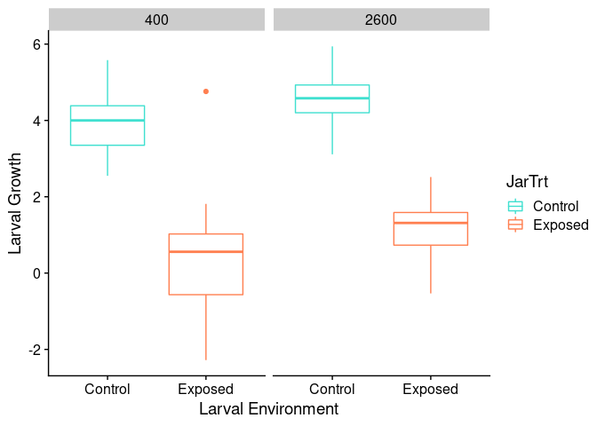<!-- -->

Next, we summarize the mean growth among replicate jars (n approx. = 3)
and use grey lines to show the phenotypic plasticity (slope) of each
family cross. This was possible because zygotes created from parental
crosses were split with half going into a larval control treatment and
half going into an exposed treatment.

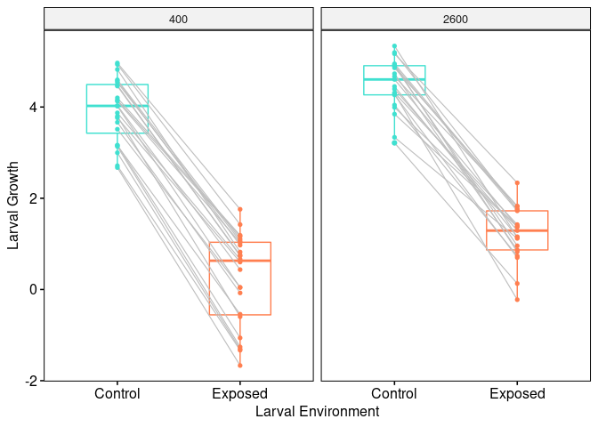<!-- -->

I think it makes sense to think of these grey lines as family specific
reaction norms, with the slope of each family representing a measure of
phenotypic plasticity of a particular phenotype (e.g. growth) in
response to a specific environmental stress (e.g. OA). In turn, to
examine the heritability of plasticity it might be appropriate to
estimate this slope for each family, and use this as our response
variable in the animal model.

    ## `geom_smooth()` using formula 'y ~ x'

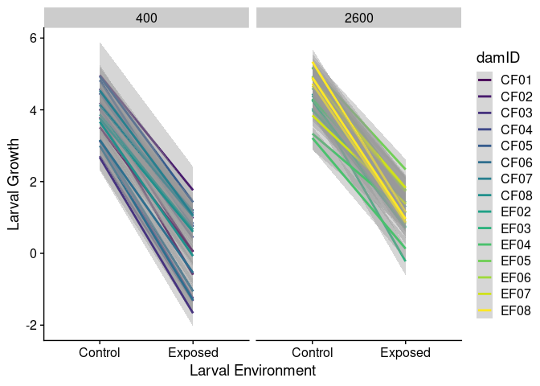<!-- -->

### Thoughts on estimating plasticity / reaction norms

**From Wies et al 1990**

*Excerpt 1 - Description of family-level design* However, reaction norms
can be measured by rearing genotypic replicates, members of an inbred
strain, or siblings, across a range of values for some relevant
environmental factor (e.g., Clausen et al., 1958; Gupta and Lewontin,
1982; Via,1984a).Because they are not properties of individuals, the
intensity of selection on reaction norms cannot be directly evaluated
from measures of individual selection. Instead, selection must be
evaluated by the differential survivorship and fecundity of genetically
related groups (i.e., clones, inbred strains, sibships, etc.). Thus the
intensity of selection on reaction norms is not measured in terms of
phenotypic values, but in genotypic or breeding values (Lynch and
Gabriel, 1987; Rausher and Simms, 1989).

*Excerpt 2 - General description of the model* What is meant by the
distribution of reaction norms? This is easily understood if reaction
norms are defined as algebraic functions, such that:

")

The phenotype, 
produced by individuals of a given genotype,
 varies as a
function, , of the
environment experienced during development,
. The parameters of such
a function would incorporate information on the position, slope, shape,
curvature, etc., of the reaction norm. For instance, if reaction norms
are linear, they can be characterized by their slope and elevation. The
distribution of reaction norms can then be considered as the
multivariate distribution of reaction norm parameters. When reaction
norms are quantified in this way, selection on the different parameters
of the reaction norm can be evaluated separately (e.g., Lynch and
Gabriel, 1987).

*Excerpt 3 - Note on estimating heritability* The heritability of
reaction norm elevation and slope are equal to twice the proportion of
phenotypic variance explained by the family variance and the
family-specific slope variance components respectively (Scheiner and
Lyman, 1989).

# Estimating reaction norms with individual level summary values

## Linear regression

``` r
pheno_ind <- ind$pheno
pheno_ind <-  pheno_ind[!is.na(pheno_ind$GrowthPerDay),]
coln <- c("JarID","JarpCO2_SW","family")
jrp_red <- subset(jrp,select=coln)
phenoID <- left_join(pheno_ind,jrp_red,by="JarID")
phenoID <-  phenoID[!is.na(phenoID$family),]
y <- c("GrowthPerDay")
x <- "JarpCO2_SW"
slope_mat <- matrix(ncol=length(y),nrow=length(unique(phenoID$family)))
colnames(slope_mat) <- y
intercept_mat <- matrix(ncol=length(y),nrow=length(unique(phenoID$family)))
colnames(intercept_mat) <- y
for( i in 1:length(unique(phenoID$family))){
  for(j in 1:length(y)){
    temp <- phenoID[phenoID$family == unique(phenoID$family)[i],]
    lm_out <- lm(temp[,y[j]]~temp[,x])
    lm_sum <- summary(lm_out)
    intercept_mat[i,j] <- lm_sum$coefficients[1,1]
    slope_mat[i,j] <- lm_sum$coefficients[2,1]
  }
}

ind_growth <- data.frame(family=unique(phenoID$family))
ind_growth <- left_join(ind_growth,jrp_pcombo,by="family")
ind_intercept <- data.frame(ind_growth,intercept_mat)
ind_slope <- data.frame(ind_growth,slope_mat)

ind <- list(intercept=ind_intercept,slope=ind_slope)
```

``` r
plot_slopes <- list()
plot_intercepts <- list()
for( i in 1:length(y)){
  temp <- data.frame(Parent_Treatment=as.factor(ind$slope$ParentTrt),Slope=ind$slope[,i+2])
  out <- ggplot(temp,aes(Slope,Parent_Treatment,group=Parent_Treatment,colour=Parent_Treatment)) + 
    geom_boxplot() +
    theme_cowplot() +
    labs(title="Slope",x="",y="") +
    scale_color_manual(values = c("turquoise","coral")) +
    theme(plot.title = element_text(hjust = 0.5))
  plot_slopes[[i]] <- out
  temp <- data.frame(Parent_Treatment=as.factor(ind$intercept$ParentTrt),Intercept=ind$intercept[,i+2])
  out <- ggplot(temp,aes(Intercept,Parent_Treatment,group=Parent_Treatment,colour=Parent_Treatment)) + 
    geom_boxplot() +
    theme_cowplot() +
    scale_color_manual(values = c("turquoise","coral")) +
    labs(title="Intercept",x="",y="") +
    theme(plot.title = element_text(hjust = 0.5))
  plot_intercepts[[i]] <- out
}
```

### Distribution of slopes and intercepts for various phenotypes by parental treatment

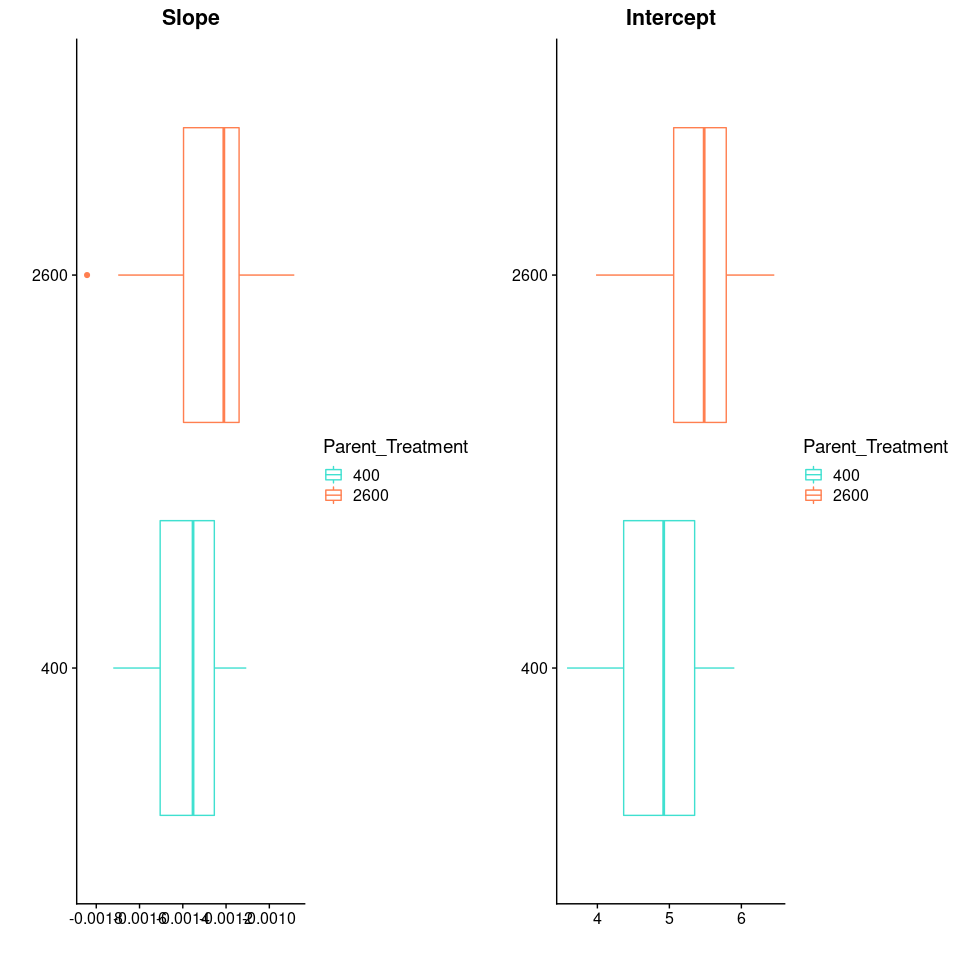<!-- -->

``` r
wilcox.test(ind$slope$GrowthPerDay~ind$slope$ParentTrt)
```

    ## 
    ##  Wilcoxon rank sum exact test
    ## 
    ## data:  ind$slope$GrowthPerDay by ind$slope$ParentTrt
    ## W = 163, p-value = 0.04328
    ## alternative hypothesis: true location shift is not equal to 0

``` r
wilcox.test(ind$intercept$GrowthPerDay~ind$intercept$ParentTrt)
```

    ## 
    ##  Wilcoxon rank sum exact test
    ## 
    ## data:  ind$intercept$GrowthPerDay by ind$intercept$ParentTrt
    ## W = 148, p-value = 0.01747
    ## alternative hypothesis: true location shift is not equal to 0

# Estimating reaction norms with family level summary values

**Variables**

-   Growth (mean growth per jar)
-   Mortality
-   Abnormality
-   Number of cilia

## Options for estimating family-level reactions norms with our data

-   **(Option 1)** : Use linear regression to estimate the slope for
    each family.  
-   **(Option 2)** : Use bootstrapping to estimate a slope distribution
    for each family.

The former option is the simplest, but may be problematic because we
have a small number of replicates (n=3) and our data may not meet the
assumptions of regression. Alternatively, bootstrapping has fewer
assumptions, but generates a distribution rather than a single slope
estimate. I think we might then have to generate a number of test
datasets in which we randomly draw a single slope value for each family
from their respective distributions, then run each of these datasets
through the animal model to generate a distribution of possible mean
heritability estimates.

## Option 1 - Estimating slopes via regression

Here we fit a linear reaction norm to each family using regression. To
this I simply fitted a simple linear model (`lm`) to each family
separately (n = \~6 (3 control and 3 exposed)) using phenotype as the
response variable and jar pH as the explanatory variable. The slope from
this model represents an approximate measure of plasticity for each
family.

``` r
y <- c("Growth","Area","Diameter","Perimeter","MMR","PDR","LarvaeSurvived","AbnormalCount","PercentCilia")
x <- "JarpCO2_SW"
slope_mat <- matrix(ncol=length(y),nrow=length(unique(jrp$family)))
colnames(slope_mat) <- y
intercept_mat <- matrix(ncol=length(y),nrow=length(unique(jrp$family)))
colnames(intercept_mat) <- y
for( i in 1:length(unique(jrp$family))){
  for(j in 1:length(y)){
    temp <- jrp[jrp$family == unique(jrp$family)[i],]
    lm_out <- lm(temp[,y[j]]~temp[,x])
    lm_sum <- summary(lm_out)
    intercept_mat[i,j] <- lm_sum$coefficients[1,1]
    slope_mat[i,j] <- lm_sum$coefficients[2,1]
  }
}

jar_growth <- data.frame(family=unique(jrp$family))
jar_growth <- left_join(jar_growth,jrp_pcombo,by="family")
jar_intercept <- data.frame(jar_growth,intercept_mat)
jar_slope <- data.frame(jar_growth,slope_mat)

jar <- list(intercept=jar_intercept,slope=jar_slope)
```

### Distribution of slopes for various phenotypes by parental treatment

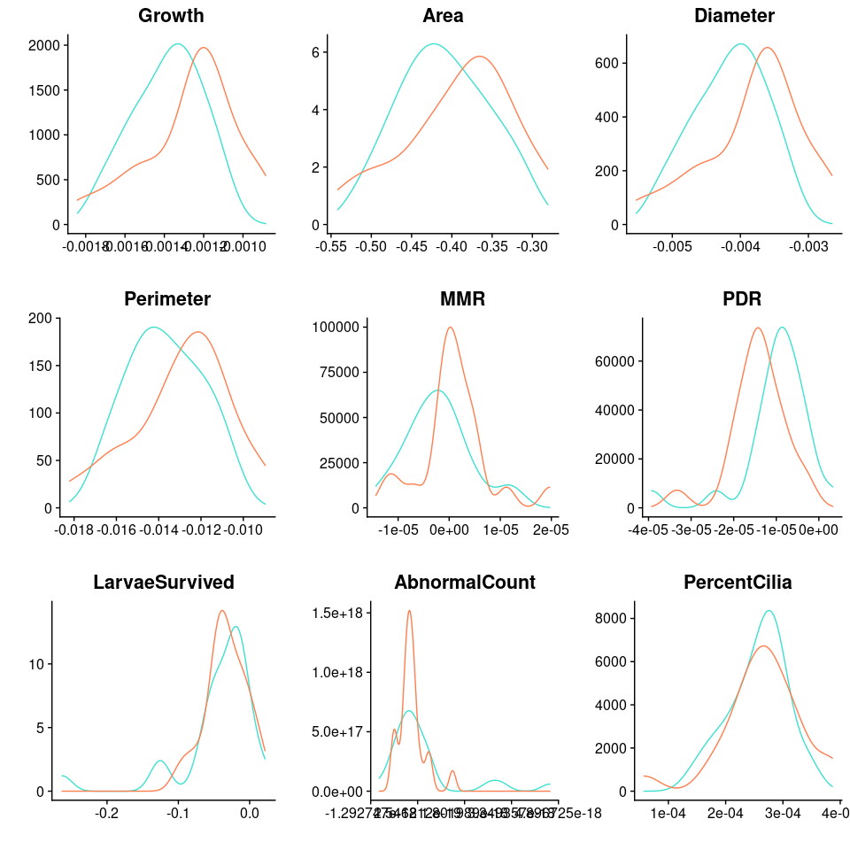<!-- -->

## Option 2 - Use bootstraping to generate a distribution of slopes based on the average of randomly sampled test datasets

In this option, rather than estimating the slope for a family using
regression I make a list of all possible slopes given every combination
of control and exposed replicates per family. For example, for family
CF02\_CM02 I would calculate the slope of Control\_Rep1 x Exposed\_Rep2,
Control\_Rep1 x Exposed\_Rep2, and Control\_Rep1 x Exposed\_Rep3, then
do the same for Control\_Rep2 and Control\_Rep3. This would generate a
list with 9 possible slopes, based on all possible replicate
combinations. After doing this for all familys I then sample one slope
from each family to create a sample dataset. I do this 1 thousand times
(`REP=1000`). I am left with 1000 thousand test datasets for each
parental treatment, for each phenotype. I visuallize this data below by
plotting the distribution of slopes summarized across all replicate
datasets.

``` r
y <- c("Growth","Area","Diameter","Perimeter","MMR","PDR","LarvaeSurvived","PercentCilia")
x <- "JarpCO2_SW"
slope_comb <- rep(list(NULL),times=length(y))
names(slope_comb) <- y
jrp <- jrp[jrp$JarID != "J279_B1",]
jrp$AbnormalCount <- as.numeric(jrp$AbnormalCount)
jrp %>% group_by(family) %>% summarise(ParentTrt=unique(ParentTrt)) -> jrp_pcombo

for(i in 1:length(y)){
  for(j in 1:length(unique(jrp$family))){
    temp <- jrp[jrp$family == unique(jrp$family)[j],]
    tc_y <- temp[temp$JarTrt == "Control",y[i]]
    tc_x <- temp[temp$JarTrt == "Control",x]
    te_y <- temp[temp$JarTrt == "Exposed",y[i]]
    te_x <- temp[temp$JarTrt == "Exposed",x]
    temp_slope <- NULL
    for(m in 1:length(tc_y)){
      for(n in 1:length(te_y)){
        temp_slope <- c(temp_slope,c(tc_y[m]-te_y[n])/c(tc_x[m]-te_x[n]))
      }
    }
    if(j == 1){
      slope_comb[[y[i]]] <- list(name=temp_slope)
    }else{
      slope_comb[[y[i]]] <- c(slope_comb[[y[i]]],name=list(temp_slope))
    }
  }
  names(slope_comb[[i]]) <- unique(jrp$family)
}
```

``` r
REP=1000
slope_reps <- rep(list(NULL),times=length(slope_comb))
names(slope_reps) <- names(slope_comb)
for(j in 1:length(slope_reps)){
  temp <- slope_comb[[names(slope_comb)[j]]]
  temp_mat <- matrix(nrow=(length(temp)),ncol=REP)
  colnames(temp_mat) <- paste0("Rep_",c(1:REP))
  rownames(temp_mat) <- names(temp)
  for(i in 1:length(temp)){
    temp_list <- temp[[i]]
    temp_mat[i,]<- sample(temp_list,size=REP,replace = T)
  }
  slope_reps[[j]] <- temp_mat
}
```

### Distribution of slopes for various phenotypes by parental treatment

``` r
plot_grid(plotlist = plot_slope_list2) 
```

    ## Warning: Removed 33317 rows containing non-finite values (stat_density).

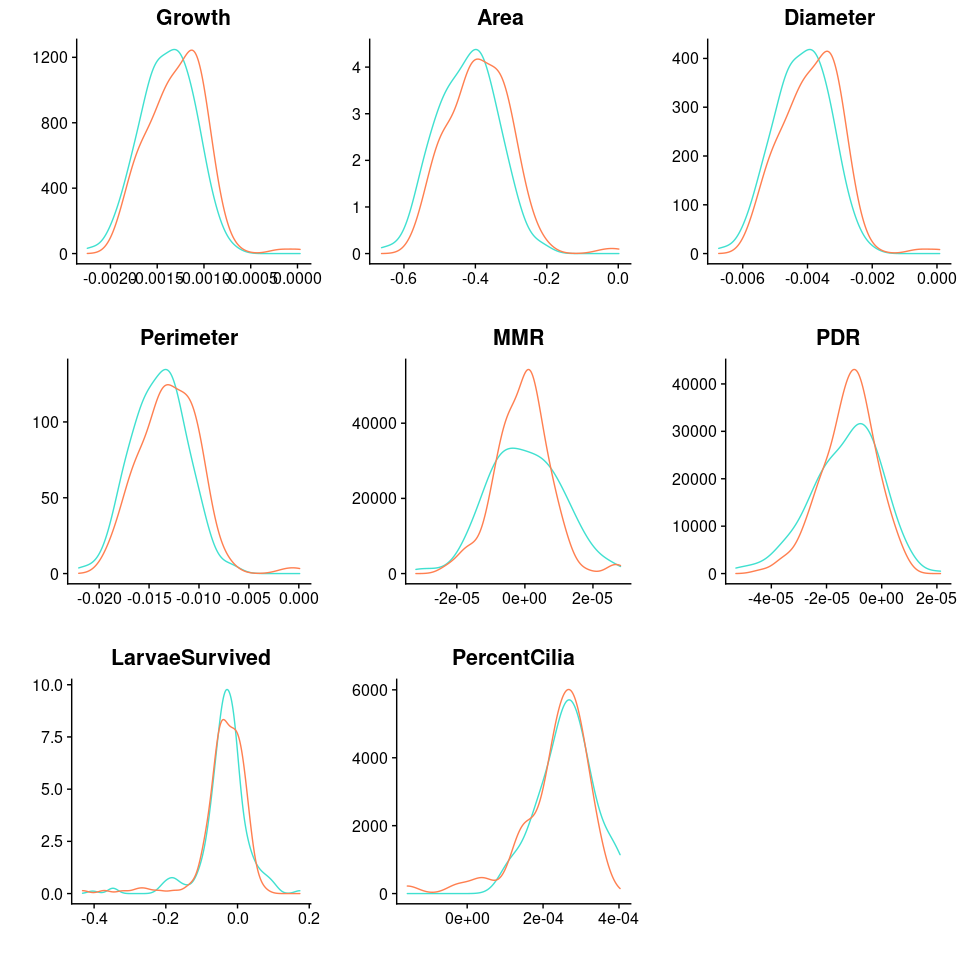<!-- -->

## Miscellaneous visualization of other phenotypes

``` r
ggplot(jrp,aes(x=JarTrt,y=log(AbnormalCount),colour=JarTrt)) + facet_grid(cols=vars(ParentTrt)) + geom_boxplot()
```

    ## Warning: Removed 24 rows containing non-finite values (stat_boxplot).

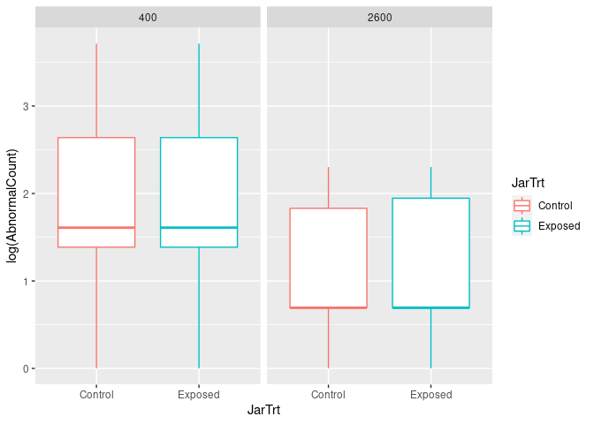<!-- -->

``` r
ggplot(jrp,aes(x=JarTrt,y=log(CiliaTotalCount),colour=JarTrt)) + facet_grid(cols=vars(ParentTrt)) + geom_boxplot()
```

    ## Warning: Removed 138 rows containing non-finite values (stat_boxplot).

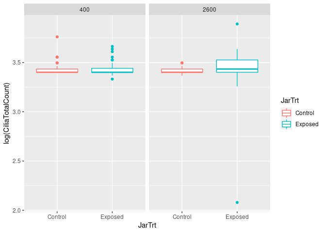<!-- -->

``` r
ggplot(jrp,aes(x=JarTrt,y=log(UnfertCount),colour=JarTrt)) + facet_grid(cols=vars(ParentTrt)) + geom_boxplot()
```

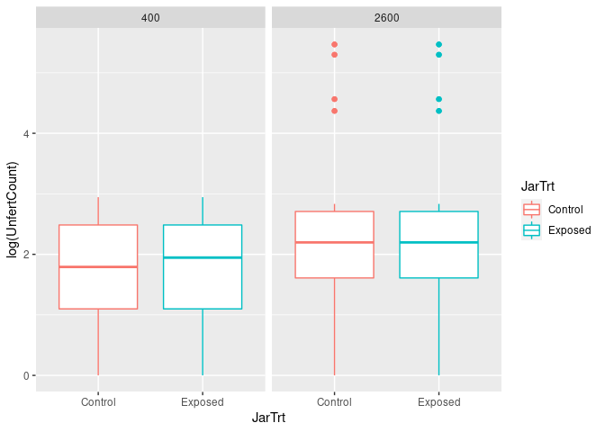<!-- -->

``` r
ggplot(jrp,aes(x=JarTrt,y=log(EggDiamum),colour=JarTrt)) + facet_grid(cols=vars(ParentTrt)) + geom_boxplot()
```

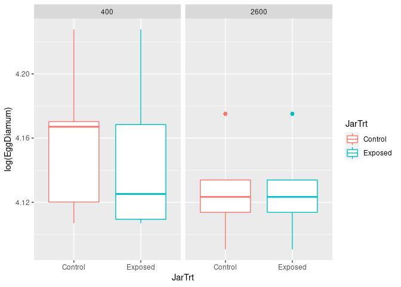<!-- -->

``` r
ggplot(jrp,aes(x=JarTrt,y=log(LarvaeSurvived),colour=JarTrt)) + facet_grid(cols=vars(ParentTrt)) + geom_boxplot()
```

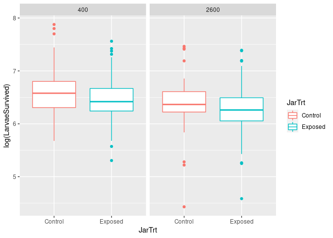<!-- -->

``` r
jrp$LarvaeSurvived
```

    ##   [1]  492.0  507.5  369.5  547.5 1024.0  949.5 1335.5 1745.5  860.0  518.0
    ##  [11]  811.0  737.5  723.5  857.5  613.5  484.5  719.5  493.5  683.0  415.5
    ##  [21]  695.5  354.0  538.5 1365.0  401.0  440.0  455.5  424.0  446.0  429.5
    ##  [31]  534.0  621.5  479.5  675.0  691.0  455.0  383.0  422.0 1110.0  829.5
    ##  [41]  650.0  296.5  201.5  533.5  705.0  704.5  569.0  729.0  693.5  645.0
    ##  [51] 1272.0  379.0  518.0  346.5  463.0  722.0  497.0  699.5  514.5  423.0
    ##  [61]  500.5  839.5  693.5  754.5  491.5  185.0  190.5 1673.5 2444.0  533.0
    ##  [71]  460.5  549.5  779.5  979.5  670.5  804.5  888.0  901.5  309.5  381.5
    ##  [81]  390.5  318.5  436.5  418.0  470.5  869.0  524.0  714.5  848.5  584.5
    ##  [91]  478.0  963.0  923.5  721.0  196.5  193.0  366.0  716.5  410.5  409.5
    ## [101]  527.5  340.0  292.5  725.5  720.5  920.5 1420.0 1526.5 1166.5  901.5
    ## [111]  815.0  560.0  544.5  780.0  920.5  828.5  715.5  503.0  483.0  583.0
    ## [121]  705.5  746.0 1690.5  666.5  709.5  467.5  334.5  362.5  422.5  389.0
    ## [131]  617.5  746.5  566.5  778.0  592.0  937.0  724.0   98.0  575.0  403.0
    ## [141]  723.0  895.0  627.0  576.0  732.0  668.0  524.0  677.0  700.0  849.0
    ## [151]  612.0  681.0  474.0  425.0  535.0  579.0  428.0 2639.0 1598.0 1068.0
    ## [161]  897.0  924.0  637.0  807.0  681.0  658.0  536.0  716.0  373.0  535.0
    ## [171]  549.0 1656.0 1606.0 1204.0 1326.0  466.0  572.0  512.0  626.0  412.0
    ## [181]  263.0  292.0  524.0  558.0  514.0  555.0  657.0  787.0  713.0  621.0
    ## [191]  708.0  728.0  697.0  550.0  486.0  472.0  514.0  440.0  678.0  679.0
    ## [201] 1502.0 1710.0  705.0  817.0  901.0  523.0  553.0  440.0  601.0  824.0
    ## [211]  632.0  766.0  526.0  667.0  641.0  653.0  809.0  713.0  810.0 1258.0
    ## [221] 1414.0  516.0  941.0  989.0  657.0  603.0  584.0  609.0  551.0  424.0
    ## [231]  228.0   84.0  821.0 2210.0 1923.0  518.0  445.0  583.0  623.0  600.0
    ## [241]  533.0  463.0  566.0  544.0  440.0  425.0  671.0  814.0  391.0  343.0
    ## [251]  308.0  321.0  474.0  580.0  927.0  961.0  643.0  484.0  702.0  809.0
    ## [261]  829.0 1621.0  576.0 1322.0 1687.0  536.0  575.0  506.0  576.0

``` r
library(lme4)
```

    ## Registered S3 methods overwritten by 'lme4':
    ##   method                          from
    ##   cooks.distance.influence.merMod car 
    ##   influence.merMod                car 
    ##   dfbeta.influence.merMod         car 
    ##   dfbetas.influence.merMod        car

``` r
library(lmerTest)
```

    ## 
    ## Attaching package: 'lmerTest'

    ## The following object is masked from 'package:lme4':
    ## 
    ##     lmer

    ## The following object is masked from 'package:stats':
    ## 
    ##     step

``` r
temp <- lmer(log(LarvaeSurvived) ~ as.factor(JarTrt) * as.factor(ParentTrt) + (1|family), data=jrp)
temp_aov <- anova(temp)
summary(temp_aov)
```

    ##      Sum Sq            Mean Sq             NumDF       DenDF       
    ##  Min.   :0.003992   Min.   :0.003992   Min.   :1   Min.   : 42.95  
    ##  1st Qu.:0.029549   1st Qu.:0.029549   1st Qu.:1   1st Qu.:132.47  
    ##  Median :0.055106   Median :0.055106   Median :1   Median :221.99  
    ##  Mean   :0.373372   Mean   :0.373372   Mean   :1   Mean   :162.31  
    ##  3rd Qu.:0.558061   3rd Qu.:0.558061   3rd Qu.:1   3rd Qu.:221.99  
    ##  Max.   :1.061017   Max.   :1.061017   Max.   :1   Max.   :221.99  
    ##     F value            Pr(>F)       
    ##  Min.   : 0.1247   Min.   :0.00000  
    ##  1st Qu.: 0.9231   1st Qu.:0.09823  
    ##  Median : 1.7215   Median :0.19647  
    ##  Mean   :11.6642   Mean   :0.30692  
    ##  3rd Qu.:17.4340   3rd Qu.:0.46039  
    ##  Max.   :33.1465   Max.   :0.72431

``` r
summary(temp)
```

    ## Linear mixed model fit by REML. t-tests use Satterthwaite's method [
    ## lmerModLmerTest]
    ## Formula: log(LarvaeSurvived) ~ as.factor(JarTrt) * as.factor(ParentTrt) +  
    ##     (1 | family)
    ##    Data: jrp
    ## 
    ## REML criterion at convergence: 10.9
    ## 
    ## Scaled residuals: 
    ##     Min      1Q  Median      3Q     Max 
    ## -7.7488 -0.3575  0.1067  0.5101  1.9140 
    ## 
    ## Random effects:
    ##  Groups   Name        Variance Std.Dev.
    ##  family   (Intercept) 0.18773  0.4333  
    ##  Residual             0.03201  0.1789  
    ## Number of obs: 269, groups:  family, 45
    ## 
    ## Fixed effects:
    ##                                                    Estimate Std. Error
    ## (Intercept)                                         6.58039    0.09096
    ## as.factor(JarTrt)Exposed                           -0.13384    0.02989
    ## as.factor(ParentTrt)2600                           -0.18001    0.13316
    ## as.factor(JarTrt)Exposed:as.factor(ParentTrt)2600   0.01547    0.04381
    ##                                                          df t value Pr(>|t|)
    ## (Intercept)                                        45.41697  72.343  < 2e-16
    ## as.factor(JarTrt)Exposed                          222.00386  -4.478  1.2e-05
    ## as.factor(ParentTrt)2600                           45.42416  -1.352    0.183
    ## as.factor(JarTrt)Exposed:as.factor(ParentTrt)2600 221.98650   0.353    0.724
    ##                                                      
    ## (Intercept)                                       ***
    ## as.factor(JarTrt)Exposed                          ***
    ## as.factor(ParentTrt)2600                             
    ## as.factor(JarTrt)Exposed:as.factor(ParentTrt)2600    
    ## ---
    ## Signif. codes:  0 '***' 0.001 '**' 0.01 '*' 0.05 '.' 0.1 ' ' 1
    ## 
    ## Correlation of Fixed Effects:
    ##             (Intr) as.(JT)E a.(PT)
    ## as.fct(JT)E -0.167                
    ## as.(PT)2600 -0.683  0.114         
    ## a.(JT)E:.(P  0.114 -0.682   -0.166
